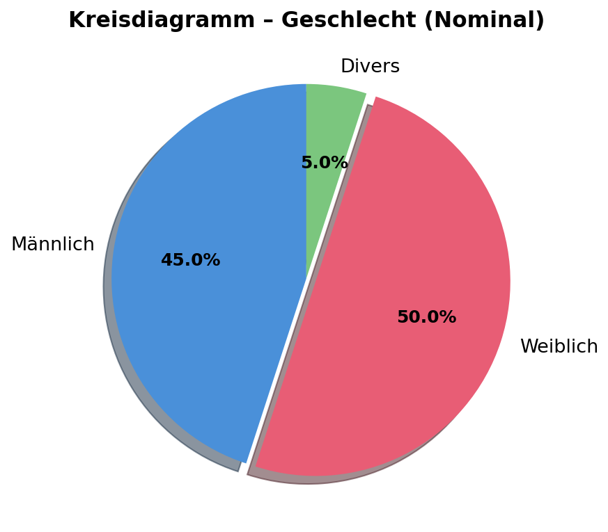
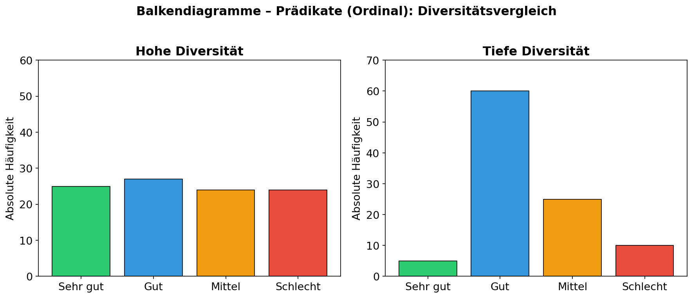
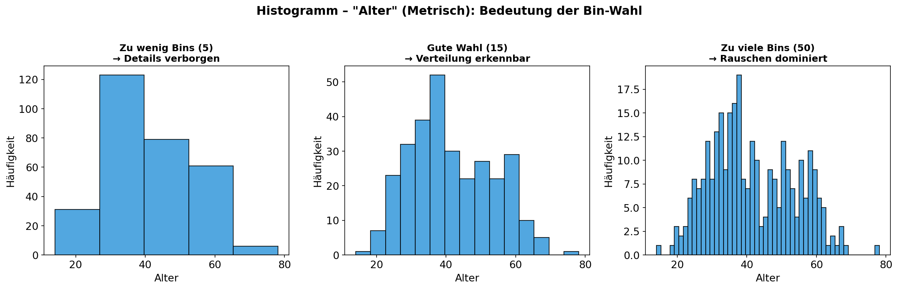
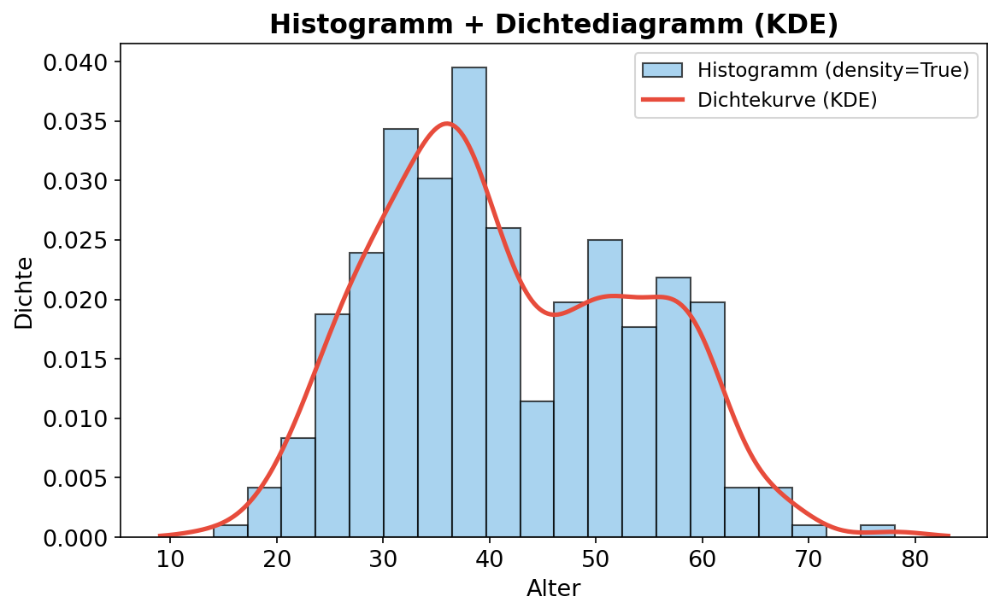
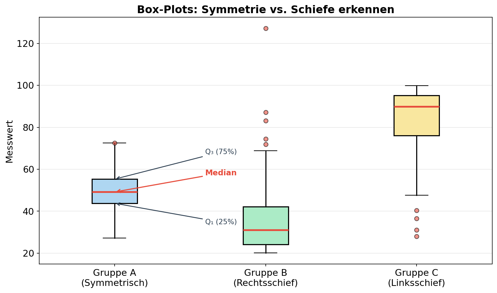

# ASTAT – Zusammenfassung SW 03: Datenvisualisierung mit Python

## 🎯 1. Lernziele (Learning Objectives)
* **Visualisierungskonzepte verstehen:** Kennenlernen der wichtigsten Plot-Arten für nominale, ordinale und metrische Daten.
* **Matplotlib und Seaborn sicher anwenden:** Erstellen und Anpassen von Kreisdiagrammen, Balkendiagrammen, Histogrammen, Dichtediagrammen und Box-Plots.
* **Verteilungen analysieren:** Interpretieren von Symmetrie, Schiefe, Lage- und Streuungsmassen direkt aus der Grafik.
* **Diversität & Dispersion:** Visuelle Erkennung von Häufigkeiten und der Diversität von Daten.

---

## 🔑 2. Key Terms (Schlüsselbegriffe)
| Begriff | Definition | Typischer Anwendungsfall / Beispiel |
| :--- | :--- | :--- |
| **Kreisdiagramm (Pie Chart)** | Zeigt relative Häufigkeiten auf einer Scheibe. Der Winkel ist proportional zur relativen Häufigkeit. | **Nominale Daten**, z.B. Marktanteile, Geschlecht. Ideal für $k \le 6$ Kategorien. |
| **Balkendiagramm (Bar Chart)** | Visualisiert absolute oder relative Häufigkeiten als rechteckige Balken. | **Ordinale Daten**, wo eine natürliche Ordnung besteht (z.B. Schulnoten, Prädikate). |
| **Histogramm** | Flächenproportionale grafische Darstellung der Häufigkeitsverteilung mittels aneinandergrenzender Rechtecke. | **Metrische Daten**. Betrachtung der Verteilungsform (Normalverteilung, Schiefe). |
| **Dichtediagramm (KDE)** | Kontinuierliche Glättung (*Kernel Density Estimation*) eines Histogramms zur Darstellung der empirischen Wahrscheinlichkeitsdichte. | **Metrische Daten**, wenn glatte Verteilungen statt diskreter Bins gewünscht sind. |
| **Box-Plot (Schachtel-Plot)** | Grafische Zusammenfassung der 5-Punkte-Zusammenfassung (Min, $Q_1$, Median, $Q_3$, Max) inkl. Ausreissern. | Vergleich mehrerer Gruppen (z.B. Lohn nach Geschlecht). |
| **Diversitätsindex** | Mass für die Heterogenität/Diversität nominaler oder ordinaler Ausprägungen. | Wie stark durchmischt sind die Prädikate in einem Jahrgang? |

---

## 🧠 3. Konzepte & Definitionen

### 3.1 Nominale Daten: Kreisdiagramm (Pie Chart)
> [!NOTE] 
> **Intuition:** Bei nominalen Daten interessiert uns primär der **Anteil** der Gruppen am Ganzen, da es keine inhärente Ordnung gibt.

* **Kreisdiagramm:** Der Winkel berechnet sich durch $h_j \cdot 360^\circ$ (relative Häufigkeit multipliziert mit 360).
* Es ist weniger geeignet für exakte Vergleiche nahe beieinanderliegender Werte, da das menschliche Auge Flächen schwerer exakt abschätzen kann als Längen.
* **Faustregel:** Kreisdiagramme eignen sich am besten bei maximal $k \le 6$ Kategorien.

**Beispiel:** Verteilung des Geschlechts in einem Datensatz.



**Code:**
```python
import numpy as np
import matplotlib.pyplot as plt

categories, counts = np.unique(df["Geschlecht"], return_counts=True)

plt.pie(counts, 
        labels=categories, 
        autopct='%1.2f%%',       # Formatiert 2 Nachkommastellen, '%%' für das '%' Symbol
        startangle=90,           # Rotiert den Kreis
        colors=['#66b3ff', '#ff9999'])
plt.title("Anteile der Geschlechter")
plt.show()
```

> [!TIP]
> **Winkelberechnung (Numerische Antwort):** Hat eine Klasse die relative Häufigkeit $0.25$ ($25\%$), dann ist ihr Anteil am Kreisdiagramm $0.25 \times 360^\circ = 90^\circ$.

---

### 3.2 Ordinale Daten: Balkendiagramme & Diversität
> [!NOTE]
> **Intuition:** Die **Reihenfolge** der Ausprägungen (z.B. Sehr gut, Gut, Mittel, Schlecht) ist streng. Ein Balkendiagramm respektiert diese Ordnung auf der Achse.

* **Diversität (Dispersion):** Wenn alle Balken etwa gleich hoch sind, ist die Diversität extrem hoch (maximale Streuung). Wenn ein einziger Balken alles dominiert, ist sie sehr tief (Konzentration).

**Beispiel:** Vergleich von hoher vs. tiefer Diversität bei Prädikaten.



**Code:**
```python
import seaborn as sns

# Wichtig für ordinale Daten: Fixierung der Reihenfolge!
kategorische_ordnung = ['Sehr gut', 'Gut', 'Mittel', 'Schlecht']

sns.countplot(data=df, 
              y='Prädikat',              # y-Achse → horizontale Balken
              order=kategorische_ordnung, # Erzwingt die ordinale Sortierung!
              palette="viridis")
plt.title("Verteilung der Prädikate")
plt.show()
```

> [!IMPORTANT]
> **Prüfungstipp:** Ist in einer MC-Frage ein Balkendiagramm ohne korrekte Sortierung der ordinalen Kategorien dargestellt, ist das eine **fehlerhafte Visualisierung**! Achte immer auf den `order=`-Parameter.

---

### 3.3 Metrische Daten: Histogramme
Ein **Histogramm** unterteilt den metrischen Wertebereich in definierte Intervalle (sogenannte **Bins**).
* **Entscheidend:** Die Wahl der Bin-Breite verändert die visuelle Gestalt massiv.
  * Zu **wenig Bins** verdecken Details.
  * Zu **viele Bins** zeigen nur Rauschen.
  * Die **richtige Anzahl** lässt die Verteilungsform klar erkennen.
* **Formel-Intuition:** Die Fläche eines Balkens ist die relative Häufigkeit! $\text{Fläche(Bin)} \propto h_i$.

**Beispiel:** Drei verschiedene Bin-Einstellungen für die gleiche Altersverteilung.



**Code:**
```python
# bins-Parameter steuert die Anzahl der Intervalle
plt.hist(df["Alter"], bins=15, color='skyblue', edgecolor='black')
plt.xlabel("Alter")
plt.ylabel("Häufigkeit")
plt.title("Histogramm")
plt.show()
```

---

### 3.4 Histogramm + Dichtediagramm (KDE Overlay)
Ein **Dichtediagramm** (KDE-Plot) verfeinert das Histogramm:
* Die Kurve legt eine stetige "Dichte" über das Histogramm.
* Das Integral (die Gesamtfläche unter der Kurve) ist exakt 1.
* Wichtig: Wenn `density=True` gesetzt wird, zeigt die y-Achse **nicht** Zähler, sondern die Wahrscheinlichkeitsdichte!

**Beispiel:** Histogramm mit überlagerter Dichtekurve.



**Code:**
```python
# 1. Histogramm: density=True normalisiert die y-Achse zur Wahrscheinlichkeitsdichte
plt.hist(df["Alter"], bins=15, density=True, color='skyblue', edgecolor='black', alpha=0.7)

# 2. Seaborn KDE-Plot legt geschmeidige Dichtelinie darüber
sns.kdeplot(df["Alter"], color='red', linewidth=2)

plt.xlabel("Alter")
plt.ylabel("Dichte")
plt.title("Histogramm + Dichtediagramm")
plt.show()
```

> [!WARNING]
> **Prüfungsfalle:** Ein Histogramm mit `density=True` hat auf der y-Achse ***nicht*** absolute Zahlen, sondern Flächendichten! Die Gesamtfläche aller Rechtecke = 1.

---

### 3.5 Box-Plots: Aufbau, Symmetrie & Schiefe
Der **Box-Plot** komprimiert die Verteilung einer metrischen Variable auf die wichtigsten Kerngrössen und macht Ausreisser sichtbar.
* **Der Kasten (Box):** Reicht vom 1. Quartil ($Q_1$) bis zum 3. Quartil ($Q_3$). = zentralen 50% der Daten = **IQR**.
* **Die Linie in der Box:** Der **Median**.
* **Die Antennen (Whiskers):** Reichen bis zum Minimum/Maximum innerhalb von $1.5 \times IQR$ Abstand von der Box.
* **Punkte ausserhalb:** Das sind **Ausreisser**.

Häufige Prüfungsfragen fordern das Erkennen der **Schiefe** (Skewness) aus einem Box-Plot:

| Verteilungsform | Box-Plot Kriterien |
| :--- | :--- |
| **Symmetrisch** | Median in der Mitte der Box, Whisker gleich lang. |
| **Rechtsschief (linkssteil)** | Median näher bei $Q_1$, rechter Whisker länger. Ausreisser nach oben. |
| **Linksschief (rechtssteil)** | Median näher bei $Q_3$, linker Whisker länger. |

**Beispiel:** Box-Plots mit verschiedenen Verteilungsformen, inkl. beschrifteter Bestandteile.



**Code:**
```python
# y-Achse: metrische Variable, x-Achse: Gruppen
# hue: zusätzliche Gruppierung durch Farben
sns.boxplot(data=df, y="body_mass_g", x="species", hue="sex")
plt.title("Pinguin-Gewicht nach Spezies & Geschlecht")
plt.show()
```

---

## ⚖️ 4. Vergleiche & Klassifikationen
| Grafischer Typ | Skalenniveau | Python-Funktion | Ergebnis |
| :--- | :--- | :--- | :--- |
| **Kreisdiagramm** | Nominal | `plt.pie(...)` |  |
| **Balkendiagramm** | Nominal, Ordinal | `sns.countplot(...)` |  |
| **Histogramm** | Metrisch | `plt.hist(...)` |  |
| **Dichtediagramm** | Metrisch | `sns.kdeplot(...)` |  |
| **Box-Plot** | Metrisch | `sns.boxplot(...)` |  |

---

## 💻 5. Weitere Code-Patterns

### 5.1 Setup & Imports
```python
import pandas as pd
import numpy as np
import matplotlib.pyplot as plt
import seaborn as sns

# Kategorien und Zählung extrahieren
categories, counts = np.unique(df["Feature"], return_counts=True)
```

### 5.2 Mehrere Plots in einer Figur (`plt.subplots`)
```python
# Erstellt eine 1x2-Matrix von Subplots (1 Zeile, 2 Spalten)
fig, ax = plt.subplots(1, 2, figsize=(12, 5))

# ax[0] → linke Grafik, ax[1] → rechte Grafik
sns.boxplot(data=df, y="Wert", x="Kategorie", ax=ax[0])
ax[0].set_title("Boxplot")

sns.countplot(data=df, x="Kategorie", ax=ax[1])
ax[1].set_title("Häufigkeit")

plt.tight_layout()
plt.show()
```

---

## 🗺️ 6. Concept-Code Mapping
| Was will ich erreichen? | Python Syntax |
| :--- | :--- |
| Einzigartige Ausprägungen + Anzahl zählen | `np.unique(data, return_counts=True)` |
| Duplikate bezgl. bestimmter Spalten entfernen | `df[["Kat1", "Kat2"]].drop_duplicates()` |
| Ordinale Reihenfolge erzwingen | `sns.countplot(..., order=['A','B','C'])` |
| Automatische Bins fürs Histogramm | `plt.hist(..., bins='sturges')` |
| Farbpalette setzen | `sns.countplot(..., palette="muted")` |
| `NaN`-Werte entfernen (vor Visualisierung!) | `df.dropna(inplace=True)` |

---

## 💡 7. Prüfungsrelevante Tipps (Exam Survival Guide)

> [!WARNING]
> **Prüfungsfokus: Closed Book / Multiple Choice Tricks**

1. **Nominal vs. Ordinal vs. Metrisch → richtigen Plot wählen!** Kreisdiagramm? → Nominal. Balkendiagramm? → Ordinal (mit korrekter Sortierung!). Histogramm? → Metrisch. Ein Kreisdiagramm für *metrische* Daten ist **falsch**.

2. **Format `%1.Xf%%` auswendig wissen:** `%1.2f%%` → `14.53%`. `%1.0f%%` → `15%`. **`%%`** steht buchstäblich für das %-Zeichen im String-Output.

3. **Diversität erkennen:** Alle Balken gleich hoch = **hohe Diversität**. Ein Balken dominiert = **tiefe Diversität**.

4. **Histogramm `density=True`:** y-Achse zeigt ***Dichte***, nicht absolute Häufigkeiten! Gesamtfläche = 1.

5. **Box-Plot Schiefe:** Median nicht in der Mitte → schiefe Verteilung. Lange Whisker + Ausreisser → Hinweis auf extreme Werte.

---

## 🔗 8. Verbindungen zu anderen Wochen

| Verknüpfung | Erklärung |
| :--- | :--- |
| **→ SW01 (Datenmanipulation)** | Daten für Boxplots müssen vorab gereinigt werden (`df.dropna(inplace=True)`). Dies wurde in SW01 etabliert. |
| **→ SW02 (Datenbeschreibung)** | Alle Streuungs- und Lagemasse (Median, Quartile, IQR, Ausreisser) aus SW02 sind direkt die Bausteine des **Box-Plots** in SW03. |
| **→ Zukünftige Wochen** | Histogramme und Dichteplots bereiten das Verständnis für **Verteilungen** und **Wahrscheinlichkeitsdichtefunktionen** vor, die in späteren Wochen vertieft werden. |
