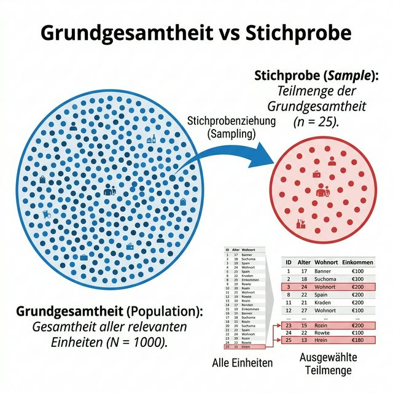
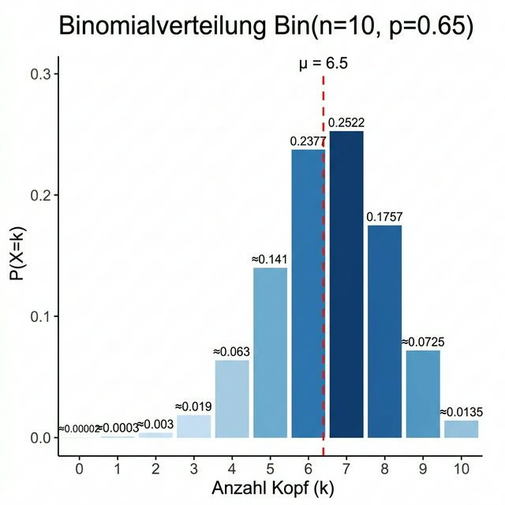
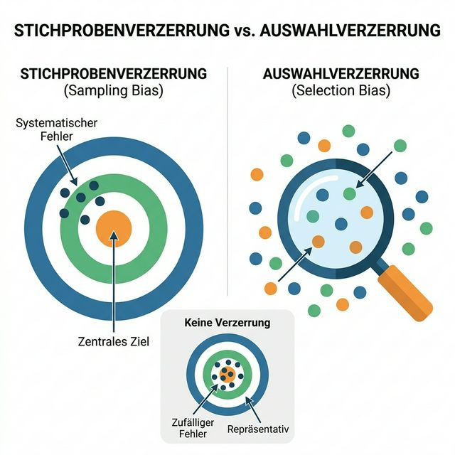
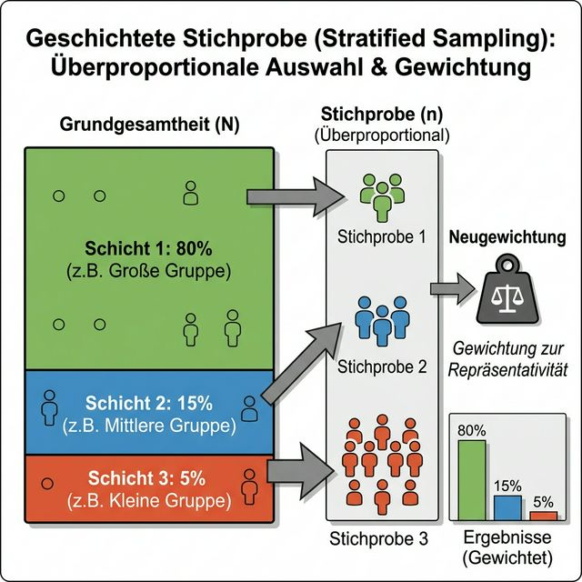
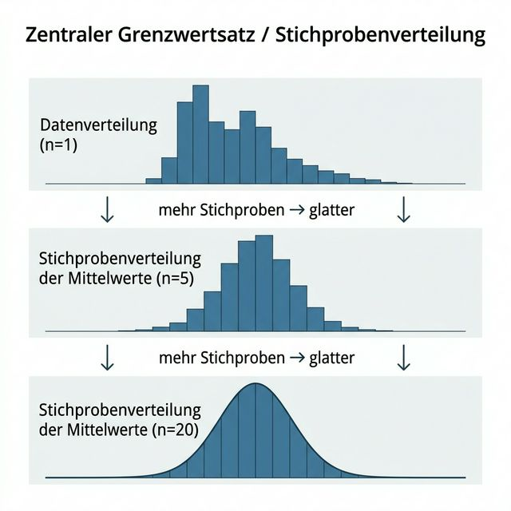

# 📑 ASTAT – Angewandte Statistik für Datenwissenschaften

## 📅 SW 05 – Stichproben (Theorie und Übungen)

---

## 🎯 Lernziele

1. Sie wissen, was eine **Zufallsstichprobe** ist und kennen ihre Bedeutung.
2. Sie können einfache **binomial verteilte Modelle** berechnen und mit Daten vergleichen.
3. Sie verstehen die Problematik der **Stichprobenverzerrung** und der **Auswahlverzerrung**.
4. Sie kennen den Unterschied zwischen der **Datenverteilung** und der **Stichprobenverteilung**.

---

## 📖 Wichtigste Begriffe

| Begriff | Englisch | Definition |
| :--- | :--- | :--- |
| **Grundgesamtheit** | *Population* | Der **gesamte** (oft theoretische) Datensatz aller Einheiten, über die man eine Aussage machen möchte. z.B. *alle* Wähler in den USA. |
| **Stichprobe** | *Sample* | Eine **Teilmenge** aus der Grundgesamtheit, die wir tatsächlich erheben. z.B. 2000 befragte Wähler. |
| **Empirische Verteilung** | *Empirical distribution* | Verteilung der **tatsächlich beobachteten** Werte in der Stichprobe (relative Häufigkeiten). |
| **Theoretische Verteilung** | *Theoretical distribution* | Das **mathematische Modell** (z.B. $\mathsf{Bin}(n,p)$), das die Verteilung in der Grundgesamtheit beschreibt. |
| **Zufallsstichprobe** | *Random sample* | Stichprobe, bei der **jede Einheit** der Grundgesamtheit die **gleiche Chance** hat, ausgewählt zu werden. |
| **Repräsentativität** | *Representativeness* | Eigenschaft, dass die Stichprobe die Grundgesamtheit **unverzerrt** abbildet – keine Gruppe ist über-/unterrepräsentiert. |
| **Stichprobenverzerrung (Bias)** | *Sampling bias* | **Systematischer** Fehler, der durch das Erhebungsverfahren entsteht (z.B. nur Telefonbesitzer befragen). |
| **Auswahlverzerrung** | *Selection bias* | Verzerrung durch **nachträgliche** Datenselektion (z.B. nur "interessante" Ergebnisse berichten). |
| **Selbstselektion** | *Self-selection bias* | Spezialfall: Teilnehmende **entscheiden selbst**, ob sie mitmachen (z.B. Online-Bewertungen). |
| **Geschichtete Stichprobe** | *Stratified sample* | Population wird in Schichten (z.B. Altersgruppen) aufgeteilt; aus **jeder Schicht** wird separat eine Zufallsstichprobe gezogen. |
| **Stichprobenverteilung** | *Sampling distribution* | Verteilung eines **Stichprobenkennwerts** (z.B. $\bar{x}$) über **viele hypothetische** Stichproben aus derselben Population. |
| **Stichprobenvariabilität** | *Sampling variability* | Die **zufälligen Unterschiede** eines Kennwerts zwischen verschiedenen Stichproben aus derselben Grundgesamtheit. |
| **Vast Search Effect** | — | Wenn man riesige Datenmengen **lange genug** durchsucht, findet man **zwangsläufig** zufällige "Muster", die nicht real sind. |

---

## 📐 Konzepte & Definitionen

### 1. Grundgesamtheit und Stichprobe

<center>

</center>

> **Formale Definition:** Eine **Stichprobe** ist eine Teilmenge von Daten aus einem grösseren Datensatz, der sogenannten **Grundgesamtheit**. Die Grundgesamtheit ist ein grosser, definierter, aber manchmal theoretischer oder imaginärer Datensatz.

**Intuitive Erklärung:** Stellen Sie sich vor, Sie wollen wissen, wie gross alle Menschen in der Schweiz sind. Die Grundgesamtheit wäre die Körpergrösse aller ~9 Millionen Einwohner. Da Sie nicht alle messen können, messen Sie 500 zufällig ausgewählte Personen → das ist Ihre Stichprobe.

**Konkretes Zahlenbeispiel:**

| | Grundgesamtheit | Stichprobe |
|---|---|---|
| **Umfang** | 9'000'000 Personen | 500 Personen |
| **Mittlere Grösse** | $\mu = 171.3$ cm (unbekannt!) | $\bar{x} = 170.8$ cm (berechnet) |
| **Std.-Abweichung** | $\sigma = 9.5$ cm (unbekannt!) | $s = 9.2$ cm (berechnet) |

→ Wir **schätzen** die unbekannten Parameter der Population ($\mu$, $\sigma$) anhand der Stichprobe ($\bar{x}$, $s$).

---

### 2. Modellierung der Grundgesamtheit mit der Binomialverteilung

Wenn ein Zufallsprozess $n$-mal **unabhängig** wiederholt wird und jeweils nur zwei Ausgänge hat (Erfolg mit $p$, Misserfolg mit $1-p$), folgt die **Anzahl der Erfolge** einer Binomialverteilung.

<center>

</center>

> **Formale Definition:** Die Wahrscheinlichkeit, bei $n$ unabhängigen Versuchen mit Erfolgswahrscheinlichkeit $p$ genau $k$ Erfolge zu erhalten:
> $$P(X = k) = \binom{n}{k} \cdot p^k \cdot (1-p)^{n-k}$$

**Schritt-für-Schritt Zahlenbeispiel:** Gezinkte Münze ($p = 0.65$), $n = 10$ Würfe, gesucht: $P(X = 7)$

$$P(X = 7) = \binom{10}{7} \cdot 0.65^7 \cdot 0.35^3$$

1. **Binomialkoeffizient:** $\binom{10}{7} = \frac{10!}{7! \cdot 3!} = \frac{10 \cdot 9 \cdot 8}{3 \cdot 2 \cdot 1} = 120$
2. **Erfolgsterm:** $0.65^7 = 0.04902$
3. **Misserfolgsterm:** $0.35^3 = 0.04288$
4. **Ergebnis:** $120 \cdot 0.04902 \cdot 0.04288 \approx 0.2522$

→ Mit ca. **25.2%** Wahrscheinlichkeit kommen genau 7 Köpfe bei 10 Würfen.

**Python-Überprüfung:**
```python
from scipy.stats import binom
X = binom(n=10, p=0.65)
print(X.pmf(7))  # 0.2522...  ✓
```

**Erwartungswert:**
$$E[X] = n \cdot p = 10 \cdot 0.65 = 6.5$$

→ Im Mittel erwarten wir 6.5 Köpfe bei 10 Würfen.

---

### 3. Das Literary-Digest-Desaster (1936) – Ein Musterbeispiel für Verzerrung

<center>

</center>

**Was geschah?** Das Magazin *Literary Digest* führte die **grösste Wählerbefragung aller Zeiten** durch (10 Mio. angeschrieben, 2.3 Mio. Antworten) und sagte vorher: *"Landon in a Landslide!"*. Roosevelt gewann aber mit **61%** – einer der deutlichsten Wahlsiege der US-Geschichte.

**Warum ging es schief? Zwei Verzerrungen:**

| Verzerrung | Problem | Auswirkung |
|---|---|---|
| **1. Bias durch Teilpopulation** | Befragung per **Telefon- und KfZ-Register** → 1936 hatten nur **Wohlhabende** Telefon und Auto | Diese Schicht wählte überwiegend **Republikaner** (Landon) → systematische Überrepräsentation |
| **2. Selbstselektions-Bias** | Nur **~23%** der Angeschriebenen antworteten → wer antwortet, hat *bestimmte Merkmale* | Motivierte Teilnehmer ≠ repräsentativer Querschnitt|

**Gegenbeispiel:** George Gallup sagte mit nur **2000 Befragten** das richtige Ergebnis voraus – durch ein besseres, repräsentatives Stichprobenverfahren!

> 🚨 **Kernlektion:** Eine **riesige, aber verzerrte** Stichprobe ist wertloser als eine **kleine, aber repräsentative**!

---

### 4. Stichprobenverzerrung (Sampling Bias) vs. Auswahlverzerrung (Selection Bias)

<center>

</center>

> **Definition Bias:** Eine **statistische Verzerrung** bezieht sich auf ***systematische*** Mess- oder Stichprobenfehler, die durch das Mess- oder Stichprobenverfahren verursacht werden.

**Analogie – Schiessen auf eine Zielscheibe:**
- **Unverzerrt (kein Bias):** Schüsse streuen zufällig um die Mitte → manchmal links, manchmal rechts, aber im Schnitt treffen wir die Mitte.
- **Verzerrt (Bias):** Schüsse streuen zwar auch zufällig, aber sie fallen **systematisch** in einen anderen Quadranten → der "Durchschnitt" liegt nicht in der Mitte.

| | Stichprobenverzerrung (Sampling Bias) | Auswahlverzerrung (Selection Bias) |
|:---|:---|:---|
| **Wann?** | Bei der **Datenerhebung** | Bei der **Datenanalyse** |
| **Was?** | Nicht-repräsentative Stichprobe | Nachträgliches "Cherry-Picking" von Ergebnissen |
| **Beispiel** | Nur Telefonbesitzer befragen (Literary Digest) | 100 Tests durchführen, nur den „signifikanten" publizieren |
| **Lösung** | Zufallsstichprobe, Schichtung, Gewichtung | Hypothese *vorher* aufstellen, Multi-Test-Korrektur |

**Gedankenexperiment – Besondere Begabung?**

1. **Szenario A:** Jemand behauptet, sie könne 10x hintereinander "Kopf" werfen. Sie tut es → das **ist** beeindruckend (Wahrscheinlichkeit: $0.5^{10} = \frac{1}{1024} \approx 0.1\%$).
2. **Szenario B:** In einem Stadion mit 20'000 Zuschauern wirft *jeder* 10x eine Münze. Die Wahrscheinlichkeit, dass *mindestens eine Person* 10x Kopf bekommt:
   $$P(\text{mind. 1 Person}) = 1 - \left(1 - \frac{1}{1024}\right)^{20000} > 99.9\%$$
   → Das ist **keine** Begabung, sondern der **vast search effect**!

---

### 5. Repräsentative Stichproben und Geschichtete Stichprobe

<center>

</center>

> **Definition:** Bei geschichteten Stichproben wird die Grundgesamtheit in **Schichten** eingeteilt, und aus jeder Schicht werden **Zufallsstichproben** gezogen.

**Konkretes Zahlenbeispiel:**

Bevölkerung: 80% Weisse, 15% Hispanics, 5% Schwarze.

| Verfahren | Weisse | Hispanics | Schwarze | Total |
|---|---|---|---|---|
| **Einfache Zufallsstichprobe** (n=1000) | ~800 | ~150 | **~50** ⚠️ | 1000 |
| **Geschichtete Stichprobe** | 400 | 300 | 300 | 1000 |

- Bei der einfachen Zufallsstichprobe haben wir nur ~50 Schwarze → **zu wenig** für zuverlässige Aussagen über diese Gruppe.
- Bei der geschichteten Stichprobe werden kleine Gruppen **überrepräsentiert** → jede Gruppe ist gross genug für separate Analyse.
- Bei der **Gesamtauswertung** werden die Ergebnisse danach wieder **gewichtet** (Faktor: tatsächlicher Bevölkerungsanteil / Anteil in Stichprobe).

---

### 6. Grösse vs. Qualität einer Stichprobe

Ein oft überraschendes Prinzip: **Kleiner kann besser sein!**

| Kleine, saubere Stichprobe | Riesige, ungepflegte Datenbank |
|---|---|
| Fehlende Werte einzeln prüfbar | Fehlende Werte = "unerschwinglich" teuer zu finden |
| Ausreisser manuell inspizierbar | Ausreisser-Analyse bei Millionen Zeilen unpraktikabel |
| Datenvisualisierung möglich | Visualisierung wird sinnlos |

**Wann braucht man trotzdem Big Data?** Wenn die Daten **massenhaft UND dünn besetzt** (sparse) sind.

**Beispiel Google-Suche:**
- Matrix: $>1$ Billion Suchanfragen × $>150'000$ Wörter
- Die **überwiegende Mehrheit der Einträge = 0** (die meisten Wörter kommen in den meisten Suchanfragen nicht vor)
- Für seltene Kombinationen wie *"Ricky Ricardo" + "Rotkäppchen"* braucht man Billionen Datenpunkte, damit unter diesen die relevanten *Tausende* gefunden werden

---

### 7. Datenverteilung vs. Stichprobenverteilung (Zentraler Grenzwertsatz)

<center>

</center>

> **Definition:** Die **Stichprobenverteilung** bezieht sich auf die Verteilung eines **Stichprobenkennwerts** (z.B. $\bar{x}$) über viele hypothetische Stichproben, die alle aus derselben Grundgesamtheit gezogen werden.

Dies ist **DAS zentrale Konzept** der Woche! Der Unterschied ist:

| | **Datenverteilung** | **Stichprobenverteilung** |
|---|---|---|
| **Was wird geplottet?** | Die **einzelnen Werte** einer Stichprobe | Der **Mittelwert** (oder anderer Kennwert) von *vielen verschiedenen Stichproben* |
| **Form** | Kann **beliebig** aussehen (schief, bimodal, etc.) | Nähert sich mit steigendem $n$ einer **Normalverteilung** (Glockenkurve) |
| **Streuung** | Abhängig von den Daten | Wird **enger** je grösser $n$ |
| **Formel für Streuung** | $s$ (Standardabweichung der Daten) | $\frac{s}{\sqrt{n}}$ (Standardfehler des Mittelwerts) |


**Konkretes Zahlenbeispiel mit Aufgabe 3 (Lending Club):**
- **Stichprobe A** (1000 Einzelwerte): Verteilung ist **rechtsschief** (viele niedrige Einkommen, wenige sehr hohe)
- **Stichprobe B** (1000 Mittelwerte von je 5 Werten): Verteilung wird **glatter, symmetrischer**
- **Stichprobe C** (1000 Mittelwerte von je 20 Werten): Verteilung ist **fast perfekt normalverteilt** (Glockenkurve)

→ **Zentraler Grenzwertsatz (Central Limit Theorem):** Je mehr Werte wir *pro Stichprobe* mitteln, desto eher folgt die Verteilung der Mittelwerte einer Normalverteilung – **unabhängig** von der Form der Originalverteilung!

---

## 🔢 Formeln & Rechenregeln

### Formel 1: Binomialverteilung PMF

$$P(X = k) = \binom{n}{k} \cdot p^k \cdot (1-p)^{n-k}$$

| Variable | Bedeutung | Beispielwert |
|---|---|---|
| $n$ | Anzahl Versuche | 10 |
| $k$ | Anzahl Erfolge | 7 |
| $p$ | Erfolgswahrscheinlichkeit pro Versuch | 0.65 |
| $\binom{n}{k}$ | Binomialkoeffizient ("n über k") | $\binom{10}{7} = 120$ |

**Durchgerechnetes Beispiel** (siehe Abschnitt 2 oben):
$$P(X=7) = 120 \cdot 0.65^7 \cdot 0.35^3 = 120 \cdot 0.04902 \cdot 0.04288 \approx 0.2522$$

> ⚠️ **Randfall:** Für $k > n$ oder $k < 0$ ist $P(X=k) = 0$.

---

### Formel 2: Erwartungswert der Binomialverteilung

$$E[X] = \mu = n \cdot p$$

**Beispiel:** $n = 50$ Server, $p = 0.02$ (Ausfallwahrscheinlichkeit):
$$E[X] = 50 \cdot 0.02 = 1.0$$
→ Im Schnitt fällt **ein Server pro Tag** aus.

---

### Formel 3: Arithmetisches Mittel der Stichprobe

$$\bar{x} = \frac{1}{n} \sum_{i=1}^{n} x_i$$

**Beispiel:** Stichprobe = $[7, 5, 8, 6, 9]$:
$$\bar{x} = \frac{7 + 5 + 8 + 6 + 9}{5} = \frac{35}{5} = 7.0$$

---

### Formel 4: Standardfehler des Mittelwerts

$$SE(\bar{x}) = \frac{s}{\sqrt{n}}$$

| Variable | Bedeutung |
|---|---|
| $s$ | Standardabweichung der Daten in der Stichprobe |
| $n$ | Stichprobengrösse |

**Beispiel:** $s = 10$, $n = 25$:
$$SE = \frac{10}{\sqrt{25}} = \frac{10}{5} = 2.0$$

→ Je grösser $n$, desto **kleiner** der Standardfehler → desto **präziser** die Schätzung des Mittelwerts.

> ⚠️ **Wichtig:** $n$ steht unter der Wurzel! Verdopplung von $n$ halbiert den SE **nicht**, sondern reduziert ihn nur um den Faktor $\frac{1}{\sqrt{2}} \approx 0.71$.

---

## 📊 Vergleiche & Klassifizierungen

### I. Drei Arten von Verzerrung

| Art | Ursache | Beispiel | Erkennbar? |
|---|---|---|---|
| **Stichprobenverzerrung** | Nicht-repräsentative Erhebung | Nur Telefonbesitzer befragen | Oft **ja** (wenn man die Methode kennt) |
| **Selbstselektion** | Teilnehmer wählen sich selbst | Online-Bewertungen, freiwillige Umfragen | Oft **ja** (typische Verzerrung Richtung Extreme) |
| **Auswahlverzerrung** | Nachträgliche Datenselektion | Vast search effect, p-Hacking | Oft **nein** (daher besonders gefährlich) |

### II. Stichprobenverfahren im Vergleich

| Verfahren | Beschreibung | Vorteil | Nachteil |
|---|---|---|---|
| **Einfache Zufallsstichprobe** | Jede Einheit hat gleiche Auswahlchance | Einfach, unverzerrt | Kleine Gruppen ev. nicht vertreten |
| **Geschichtete Stichprobe** | Population in Schichten → aus jeder Zufallsauswahl | Alle Gruppen vertreten | Aufwändiger, erfordert Gewichtung |
| **Mit Zurücklegen** | Einheiten werden nach Ziehung "zurückgelegt" | Einfach zu modellieren (Binomial) | Doppelte Ziehungen möglich |
| **Ohne Zurücklegen** | Gezogene Einheiten stehen nicht mehr zur Verfügung | Realistischer für endliche Populationen | Modellierung komplexer (Hypergeometrisch) |

### III. Datenqualitäts-Checkliste

| Kriterium | Problem-Beispiel | Auswirkung |
|---|---|---|
| **Vollständigkeit** | 30% fehlende Einkommensangaben | Verzerrte Schätzung (evtl. fehlen gerade die hohen Einkommen) |
| **Konsistenz** | Mix aus CH-Notenskala (6=best) und DE-Notenskala (1=best) | Durchschnittsnote ist **sinnlos** |
| **Genauigkeit** | Alter "250" statt "25" | Einzelner Ausreisser **kippt den Mittelwert** (besonders bei kleinem $n$) |

---

## 💻 Code-Beispiele (Python)

### Konzept 1: Bernoulli-Experiment – Eine Münze simulieren

Der Code simuliert das Werfen einer **gezinkten Münze** ($p = 0.65$ für Kopf). `bernoulli.rvs()` erzeugt 0/1-Werte, wobei 1 = Kopf.

```python
from scipy.stats import bernoulli

# Gezinkte Münze: Kopf (1) mit 65%, Zahl (0) mit 35%
X = bernoulli(p=0.65)

# Ein Experiment: 10-mal werfen
experiment = X.rvs(size=10)
print(experiment)
# Möglicher Output: [1 1 0 1 1 1 0 1 1 1]
# → 8 von 10 Würfen waren Kopf
```

**Output/Interpretation:** Jeder Aufruf liefert ein anderes Ergebnis (Zufallsprozess!). Die 1en representieren "Kopf", die 0en "Zahl". Bei $p=0.65$ erwarten wir **im Schnitt** 6.5 Einsen, aber einzelne Experimente können stark abweichen.

---

### Konzept 2: Vom Bernoulli-Experiment zur Binomialverteilung

Wir **iterieren** das Münz-Experiment: 15x werfen wir je 10 Münzen und zählen, wie oft "Kopf" kam. Das ergibt eine **Stichprobe der Anzahl Köpfe**.

```python
from scipy.stats import bernoulli
import matplotlib.pyplot as plt
import numpy as np
import seaborn as sns

X = bernoulli(p=0.65)

# 15 Stichproben: Jede besteht aus der Summe von 10 Würfen
stichprobe = [sum(X.rvs(size=10)) for _ in range(15)]
print(stichprobe)
# Möglicher Output: [8, 6, 7, 5, 9, 6, 7, 7, 8, 6, 5, 7, 8, 6, 7]

# Dichtediagramm
fig, axi = plt.subplots(figsize=(6, 5))
sns.histplot(stichprobe,
             bins=np.arange(-0.5, 11.5),  # Bins zentriert auf 0,1,...,10
             stat="density",               # Y-Achse = Dichte (nicht Counts)
             color="red",
             ax=axi)
axi.set_ylim(0, 0.5)
axi.set_title("15 Experimente", fontsize=13)
axi.set_xlabel("Anzahl Kopf bei 10 Würfen")
axi.set_ylabel("Dichte")
plt.show()
```

**Output/Interpretation:** Bei nur 15 Experimenten ist das Histogramm **lückenhaft und unregelmässig** – manche Werte kommen gar nicht vor. Das ist **keine** gute Annäherung an die theoretische Verteilung.

---

### Konzept 3: Gesetz der grossen Zahlen – 100'000 Experimente

Wenn wir die Stichprobengrösse massiv erhöhen (100'000 statt 15), nähert sich die **empirische Verteilung** der **theoretischen Verteilung** an.

```python
from scipy.stats import bernoulli, binom
import matplotlib.pyplot as plt
import numpy as np
import seaborn as sns

X_bern = bernoulli(p=0.65)
stichprobenUmfang = 100000

# 100'000 Experimente (je 10 Würfe, Summe zählen)
stichprobe = [sum(X_bern.rvs(size=10)) for _ in range(stichprobenUmfang)]

# Theoretische Binomialverteilung
X_binom = binom(p=0.65, n=10)

# Vergleich: Empirisch (Histogramm) vs. Theoretisch (blaue Linien)
fig, axi = plt.subplots(figsize=(6, 5))

sns.histplot(stichprobe,
             bins=np.arange(-0.5, 11.5),
             stat="density",
             color="red",
             ax=axi)

# Theoretische PMF als blaue vertikale Linien
axi.vlines(np.arange(0, 11),
           0, X_binom.pmf(np.arange(0, 11)),
           lw=3, color="blue")

axi.set_ylim(0, 0.5)
axi.set_title("100'000 Experimente vs. Theorie (Bin(10, 0.65))")
axi.set_xlabel("Anzahl Kopf bei 10 Würfen")
axi.set_ylabel("Dichte")
plt.show()

# Vergleich Mittelwerte
mittelwert = sum(stichprobe) / stichprobenUmfang
erwartungswert = X_binom.mean()
print(f"Empirischer Mittelwert:    {mittelwert:.4f}")
print(f"Theoretischer Erwartungswert: {erwartungswert}")
# Output: Empirischer Mittelwert:    6.4987
#         Theoretischer Erwartungswert: 6.5
```

**Output/Interpretation:** Das rote Histogramm (empirisch) deckt sich **fast perfekt** mit den blauen Linien (theoretisch). Der empirische Mittelwert ($\approx 6.50$) stimmt mit dem theoretischen Erwartungswert ($n \cdot p = 6.5$) überein. → **Je grösser die Stichprobe, desto besser die Annäherung!**

---

### Konzept 4: Stichprobenverteilung des Mittelwerts (Aufgabe 3 – Lending Club)

Dieses Beispiel zeigt den **Zentralen Grenzwertsatz** in Aktion: Mittelwerte aus grösseren Stichproben werden **normalverteilt**, egal wie die Originaldaten verteilt sind.

```python
import pandas as pd
import numpy as np
import matplotlib.pyplot as plt
import seaborn as sns
from scipy.stats import norm

# Einkommensdaten laden
loans = pd.read_csv("Daten/loans_income.csv")

# Stichprobe A: 1000 einzelne Werte (= Datenverteilung)
A = loans.sample(n=1000, replace=True)["x"].values

# Stichprobe B: 1000 Mittelwerte von je 5 Werten
B = [loans.sample(n=5, replace=True)["x"].mean() for _ in range(1000)]

# Stichprobe C: 1000 Mittelwerte von je 20 Werten
C = [loans.sample(n=20, replace=True)["x"].mean() for _ in range(1000)]

# Visualisierung
fig, axes = plt.subplots(1, 3, figsize=(18, 5))

# Panel 1: Datenverteilung (schief!)
sns.histplot(A, stat="density", color="steelblue", ax=axes[0], bins=40)
axes[0].set_title("A: 1000 Einzelwerte (Datenverteilung)")
axes[0].set_xlabel("Einkommen ($)")

# Panel 2: Mittelwerte von 5 (wird glatter)
sns.histplot(B, stat="density", color="coral", ax=axes[1], bins=40)
# Normalverteilung überlagern
x_range = np.linspace(min(B), max(B), 200)
axes[1].plot(x_range, norm.pdf(x_range, np.mean(B), np.std(B)),
             'k-', lw=2, label="Normalverteilung")
axes[1].set_title("B: 1000 Mittelwerte (n=5)")
axes[1].legend()

# Panel 3: Mittelwerte von 20 (fast perfekte Glockenkurve!)
sns.histplot(C, stat="density", color="mediumseagreen", ax=axes[2], bins=40)
x_range = np.linspace(min(C), max(C), 200)
axes[2].plot(x_range, norm.pdf(x_range, np.mean(C), np.std(C)),
             'k-', lw=2, label="Normalverteilung")
axes[2].set_title("C: 1000 Mittelwerte (n=20)")
axes[2].legend()

plt.tight_layout()
plt.show()
```

**Output/Interpretation:**
- **Panel A:** Die Einkommensverteilung ist **stark rechtsschief** (viele niedrige, wenige sehr hohe Einkommen).
- **Panel B:** Schon bei $n=5$ wird die Verteilung der Mittelwerte **symmetrischer**.
- **Panel C:** Bei $n=20$ ist die Verteilung **fast perfekt normalverteilt** (Glockenkurve).

→ Das ist der **Zentrale Grenzwertsatz** in Aktion!

---

## 🔗 Konzept-Code-Zuordnung

| Konzept | Python-Funktion/Code | Library | Beschreibung |
|:---|:---|:---|:---|
| Bernoulli-Verteilung erstellen | `X = bernoulli(p=0.65)` | `scipy.stats` | Ein Zufallsexperiment mit 2 Ausgängen |
| Binomialverteilung erstellen | `Y = binom(n=10, p=0.65)` | `scipy.stats` | $n$-fache Wiederholung eines Bernoulli-Experiments |
| Zufallswerte ziehen | `X.rvs(size=10)` | `scipy.stats` | Erzeugt `size` zufällige Realisierungen |
| Erwartungswert berechnen | `Y.mean()` | `scipy.stats` | Gibt $E[X] = n \cdot p$ zurück |
| Wahrscheinlichkeit $P(X=k)$ | `Y.pmf(k)` | `scipy.stats` | Diskrete Wahrscheinlichkeitsmasse |
| **Stichprobe simulieren** | `[sum(X.rvs(size=n)) for _ in range(N)]` | Python + scipy | Erzeugt $N$ Binomial-Stichproben der Grösse $n$ |
| CSV laden | `pd.read_csv("Daten/file.csv")` | `pandas` | Liest Datendatei in DataFrame |
| Zufallsstichprobe aus DataFrame | `df.sample(n=20, replace=True)` | `pandas` | Zieht $n$ zufällige Zeilen (mit Zurücklegen) |
| Histogramm (Dichte) | `sns.histplot(data, stat="density")` | `seaborn` | Plottet relative Häufigkeitsdichten |
| Normalverteilungskurve | `norm.pdf(x, mu, sigma)` | `scipy.stats` | Dichtefunktion der Normalverteilung |
| Theoretische PMF als Linien | `ax.vlines(k, 0, Y.pmf(k))` | `matplotlib` | Zeichnet vertikale Linien für diskrete Wahrscheinlichkeiten |

---

## ✏️ Übungsaufgaben-Zusammenfassung

### Aufgabe 1: Klickverhalten auf einer Webseite

| Aspekt | Detail |
|---|---|
| **Szenario** | 20 Werbeelemente, Klickwahrscheinlichkeit $p = 0.33$ pro Element |
| **Gesucht** | Empirische vs. theoretische Verteilung der **Anzahl Klicks pro Besuch** |
| **Modell** | $X \sim \mathsf{Bin}(n=20, p=0.33)$ |
| **Erwartungswert** | $E[X] = 20 \cdot 0.33 = 6.6$ Klicks pro Besuch |

```python
from scipy.stats import bernoulli, binom

# Empirisch: 200'000 Besuche simulieren
X_bern = bernoulli(p=0.33)
stichprobe = [sum(X_bern.rvs(size=20)) for _ in range(200000)]

# Theoretisch
X_binom = binom(n=20, p=0.33)

# Vergleich Mittelwerte
print(f"Empirisch:   {sum(stichprobe)/200000:.2f}")
print(f"Theoretisch: {X_binom.mean()}")
# → Beide ≈ 6.6
```

---

### Aufgabe 2: Serverausfälle im Rechenzentrum

| Aspekt | Detail |
|---|---|
| **Szenario** | 50 Server, Ausfallwahrscheinlichkeit $p = 0.02$ pro Server pro Tag |
| **Stichprobe** | 5 Jahre = $5 \times 365 = 1825$ Tage |
| **Modell** | $X \sim \mathsf{Bin}(n=50, p=0.02)$ |
| **Erwartungswert** | $E[X] = 50 \cdot 0.02 = 1.0$ Ausfall pro Tag |

```python
from scipy.stats import bernoulli, binom

# 1825 Tage simulieren
X_bern = bernoulli(p=0.02)
tage = 5 * 365  # = 1825
stichprobe = [sum(X_bern.rvs(size=50)) for _ in range(tage)]

# Theoretisch
X_binom = binom(n=50, p=0.02)

print(f"Empirisch:   {sum(stichprobe)/tage:.2f} Ausfälle/Tag")
print(f"Theoretisch: {X_binom.mean()} Ausfälle/Tag")
# → Beide ≈ 1.0
```

---

### Aufgabe 3: Stichprobenverteilung (Lending Club Einkommen)

| Aspekt | Detail |
|---|---|
| **Datei** | `Daten/loans_income.csv` |
| **Stichprobe A** | 1000 einzelne Werte → **Datenverteilung** (rechtsschief) |
| **Stichprobe B** | 1000 Mittelwerte von je 5 Werten → wird glatter |
| **Stichprobe C** | 1000 Mittelwerte von je 20 Werten → **≈ Normalverteilung** 🔔 |
| **Kernaussage** | Zentraler Grenzwertsatz: Mittelwerte werden normalverteilt wenn $n$ steigt |

→ Vollständiger Code siehe Abschnitt **Konzept 4** oben.

---

## ⚠️ Prüfungsrelevante Hinweise

### 🚨 Typische SC/MC-Fallen

| Falle | Warum falsch? | Richtige Aussage |
|---|---|---|
| "Eine grössere Stichprobe ist **immer** besser." | ❌ Verzerrte Stichprobe bleibt verzerrt, egal wie gross! | Qualität (Repräsentativität) > Quantität. |
| "Selbstselektion gibt es nur bei Online-Umfragen." | ❌ Auch bei postalischen Befragungen (Literary Digest). | Selbstselektion tritt auf, wenn Teilnehmer **selbst entscheiden** ob sie mitmachen. |
| "Die Stichprobenverteilung ist die Verteilung der Daten in einer Stichprobe." | ❌ Das ist die **Datenverteilung**! | Die Stichprobenverteilung = Verteilung eines **Kennwerts** (z.B. $\bar{x}$) über **viele** Stichproben. |
| "Der Mittelwert einer Stichprobe ist immer gleich dem Erwartungswert." | ❌ Einzelne Stichproben weichen ab! | $\bar{x} \approx \mu$ gilt nur *im Durchschnitt* über viele Stichproben. |

### 📝 Formeln auswendig / auf das A4-Blatt

| Formel | Auswendig? | Begründung |
|---|---|---|
| $P(X=k) = \binom{n}{k} p^k (1-p)^{n-k}$ | 📄 **A4-Blatt** | Zu komplex zum Auswendiglernen, aber oft benötigt |
| $E[X] = n \cdot p$ | ✅ **Auswendig** | Kurz und wird ständig gebraucht |
| $\bar{x} = \frac{1}{n} \sum x_i$ | ✅ **Auswendig** | Grundformel |
| $SE = \frac{s}{\sqrt{n}}$ | 📄 **A4-Blatt** | Wird in SW06 (Konfidenzintervalle) intensiv gebraucht |

### 🧠 Merkregeln & Eselsbrücken

- **"LD = Lies Didn't work"**: Literary Digest – grosse Lüge mit grosser Stichprobe. Erinnert daran: Grösse ≠ Qualität.
- **"Sampling vs. Selection"**: **Sa**mpling = **Sa**mmlung (Erhebung). **Se**lection = **Se**lektion (Analyse/Auswahl).
- **"Die Glockenkurve kommt von allein"**: Mittelwerte werden **automatisch** normalverteilt (ZGS) – egal wie die Originaldaten aussehen.
- **"Wurzel-n-Gesetz"**: Standardfehler fällt mit $\frac{1}{\sqrt{n}}$ → um den Fehler zu **halbieren**, braucht man die **4-fache** Stichprobengrösse!

### 🔢 Hinweise für numerische Antworten

- **Binomialkoeffizient:** $\binom{n}{k} = \frac{n!}{k!(n-k)!}$ – bei der Berechnung Schritt für Schritt kürzen!
- **Rundung:** Wahrscheinlichkeiten auf **4 Dezimalstellen** angeben (z.B. 0.2522), sofern nicht anders verlangt.
- **Einheiten:** Erwartungswerte haben die **gleiche Einheit** wie die Daten (z.B. "6.5 Köpfe", "1.0 Ausfälle/Tag").

---

## 🔗 Verbindung zu vorherigen/folgenden Wochen

### ← Rückbezug

| Vorherige Woche | Verbindung zu SW 05 |
|---|---|
| **SW 02** (Datenbeschreibung) | Lagemasse ($\bar{x}$) und Streuungsmasse ($s$) aus SW 02 sind die **empirischen** Gegenstücke zu den **theoretischen** $\mu$ und $\sigma$ dieser Woche. |
| **SW 03** (Datenvisualisierung) | Histogramme mit `sns.histplot(stat="density")` werden hier intensiv genutzt, um empirische und theoretische Verteilungen zu vergleichen. |
| **SW 04** (Zufallsmodelle) | Die **Binomialverteilung** $\mathsf{Bin}(n,p)$, `binom.pmf()`, `binom.rvs()` aus SW 04 sind die Hauptwerkzeuge dieser Woche. Neu ist der **Vergleich** von Modell (Theorie) und Daten (Empirie). |

### → Vorausschau

| Folgende Woche | Warum SW 05 wichtig ist |
|---|---|
| **SW 06** (Schätzverfahren) | Die **Stichprobenverteilung des Mittelwerts** ist die Grundlage für **Konfidenzintervalle**. Der **Standardfehler** $SE = s/\sqrt{n}$ bestimmt die Breite des Konfidenzintervalls. |
| **SW 07/08** (Testverfahren) | Hypothesentests basieren auf der Frage "Wie wahrscheinlich ist mein beobachteter Stichprobenwert unter der Nullhypothese?" – das setzt das Verständnis der Stichprobenverteilung voraus. |
| **SW 11/12** (Regression) | Auch Regressionskoeffizienten haben eine Stichprobenverteilung → gleiche Logik wird für Signifikanztests der Regressionsparameter verwendet. |
