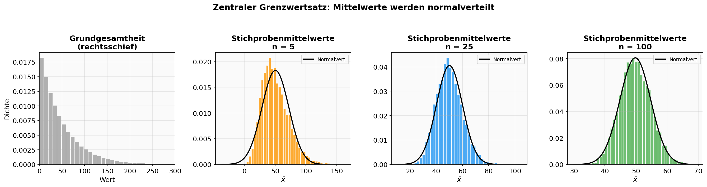
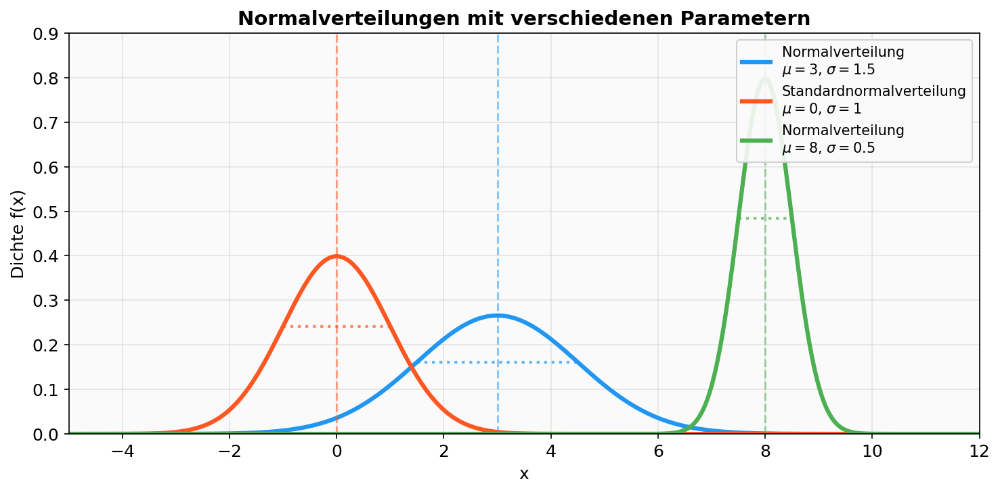
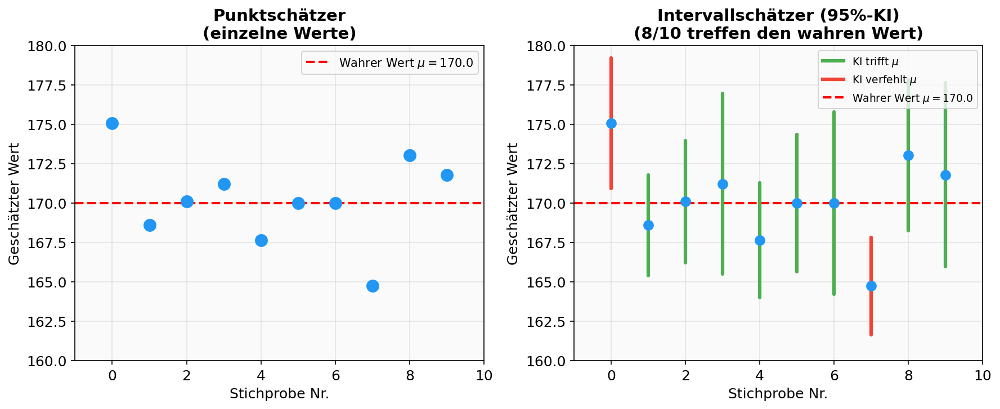
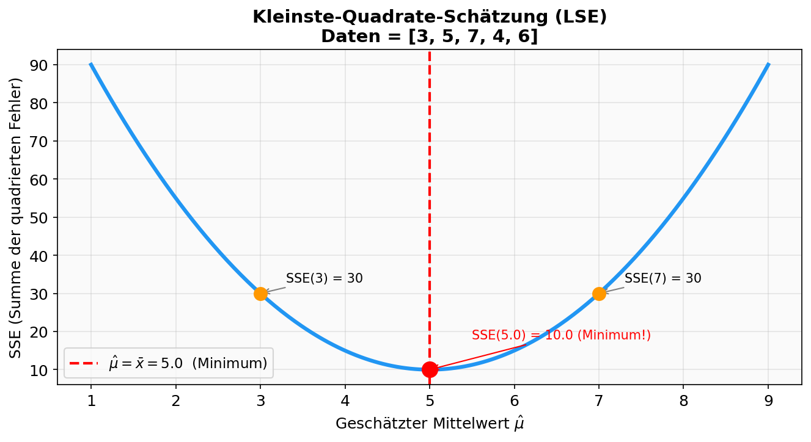
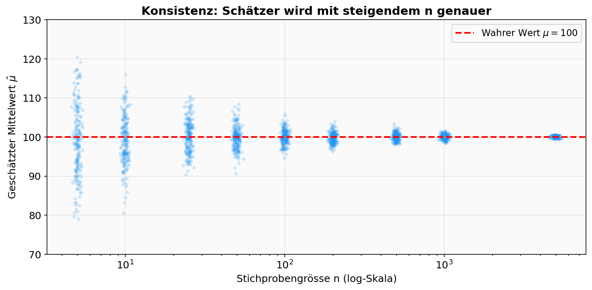
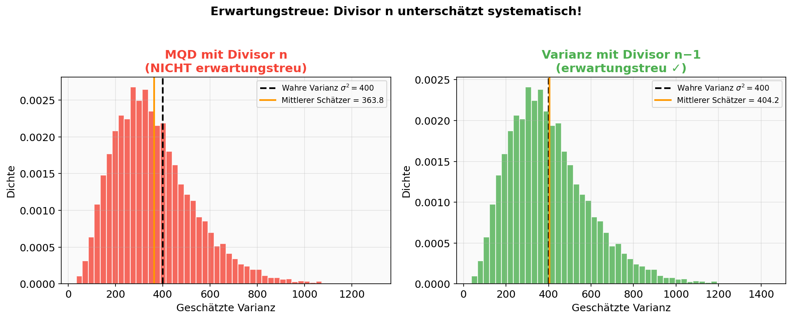
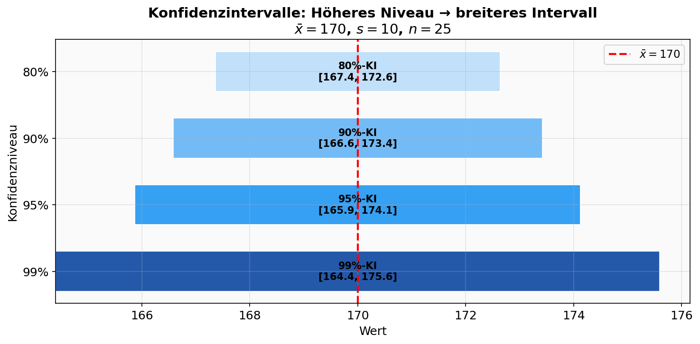
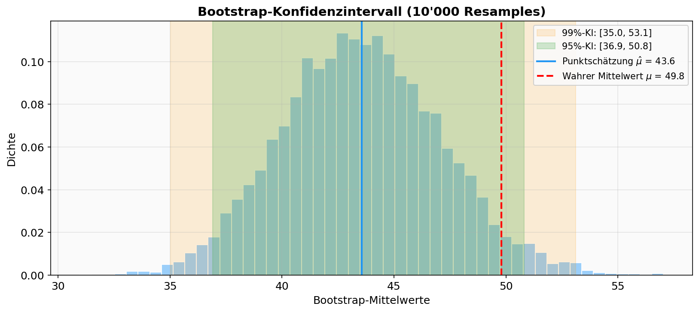

# 📑 ASTAT – Angewandte Statistik für Datenwissenschaften

## 📅 SW 06 – Schätzverfahren

---

## 🎯 Lernziele

1. Sie kennen den **zentralen Grenzwertsatz** und können die passende **Normalverteilung** in die Stichprobenverteilung zeichnen.
2. Sie kennen Eigenschaften von **Schätzverfahren** (konsistent, erwartungstreu).
3. Sie können **Punktschätzer** von **Intervallschätzern** unterscheiden.
4. Sie können für wichtige Parameter diese **Schätzer berechnen** (Mittelwert, Varianz, Konfidenzintervall).

---

## 📖 Wichtigste Begriffe

| Begriff | Englisch | Definition |
| :--- | :--- | :--- |
| **Normalverteilung** | *Normal distribution* | Stetige Verteilung mit Glockenkurve, parametrisiert durch $\mu$ (Erwartungswert) und $\sigma$ (Standardabweichung). Dichte: $f(x) = \frac{1}{\sigma\sqrt{2\pi}} e^{-\frac{(x-\mu)^2}{2\sigma^2}}$ |
| **Standardnormalverteilung** | *Standard normal distribution* | Spezialfall mit $\mu = 0$ und $\sigma = 1$. In SciPy: `norm(loc=0, scale=1)`. |
| **Zentraler Grenzwertsatz (ZGS)** | *Central Limit Theorem (CLT)* | Stichprobenmittelwerte nähern sich einer Normalverteilung an, wenn $n$ gross wird – **unabhängig** von der Verteilung der Grundgesamtheit. |
| **Schätztheorie** | *Estimation theory* | Teilgebiet der Statistik: unbekannte Parameter einer Grundgesamtheit auf Basis von Stichproben **schätzen**. |
| **Punktschätzer** | *Point estimator* | Gibt **einen einzelnen Wert** als Schätzung für einen unbekannten Parameter an (z.B. $\hat{\mu} = \bar{x}$). |
| **Intervallschätzer** | *Interval estimator* | Gibt ein **Intervall** an, in dem der wahre Parameter mit einer bestimmten Wahrscheinlichkeit liegt. |
| **Konfidenzintervall** | *Confidence interval* | Intervall $[\hat{\theta} - \delta_n,\; \hat{\theta} + \delta_n]$ das den wahren Parameter $\theta$ mit Wahrscheinlichkeit $\alpha$ überdeckt. |
| **Konfidenzniveau** | *Confidence level* | Die Wahrscheinlichkeit $\alpha$ (z.B. 95% oder 99%), mit der das Konfidenzintervall den wahren Parameter überdeckt. |
| **Stichprobenfehler** | *Sampling error* | Die Grösse $\delta_n$ des Konfidenzintervalls um den Punktschätzer herum. |
| **Konsistenz** | *Consistency* | Eigenschaft: Mit wachsender Stichprobengrösse $n$ nähert sich der Schätzer dem wahren Parameter an. |
| **Erwartungstreue** | *Unbiasedness* | Eigenschaft: Im Mittel über alle Stichproben schätzt der Schätzer den wahren Parameter **korrekt**. |
| **Kleinste-Quadrate-Schätzung (LSE)** | *Least Squares Estimation* | Methode, die die Summe der quadrierten Fehler (SSE) minimiert. |
| **Maximum-Likelihood-Schätzung (MLE)** | *Maximum Likelihood Estimation* | Methode, die den Parameter so wählt, dass die beobachteten Daten **am wahrscheinlichsten** sind. |
| **Bootstrap** | *Bootstrap* | Moderne Computer-Methode zur Berechnung von Konfidenzintervallen durch **wiederholtes Ziehen mit Zurücklegen** aus der eigenen Stichprobe. |
| **$t$-Verteilung** | *$t$-distribution* | Verteilung, die in der klassischen Statistik zur Berechnung von Konfidenzintervallen für Mittelwerte verwendet wird. |

---

## 📐 Konzepte & Definitionen

### 1. Der Zentrale Grenzwertsatz (ZGS)

> **Formale Definition:** Unabhängig von der Verteilung in der Grundgesamtheit gilt für Stichprobenmittelwerte:
> 1. Die Verteilung der Stichprobenmittelwerte nähert sich für grosse $n$ einer **Normalverteilung** an.
> 2. Die **mittlere Lage** der Stichprobenmittelwerte = mittlere Lage in der Grundgesamtheit.
> 3. Die **Streuung** der Stichprobenmittelwerte = $\frac{\text{Streuung in der Grundgesamtheit}}{\sqrt{n}}$.

**Intuitive Erklärung:** Egal wie „wild" die Originalverteilung aussieht (schief, bimodal, etc.) – wenn man genügend grosse Stichproben zieht und deren Mittelwerte berechnet, bilden diese Mittelwerte immer eine **Glockenkurve**.

<center>

</center>

**Konkretes Zahlenbeispiel (Lending Club Einkommen):**

| | Grundgesamtheit | $n = 25$ | $n = 400$ |
|---|---|---|---|
| **Mittlere Lage** | $\mu = 68\,760.52$ | $\bar{x}_{25} \approx 68\,388.86$ | $\bar{x}_{400} \approx 68\,758.96$ |
| **Streuung** | $\sigma = 32\,871.70$ | $s_{25} \approx 6\,518.53$ | $s_{400} \approx 1\,654.40$ |
| **Erwartete Streuung** ($\sigma / \sqrt{n}$) | — | $32\,871.70 / 5 = 6\,574.34$ ✓ | $32\,871.70 / 20 = 1\,643.59$ ✓ |

→ Die empirischen und theoretischen Werte stimmen hervorragend überein!

---

### 2. Die Normalverteilung

> **Formale Definition:** Eine normalverteilte Zufallsvariable $X$ hat die Dichtefunktion:
> $$f(x) = \frac{1}{\sigma \cdot \sqrt{2\pi}} \cdot e^{-\frac{(x - \mu)^2}{2 \sigma^2}}$$

| Parameter | Bedeutung | In SciPy |
|---|---|---|
| $\mu$ (Erwartungswert) | Lage der Glockenkurve (Symmetrieachse) | `loc` |
| $\sigma$ (Standardabweichung) | Breite der Glockenkurve | `scale` |

**Drei Beispiele:**

| | $X_1$ | $X_2$ (Standard) | $X_3$ |
|---|---|---|---|
| `loc` ($\mu$) | 3 | 0 | 8 |
| `scale` ($\sigma$) | 1.5 | 1 | 0.5 |
| Kurve | breit, bei 3 zentriert | mittel, bei 0 zentriert | schmal, bei 8 zentriert |

→ Kleineres $\sigma$ = **schmalere** Glockenkurve. Grösseres $\sigma$ = **breitere** Glockenkurve.

<center>

</center>

---

### 3. Schätzverfahren – Übersicht

> **Definition:** Die **Schätztheorie** beschäftigt sich damit, unbekannte Verteilungsparameter ($\mu$, $\sigma$, etc.) einer Grundgesamtheit auf Basis von Zufallsstichproben zu **schätzen**.

**Notation:**
- **Kennzahlen der Grundgesamtheit** → griechische Buchstaben: $\mu$, $\sigma$, $\pi$
- **Geschätzte Werte** → gleiche Symbole **mit Hausdach** $\hat{}$: $\hat{\mu}$, $\hat{\sigma}$, $\hat{\pi}$

---

### 4. Punktschätzer vs. Intervallschätzer

| | **Punktschätzer** | **Intervallschätzer** |
|:---|:---|:---|
| **Was?** | Ein **einzelner Wert** | Ein **Intervall** $[a, b]$ |
| **Beispiel** | $\hat{\mu} = \bar{x} = 170.8$ cm | $K = [168.5,\; 173.1]$ cm (95%-KI) |
| **Vorteil** | Einfach und direkt interpretierbar | Enthält Information über die **Unsicherheit** der Schätzung |
| **Nachteil** | Keine Info über Unsicherheit | Komplexer als ein einzelner Wert |
| **Analogie** | Wie ein einzelner Schuss auf eine Zielscheibe – kann treffen oder daneben liegen | Wie ein Zielfernrohr mit Streuung – gibt einen **Bereich möglicher Werte** an |

<center>

</center>

---

### 5. Methoden zur Bestimmung von Punktschätzern

#### a) Kleinste-Quadrate-Schätzung (LSE – Least Squares Estimation)

- **Keine** Annahme über die Verteilung der Grundgesamtheit nötig.
- **Ziel:** Minimiere die **Summe der quadrierten Fehler** (SSE):
$$\text{SSE}(\hat{\mu}) = (x_1 - \hat{\mu})^2 + (x_2 - \hat{\mu})^2 + \cdots + (x_n - \hat{\mu})^2$$
- **Ergebnis:** $\hat{\mu} = \frac{1}{n}(x_1 + x_2 + \cdots + x_n) = \bar{x}$ (arithmetisches Mittel)

**Zahlenbeispiel:** Stichprobe $= [4, 6, 8]$:
$$\text{SSE}(\hat{\mu}) = (4 - \hat{\mu})^2 + (6 - \hat{\mu})^2 + (8 - \hat{\mu})^2$$
Minimum bei $\hat{\mu} = \bar{x} = \frac{4+6+8}{3} = 6.0$

<center>

</center>

#### b) Maximum-Likelihood-Schätzung (MLE – Maximum Likelihood Estimation)

- **Annahme:** Daten stammen aus einer **bestimmten Verteilung** (z.B. Normalverteilung).
- **Ziel:** Wähle $\hat{\mu}$ so, dass die **Likelihood-Funktion** maximal wird:

$$L(\hat{\mu}) = \prod_{i=1}^{n} \frac{1}{\sigma\sqrt{2\pi}} e^{-\frac{(x_i - \hat{\mu})^2}{2\sigma^2}} = P(X_1 = x_1) \cdot P(X_2 = x_2) \cdots P(X_n = x_n)$$

- **Interpretation:** Die Likelihood-Funktion gibt an, wie **wahrscheinlich** die beobachteten Daten bei gegebenem $\hat{\mu}$ sind.
- **Ergebnis:** Auch hier: $\hat{\mu} = \bar{x}$ (arithmetisches Mittel)

> 💡 **Beide Methoden (LSE und MLE) liefern denselben Schätzer** für den Mittelwert: das arithmetische Mittel $\bar{x}$.

---

### 6. Eigenschaften von Punktschätzern

| Eigenschaft | Definition | Mathematisch |
|:---|:---|:---|
| **Konsistenz** | Mit zunehmendem $n$ werden grosse Abweichungen zwischen $\hat{\theta}_n$ und $\theta$ immer **seltener**. | $\lim_{n \to \infty} P(\lvert\hat{\theta}_n - \theta\rvert < \varepsilon) = 1$ für beliebig kleine $\varepsilon > 0$ |
| **Erwartungstreue** | Im Mittel über alle Stichproben schätzt der Schätzer den Parameter **korrekt**. | $E_{\text{über alle Stichproben}}(\hat{\theta}) = \theta$ |

**Wichtige Beispiele:**
- Der **Stichprobenmittelwert** $\bar{x}$ ist sowohl **konsistent** als auch **erwartungstreu** für $\mu$.
- Der **Stichprobenmedian** ist **konsistent**, aber im Allgemeinen **nicht erwartungstreu** für den wahren Median.
- Die **MQD** (mittlere quadratische Abweichung mit Divisor $n$) ist **nur konsistent**, nicht erwartungstreu für $\sigma^2$.

<center>

</center>

---

### 7. Wichtige Punktschätzer (erwartungstreu)

Gegeben: Zufallsstichprobe $x_1, x_2, \ldots, x_n$ vom Umfang $n$.

| Parameter | Schätzer | Formel |
|:---|:---|:---|
| **Mittelwert** $\mu$ | $\hat{\mu}$ | $\hat{\mu} = \frac{1}{n}(x_1 + x_2 + \cdots + x_n) = \bar{x}$ |
| **Varianz** $\sigma^2$ | $\hat{\sigma}^2$ | $\hat{\sigma}^2 = \frac{1}{\textcolor{red}{n-1}} \sum_{i=1}^{n} (x_i - \bar{x})^2$ |
| **Anteil** $\pi$ | $\hat{\pi}$ | $\hat{\pi} = \frac{\text{Anzahl Erfolge}}{n} = h(\text{Erfolg})$ (relative Häufigkeit) |

> ⚠️ **Achtung:** Für die **erwartungstreue** Schätzung der Varianz wird durch $n-1$ geteilt (nicht durch $n$)! Die MQD mit Divisor $n$ ist **nur konsistent**, nicht erwartungstreu.

**Zahlenbeispiel:** Stichprobe $= [4, 6, 8]$, $\bar{x} = 6$:
- **Nicht erwartungstreu** (Divisor $n$): $\text{MQD} = \frac{(4-6)^2 + (6-6)^2 + (8-6)^2}{3} = \frac{8}{3} \approx 2.667$
- **Erwartungstreu** (Divisor $n-1$): $\hat{\sigma}^2 = \frac{(4-6)^2 + (6-6)^2 + (8-6)^2}{2} = \frac{8}{2} = 4.0$

In Python: `np.std(data, ddof=0)` → Divisor $n$; `np.std(data, ddof=1)` → Divisor $n-1$.

<center>

</center>

---

### 8. Konfidenzintervalle (Intervallschätzung)

> **Definition:** Ein **Konfidenzintervall** für einen Parameter $\theta$ ist ein Intervall
> $$K = [\hat{\theta} - \delta_n,\;\hat{\theta} + \delta_n]$$
> wobei der Stichprobenfehler $\delta_n$ so bestimmt wird, dass $P(\theta \in K) = \alpha$ (Konfidenzniveau).

#### a) Klassische Methode mit $t$-Verteilung

Für Mittelwerte (unter Annahme der Normalverteilung):

$$\delta = t_{1-\alpha/2}(n-1) \cdot \frac{\hat{\sigma}}{\sqrt{n}}$$

| Symbol | Bedeutung |
|---|---|
| $t_{1-\alpha/2}(n-1)$ | $(1-\alpha/2)$-Quantil der $t$-Verteilung mit $n-1$ Freiheitsgraden |
| $\hat{\sigma}$ | Geschätzte Standardabweichung (mit $n-1$ im Nenner) |
| $n$ | Stichprobengrösse |

**Zahlenbeispiel:** 95%-KI, $n = 25$, $\bar{x} = 170$, $\hat{\sigma} = 10$:
- $t_{0.975}(24) \approx 2.064$
- $\delta = 2.064 \cdot \frac{10}{\sqrt{25}} = 2.064 \cdot 2 = 4.128$
- $K = [170 - 4.128,\; 170 + 4.128] = [165.87,\; 174.13]$

<center>

</center>

#### b) Bootstrap-Verfahren (moderne Computer-Methode)

> **Merksatz:** Bootstrap heisst, dass man sich selbst die Informationsgrundlage schafft, indem man aus den eigenen Daten **neue Zufallsstichproben** bildet, **statt theoretische Formeln** oder **neue Daten** zu verwenden.

**Bootstrap-Algorithmus:**

1. Ziehe ein **Resample** (**mit Zurücklegen**, Grösse $n$) aus den Daten.
2. Berechne den interessierenden Parameter für das Resample.
3. Wiederhole Schritte 1–2 **viele Male** (z.B. 10'000-mal).
4. Schneide $\frac{(100 - \alpha)}{2}\%$ der **geordneten** Resample-Werte an **beiden Enden** ab.
5. Die beiden Schnittstellen bilden die **Konfidenzschranken**.

**Beispiel:** 95%-Konfidenzintervall → links und rechts je **2.5%** abschneiden.
99%-Konfidenzintervall → links und rechts je **0.5%** abschneiden.

| Methode | Vorteil | Nachteil |
|:---|:---|:---|
| **$t$-Verteilung** | Formelmässig exakt, braucht keinen Computer | Setzt Normalverteilung voraus |
| **Bootstrap** | Keine Verteilungsannahme nötig, flexibel | Braucht Computer, Ergebnis variiert leicht |

<center>

</center>

---

## 🔢 Formeln & Rechenregeln

### Formel 1: Dichtefunktion der Normalverteilung

$$f(x) = \frac{1}{\sigma \sqrt{2\pi}} \cdot e^{-\frac{(x - \mu)^2}{2\sigma^2}}$$

| Variable | Bedeutung | Beispielwert |
|---|---|---|
| $\mu$ | Erwartungswert (Zentrum der Kurve) | 0 |
| $\sigma$ | Standardabweichung (Breite der Kurve) | 1 |

**Beispiel:** $\mu = 0$, $\sigma = 1$ (Standardnormalverteilung), $x = 0$:
$$f(0) = \frac{1}{1 \cdot \sqrt{2\pi}} \cdot e^0 = \frac{1}{\sqrt{2\pi}} \approx 0.3989$$

---

### Formel 2: Streuung der Stichprobenmittelwerte (aus dem ZGS)

$$\sigma_{\bar{x}} = \frac{\sigma}{\sqrt{n}}$$

| Variable | Bedeutung |
|---|---|
| $\sigma$ | Standardabweichung in der Grundgesamtheit |
| $n$ | Stichprobengrösse |

**Beispiel:** $\sigma = 32\,871.70$, $n = 400$:
$$\sigma_{\bar{x}} = \frac{32\,871.70}{\sqrt{400}} = \frac{32\,871.70}{20} = 1\,643.59$$

> ⚠️ **Wichtig:** Verdopplung von $n$ halbiert die Streuung **nicht**, sondern reduziert sie nur um den Faktor $\frac{1}{\sqrt{2}} \approx 0.71$. Um die Streuung zu **halbieren**, braucht man die **4-fache** Stichprobengrösse!

---

### Formel 3: Erwartungstreuer Schätzer für den Mittelwert

$$\hat{\mu} = \bar{x} = \frac{1}{n} \sum_{i=1}^{n} x_i$$

**Beispiel:** Stichprobe $= [800, 600, 900, 800, 700]$:
$$\hat{\mu} = \frac{800 + 600 + 900 + 800 + 700}{5} = \frac{3800}{5} = 760$$

---

### Formel 4: Erwartungstreuer Schätzer für die Varianz

$$\hat{\sigma}^2 = \frac{1}{n-1} \sum_{i=1}^{n} (x_i - \bar{x})^2$$

| Variable | Bedeutung |
|---|---|
| $n-1$ | **Bessel-Korrektur** → sorgt für Erwartungstreue |
| $\bar{x}$ | Stichprobenmittelwert |

**Beispiel:** Stichprobe $= [4, 6, 8]$, $\bar{x} = 6$:
$$\hat{\sigma}^2 = \frac{(4-6)^2 + (6-6)^2 + (8-6)^2}{3-1} = \frac{4 + 0 + 4}{2} = 4.0$$

> ⚠️ **Randfall:** Bei $n = 1$ ist $\hat{\sigma}^2$ **nicht definiert** (Division durch 0).

---

### Formel 5: Konfidenzintervall mit $t$-Verteilung

$$K = \left[\bar{x} - t_{1-\alpha/2}(n-1) \cdot \frac{\hat{\sigma}}{\sqrt{n}},\;\; \bar{x} + t_{1-\alpha/2}(n-1) \cdot \frac{\hat{\sigma}}{\sqrt{n}}\right]$$

**Beispiel:** 95%-KI, $\bar{x} = 100$, $\hat{\sigma} = 15$, $n = 36$:
- $t_{0.975}(35) \approx 2.030$
- $\delta = 2.030 \cdot \frac{15}{\sqrt{36}} = 2.030 \cdot 2.5 = 5.075$
- $K = [94.93,\; 105.08]$

---

### Formel 6: Summe der quadrierten Fehler (SSE)

$$\text{SSE}(\hat{\mu}) = \sum_{i=1}^{n} (x_i - \hat{\mu})^2$$

**Beispiel:** Stichprobe $= [3, 5, 7]$, $\hat{\mu} = 5$:
$$\text{SSE}(5) = (3-5)^2 + (5-5)^2 + (7-5)^2 = 4 + 0 + 4 = 8$$
Für $\hat{\mu} = 4$: $\text{SSE}(4) = 1 + 1 + 9 = 11$ → grösser, also schlechter!

---

## 📊 Vergleiche & Klassifizierungen

### I. Punktschätzer vs. Intervallschätzer

| | **Punktschätzer** | **Intervallschätzer** |
|:---|:---|:---|
| **Ergebnis** | Ein einzelner Wert | Ein Intervall $[a, b]$ |
| **Unsicherheit** | ❌ Nicht quantifiziert | ✅ Explizit angegeben |
| **Beispiel Mittelwert** | $\hat{\mu} = 68\,760$ | $K_{95\%} = [65\,000;\; 72\,520]$ |
| **Analogie** | Einzelner Schuss auf Zielscheibe | Zielfernrohr mit erlaubter Streuung |

### II. LSE vs. MLE

| | **LSE** | **MLE** |
|:---|:---|:---|
| **Verteilungsannahme** | ❌ Keine | ✅ Ja (z.B. Normalverteilung) |
| **Optimierungsziel** | Minimiere **SSE** (Summe quadrierter Fehler) | Maximiere **Likelihood** (Wahrscheinlichkeit der Daten) |
| **Ergebnis für $\hat{\mu}$** | $\bar{x}$ | $\bar{x}$ |
| **Vorteil** | Einfach, keine Verteilungsannahme | Nutzt mehr Info (Verteilungsform) |

### III. Schätzer-Eigenschaften

| Eigenschaft | Bedeutung | Beispiel |
|:---|:---|:---|
| **Konsistent** | Für grosse $n$ → $\hat{\theta} \to \theta$ | Stichprobenmedian für den Median |
| **Erwartungstreu** | $E(\hat{\theta}) = \theta$ (im Mittel korrekt) | $\bar{x}$ für $\mu$ |
| **Konsistent + Erwartungstreu** | Beides! | $\bar{x}$ für $\mu$, $\hat{\sigma}^2$ (mit $n-1$) für $\sigma^2$ |
| **Konsistent, aber NICHT erwartungstreu** | Konvergiert, aber systematisch verschoben | MQD (Divisor $n$) für $\sigma^2$, Stichprobenmedian |

### IV. Klassisches KI vs. Bootstrap-KI

| | **Klassisch ($t$-Verteilung)** | **Bootstrap** |
|:---|:---|:---|
| **Verteilungsannahme** | Normalverteilung | Keine |
| **Computer nötig?** | Nein (Tabelle genügt) | Ja |
| **Flexibilität** | Nur Mittelwert, Anteil, etc. | Beliebige Parameter |
| **Reproduzierbarkeit** | Exakt gleich | Leichte Variation (Zufalls-Resamples) |
| **Wann verwenden?** | Genug Daten, plausible Normalverteilung | Unklare Verteilung, kleine Stichproben, komplexe Parameter |

---

## 💻 Code-Beispiele (Python)

### Konzept 1: Normalverteilung erstellen und plotten

Wir definieren drei normalverteilte Zufallsvariablen mit verschiedenen Erwartungswerten und Standardabweichungen und zeichnen deren Dichtefunktionen.

```python
import matplotlib.pyplot as plt
import numpy as np
from scipy.stats import norm

# Drei Normalverteilungen definieren
X_1 = norm(loc=3, scale=1.5)     # μ=3, σ=1.5
X_2 = norm(loc=0, scale=1)       # Standard-Normalverteilung (μ=0, σ=1)
X_3 = norm(loc=8, scale=0.5)     # μ=8, σ=0.5

# x-Koordinaten und Dichtefunktionen berechnen
x = np.linspace(-3.1, 12.1, 200)
X_pdf_1 = X_1.pdf(x)
X_pdf_2 = X_2.pdf(x)
X_pdf_3 = X_3.pdf(x)

# Plotten
fig = plt.figure(figsize=(13, 5))
axi = fig.add_subplot(1, 1, 1)
axi.plot(x, X_pdf_1, lw=3)
axi.plot(x, X_pdf_2, lw=3)
axi.plot(x, X_pdf_3, lw=3)
axi.legend(["loc=3, scale=1.5", "loc=0, scale=1.0", "loc=8, scale=0.5"])
plt.show()
```

**Output/Interpretation:** Drei Glockenkurven mit unterschiedlicher Lage und Breite. Grösseres $\sigma$ (`scale`) → breitere, flachere Kurve. Kleineres $\sigma$ → schmalere, höhere Kurve. Die gestrichelten vertikalen Linien markieren $\mu$, die horizontalen $\sigma$.

---

### Konzept 2: Zentraler Grenzwertsatz – Mittlere Lage

Wir ziehen 1000 Stichproben der Grösse $n=25$ bzw. $n=400$ und vergleichen die mittlere Lage der Stichprobenmittelwerte mit dem Mittelwert der Grundgesamtheit.

```python
import numpy as np
import pandas as pd

income = pd.read_csv("Daten/loans_income.csv")

# 1000 Stichprobenmittelwerte berechnen
stichprobenmittelwerte_25 = [np.random.choice(income["x"],
                                             size=25,
                                             replace=False).mean()
                            for _ in range(1000)]

stichprobenmittelwerte_400 = [np.random.choice(income["x"],
                                              size=400,
                                              replace=False).mean()
                            for _ in range(1000)]

# Vergleich: mittlere Lage
mittelwert_G = income["x"].mean()
mittelwert_25 = np.array(stichprobenmittelwerte_25).mean()
mittelwert_400 = np.array(stichprobenmittelwerte_400).mean()

print("Mittlerer Lohn in der Grundgesamtheit               :", round(mittelwert_G, 2))
print("Mittlere Lage der Stichprobenmittelwerte mit n = 25 :", round(mittelwert_25, 2))
print("Mittlere Lage der Stichprobenmittelwerte mit n = 400:", round(mittelwert_400, 2))
```

**Output:**
```
Mittlerer Lohn in der Grundgesamtheit               : 68760.52
Mittlere Lage der Stichprobenmittelwerte mit n = 25 : 68388.86
Mittlere Lage der Stichprobenmittelwerte mit n = 400: 68758.96
```

**Interpretation:** Die Stichprobenmittelwerte liegen **um denselben Wert** wie der Populationsmittelwert. Mit grösserem $n$ wird die Übereinstimmung **besser** – genau wie der ZGS vorhersagt.

---

### Konzept 3: Zentraler Grenzwertsatz – Streuung

Vergleich der empirischen Streuung der Stichprobenmittelwerte mit der theoretischen Vorhersage $\sigma / \sqrt{n}$.

```python
# Standardabweichung in der Grundgesamtheit
std_G = income["x"].std(ddof=0)

# Empirische Streuung der Stichprobenmittelwerte
std_25 = np.array(stichprobenmittelwerte_25).std(ddof=0)
std_400 = np.array(stichprobenmittelwerte_400).std(ddof=0)

print("Streuung der Stichprobenmittelwerte mit n = 25      :", round(std_25, 2))
print("Streuung in Grundgesamtheit / sqrt(25)              :", round(std_G / np.sqrt(25), 2))
print("Streuung der Stichprobenmittelwerte mit n = 400     :", round(std_400, 2))
print("Streuung in Grundgesamtheit / sqrt(400)             :", round(std_G / np.sqrt(400), 2))
```

**Output:**
```
Streuung der Stichprobenmittelwerte mit n = 25      : 6518.53
Streuung in Grundgesamtheit / sqrt(25)              : 6574.34
Streuung der Stichprobenmittelwerte mit n = 400     : 1654.40
Streuung in Grundgesamtheit / sqrt(400)             : 1643.59
```

**Interpretation:** Die empirische Streuung der Stichprobenmittelwerte stimmt mit der Formel $\sigma / \sqrt{n}$ überein. Grösseres $n$ → **geringere** Streuung der Mittelwerte.

---

### Konzept 4: Bootstrap-Konfidenzintervall berechnen

Wir berechnen ein 95%- und 99%-Konfidenzintervall für den Mittelwert mit dem Bootstrap-Verfahren.

```python
import numpy as np
import pandas as pd

income = pd.read_csv("Daten/loans_income.csv")

# Eine Stichprobe der Grösse n=128 ziehen
stichprobe = np.random.choice(income["x"], size=128, replace=False)

# Bootstrap: 10'000 Resamples mit Zurücklegen
n_resamples = 10000
bootstrap_mittelwerte = [np.random.choice(stichprobe,
                                          size=len(stichprobe),
                                          replace=True).mean()
                         for _ in range(n_resamples)]

# Geordnete Bootstrap-Mittelwerte
bootstrap_sortiert = np.sort(bootstrap_mittelwerte)

# 95%-Konfidenzintervall: 2.5% links und rechts abschneiden
ki_95_unten = np.percentile(bootstrap_mittelwerte, 2.5)
ki_95_oben = np.percentile(bootstrap_mittelwerte, 97.5)

# 99%-Konfidenzintervall: 0.5% links und rechts abschneiden
ki_99_unten = np.percentile(bootstrap_mittelwerte, 0.5)
ki_99_oben = np.percentile(bootstrap_mittelwerte, 99.5)

print(f"Punktschätzung (Mittelwert): {stichprobe.mean():.2f}")
print(f"95%-KI: [{ki_95_unten:.2f}, {ki_95_oben:.2f}]")
print(f"99%-KI: [{ki_99_unten:.2f}, {ki_99_oben:.2f}]")
```

**Output/Interpretation:** Das 95%-KI ist **schmaler** als das 99%-KI, da man bei höherem Konfidenzniveau einen **breiteren** Bereich braucht, um sicherer zu sein, den wahren Parameter abzudecken.

---

### Konzept 5: Konfidenzintervall mit $t$-Verteilung

Berechnung eines Konfidenzintervalls für den Mittelwert mit der klassischen Formel.

```python
import numpy as np
from scipy.stats import t

# Stichprobendaten
stichprobe = np.array([65, 72, 68, 70, 74, 66, 71, 69, 73, 67])

n = len(stichprobe)
x_bar = stichprobe.mean()
s_hat = stichprobe.std(ddof=1)  # Erwartungstreuer Schätzer (n-1)

# 95%-Konfidenzintervall
alpha = 0.95
t_quantil = t.ppf(1 - (1 - alpha) / 2, df=n-1)  # t_{0.975}(9)
delta = t_quantil * s_hat / np.sqrt(n)

print(f"Stichprobenmittelwert: {x_bar:.2f}")
print(f"Geschätzte Std.abw.:   {s_hat:.2f}")
print(f"t-Quantil (n-1={n-1}): {t_quantil:.4f}")
print(f"Stichprobenfehler δ:   {delta:.2f}")
print(f"95%-KI: [{x_bar - delta:.2f}, {x_bar + delta:.2f}]")
```

**Output/Interpretation:** Die $t$-Verteilung liefert ein exaktes Konfidenzintervall unter der Annahme, dass die Daten normalverteilt sind. Für grosse $n$ nähert sich die $t$-Verteilung der Standardnormalverteilung an.

---

## 🔗 Konzept-Code-Zuordnung

| Konzept | Python-Funktion/Code | Library | Beschreibung |
|:---|:---|:---|:---|
| Normalverteilung erstellen | `X = norm(loc=μ, scale=σ)` | `scipy.stats` | Erstellt eine normalverteilte Zufallsvariable |
| Dichtefunktion berechnen | `X.pdf(x)` | `scipy.stats` | Berechnet $f(x)$ der Normalverteilung |
| Erwartungswert abrufen | `X.mean()` | `scipy.stats` | Gibt $\mu$ zurück |
| Standardabweichung abrufen | `X.std()` | `scipy.stats` | Gibt $\sigma$ zurück |
| Stichprobenmittelwert | `np.array(data).mean()` | `numpy` | Berechnet $\bar{x} = \frac{1}{n} \sum x_i$ |
| Erwartungstreue Std.abw. | `np.std(data, ddof=1)` | `numpy` | Divisor $n-1$ → erwartungstreu |
| Nicht-erwartungstreue Std.abw. | `np.std(data, ddof=0)` | `numpy` | Divisor $n$ → nur konsistent |
| Zufallsstichprobe (ohne Zurücklegen) | `np.random.choice(data, size=n, replace=False)` | `numpy` | Für Stichproben aus Grundgesamtheit |
| Bootstrap-Resample (mit Zurücklegen) | `np.random.choice(data, size=n, replace=True)` | `numpy` | Für Bootstrap-Konfidenzintervalle |
| Perzentil berechnen | `np.percentile(data, q)` | `numpy` | Für Bootstrap-KI-Grenzen |
| $t$-Quantil berechnen | `t.ppf(q, df=n-1)` | `scipy.stats` | Für klassisches Konfidenzintervall |
| CSV laden | `pd.read_csv("Datei.csv")` | `pandas` | Daten einlesen |

---

## ✏️ Übungsaufgaben-Zusammenfassung

### Aufgabe 1: Erwartungstreue Schätzer – Kleines Rechenbeispiel

| Aspekt | Detail |
|---|---|
| **Szenario** | 5 Personen (A–E) mit PKW-Besitz ($Y$) und Einkünften ($X$) |
| **Stichprobe** | $n = 2$ Personen (alle möglichen Kombinationen) |
| **Gesucht** | Wahre Parameter $\pi$, $\mu$, $\sigma^2$ und ob die Schätzer erwartungstreu sind |
| **Wahre Parameter** | $\pi = 3/5 = 0.6$, $\mu = 760$, $\sigma^2 = \text{MQD der Grundgesamtheit}$ |

**Aufgabenteile:**
1. Wahre Parameter aus Grundgesamtheit berechnen
2. Alle Stichproben **mit** Zurücklegen → Schätzer berechnen → Durchschnitt prüfen
3. Alle Stichproben **ohne** Zurücklegen → Schätzer berechnen → Durchschnitt prüfen
4. Erwartungstreue prüfen: Ist $E(\hat{\theta}) = \theta$?

| Schätzer | Formel | Erwartungstreu für $\hat{\mu}$ und $\hat{\pi}$? | Erwartungstreu für $\hat{\sigma}^2$ (Divisor $n$)? |
|---|---|---|---|
| Mit Zurücklegen | Alle $5^2 = 25$ Kombinationen | ✅ Ja | ❌ Nein (systematisch zu klein) |
| Ohne Zurücklegen | Alle $\binom{5}{2} = 10$ Kombinationen | ✅ Ja | ❌ Nein |

> 💡 **Fazit:** $\bar{x}$ und $h()$ sind erwartungstreu, aber MQD mit Divisor $n$ ist es **nicht** – man braucht den Divisor $n-1$!

---

### Aufgabe 2: Stichprobenmittelwerte und Bootstrap-KI (Lending Club)

| Aspekt | Detail |
|---|---|
| **Datei** | `Daten/loans_income.csv` |
| **Stichproben** | Je 1000 Stichproben der Grösse $n=8$, $n=32$, $n=128$ |
| **Teil 1** | Mittelwert und Std.abw. schätzen → mit wahren Parametern vergleichen |
| **Teil 2** | Bootstrap-KI (95% und 99%) für den Mittelwert mit $n=128$ |
| **Kernaussage** | Grössere $n$ → genauere Schätzung; Bootstrap liefert verlässliche KI |

---

### Aufgabe 3: Hühnerei-Daten (Palette.sav)

| Aspekt | Detail |
|---|---|
| **Datei** | `Daten/Palette.sav` (750 Hühnereier, Rasse: Lohmann Braun) |
| **Variablen** | Gewicht, Höhe, Breite |
| **Stichproben** | Je 100 Stichproben der Grösse $n=8$, $n=32$, $n=128$ |
| **Teil 1** | Mittelwerte und Std.abw. schätzen → mit wahren Parametern vergleichen |
| **Teil 2** | 95%- und 99%-Bootstrap-KI für Mittelwerte und Standardabweichungen mit $n=128$ |

---

## ⚠️ Prüfungsrelevante Hinweise

### 🚨 Typische SC/MC-Fallen

| Falle | Warum falsch? | Richtige Aussage |
|---|---|---|
| "Punktschätzer sind besser als Intervallschätzer." | ❌ Kommt auf den Kontext an! | Beide haben Vor- und Nachteile. Intervallschätzer liefern **zusätzlich** Information über die Unsicherheit. |
| "$\hat{\sigma}^2$ wird mit Divisor $n$ berechnet." | ❌ Divisor $n$ ergibt die MQD, die **nicht erwartungstreu** ist! | Für den **erwartungstreuen** Schätzer braucht man Divisor $n-1$ (Bessel-Korrektur). |
| "Der ZGS gilt nur für normalverteilte Grundgesamtheiten." | ❌ Das ist gerade der Punkt! | Der ZGS gilt **unabhängig** von der Verteilung der Grundgesamtheit. |
| "Ein 99%-KI ist schmaler als ein 95%-KI." | ❌ Höheres Konfidenzniveau = breiteres Intervall! | Mehr Sicherheit → breiterer Bereich nötig. |
| "Der Stichprobenmittelwert ist immer gleich $\mu$." | ❌ Einzelne Stichproben weichen ab! | $E(\bar{x}) = \mu$ gilt nur **im Durchschnitt** über alle Stichproben. |
| "Bootstrap braucht neue Daten aus der Grundgesamtheit." | ❌ Das ist was Bootstrap gerade **nicht** tut! | Bootstrap zieht **aus der vorhandenen Stichprobe** mit Zurücklegen. |

### 📝 Formeln auswendig / auf das A4-Blatt

| Formel | Auswendig? | Begründung |
|---|---|---|
| $f(x) = \frac{1}{\sigma\sqrt{2\pi}} e^{-\frac{(x-\mu)^2}{2\sigma^2}}$ | 📄 **A4-Blatt** | Komplex, aber wichtig zum Nachschlagen |
| $\sigma_{\bar{x}} = \sigma / \sqrt{n}$ | ✅ **Auswendig** | Kurz, wird ständig gebraucht |
| $\hat{\mu} = \bar{x}$ | ✅ **Auswendig** | Grundformel |
| $\hat{\sigma}^2 = \frac{1}{n-1}\sum(x_i - \bar{x})^2$ | 📄 **A4-Blatt** | Unterschied zu MQD merken! |
| $K = [\bar{x} \pm t_{1-\alpha/2}(n-1) \cdot \frac{\hat{\sigma}}{\sqrt{n}}]$ | 📄 **A4-Blatt** | Formel für Konfidenzintervall |
| Bootstrap: Enden abschneiden | ✅ **Auswendig** | Schneiden: $\frac{100 - \alpha}{2}\%$ an beiden Enden |

### 🧠 Merkregeln & Eselsbrücken

- **"Hausdach = geschätzt"**: $\hat{\mu}$ → Schätzung für $\mu$. Wenn ein Hausdach drauf ist, wissen wir es **nicht genau**.
- **"$n-1$ für Erwartungstreue"**: Varianz-Schätzer mit Divisor $n$ **unterschätzt** systematisch → $n-1$ korrigiert das (Bessel-Korrektur). Python: `ddof=1`.
- **"Bootstrap = Stiefelriemen"**: Man zieht sich selbst hoch, indem man aus den **eigenen Daten** neue Stichproben bildet.
- **"LSE und MLE sind sich einig"**: Für den Mittelwert liefern **beide** Methoden $\hat{\mu} = \bar{x}$.
- **"95% enger, 99% breiter"**: Höheres Konfidenzniveau → breiteres Intervall → mehr Sicherheit kostet Präzision.
- **"Wurzel-n-Gesetz"** (aus SW 05): Standardfehler fällt mit $1/\sqrt{n}$ → **4 × n** nötig, um Fehler zu halbieren.

### 🔢 Hinweise für numerische Antworten

- **ddof-Parameter:** In Python `np.std(data, ddof=0)` = Divisor $n$, `np.std(data, ddof=1)` = Divisor $n-1$. **Bei Schätzung für die Grundgesamtheit: `ddof=1`!**
- **Konfidenzintervalle:** Bei Bootstrap auf **Percentile** achten: 95%-KI → `np.percentile(data, [2.5, 97.5])`.
- **Rundung:** KI-Grenzen auf **2 Dezimalstellen** angeben, sofern nicht anders verlangt.
- **Einheiten:** KI hat die **gleiche Einheit** wie der geschätzte Parameter.

---

## 🔗 Verbindung zu vorherigen/folgenden Wochen

### ← Rückbezug

| Vorherige Woche | Verbindung zu SW 06 |
|---|---|
| **SW 02** (Datenbeschreibung) | $\bar{x}$ und $s$ aus SW 02 sind jetzt als **Punktschätzer** $\hat{\mu}$ und $\hat{\sigma}$ für die Grundgesamtheit formalisiert. Der Unterschied Divisor $n$ vs. $n-1$ wird nun klar. |
| **SW 04** (Zufallsmodelle) | Die **Normalverteilung** mit `norm(loc, scale)` aus SW 04 wird zur Modellierung der Stichprobenverteilung verwendet. |
| **SW 05** (Stichproben) | Die **Stichprobenverteilung** und die **Stichprobenvariabilität** aus SW 05 sind die Grundlage für den ZGS und die Konfidenzintervalle dieser Woche. Die Formel $SE = s/\sqrt{n}$ aus SW 05 erscheint hier im Konfidenzintervall. |

### → Vorausschau

| Folgende Woche | Warum SW 06 wichtig ist |
|---|---|
| **SW 07/08** (Testverfahren) | Hypothesentests nutzen **Konfidenzintervalle** und die **$t$-Verteilung**. Der **p-Wert** basiert auf der Stichprobenverteilung, die wir mit dem ZGS beschrieben haben. |
| **SW 09/10** (Zusammenhangsanalyse) | Korrelationskoeffizienten haben ebenfalls eine Stichprobenverteilung → gleiches Prinzip von Punkt- und Intervallschätzung. |
| **SW 11/12** (Regression) | Regressionskoeffizienten werden mit **LSE** (Kleinste Quadrate) geschätzt → genau die Methode aus dieser Woche. Auch für Regressionskoeffizienten werden Konfidenzintervalle und Signifikanztests berechnet. |
