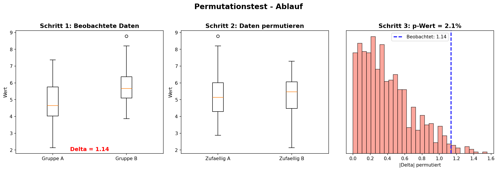
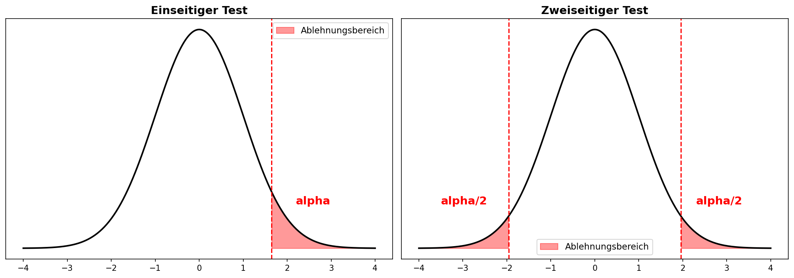
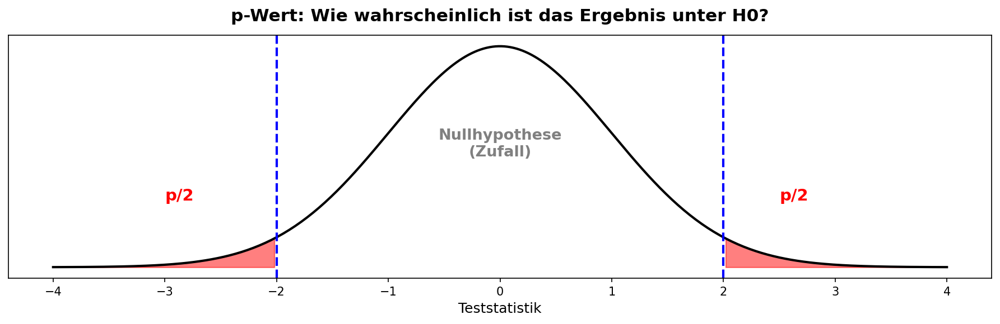
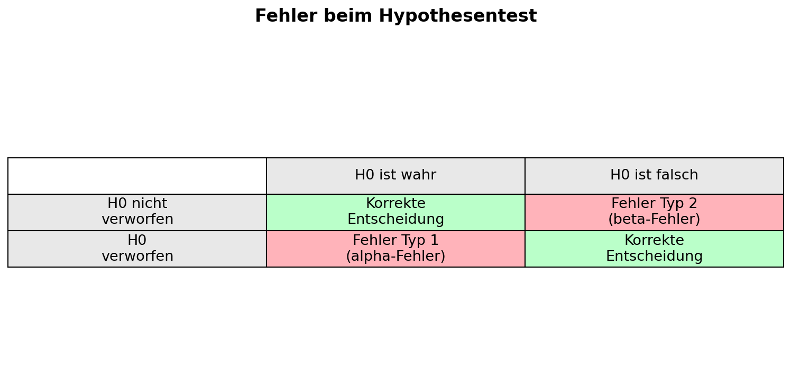
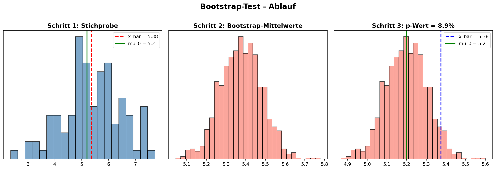

# ASTAT – Angewandte Statistik für Datenwissenschaften

## SW 07 – Testverfahren mit Resampling (Teil 1)

---

## Lernziele

1. Sie verstehen die Idee des **statistischen Testens**.
2. Sie kennen den Unterschied zwischen der **Nullhypothese** und der **Alternativhypothese**.
3. Sie können mit dem **Permutationstest** und **Bootstrap-Test** Hypothesen testen.
4. Sie können **p-Werte** bestimmen und kennen ihre Bedeutung.

---

## Wichtigste Begriffe

| Begriff | Englisch | Definition |
| :--- | :--- | :--- |
| **Hypothese** | *Hypothesis* | Eine **behauptete Annahme** über einen Zusammenhang in der Welt, die man **durch Daten überprüfen** kann. |
| **Nullhypothese** ($H_0$) | *Null hypothesis* | Grundannahme, dass ein Unterschied **nur auf den Zufall** zurückzuführen ist. |
| **Alternativhypothese** ($H_1$) | *Alternative hypothesis* | Die entgegengesetzte Behauptung zur Nullhypothese. Zusammen decken $H_0$ und $H_1$ **alle Möglichkeiten** ab. |
| **p-Wert** | *p-value* | Wahrscheinlichkeit, ein **mindestens so extremes** Ergebnis zu beobachten, **wenn $H_0$ gilt**. |
| **Signifikanzniveau** ($\alpha$) | *Significance level* | Schwellenwert (z.B. 5%), ab dem ein Ergebnis als **statistisch signifikant** gilt. |
| **Einseitiger Test** | *One-sided test* | Prüft, ob ein Effekt in **eine bestimmte Richtung** auftritt (gerichtete Alternativhypothese). |
| **Zweiseitiger Test** | *Two-sided test* | Prüft, ob ein Effekt in **irgendeine Richtung** auftritt (ungerichtete Alternativhypothese). |
| **Permutationstest** | *Permutation test* | Resampling-Verfahren zum Vergleich von **zwei Gruppen** durch zufälliges Vertauschen der Gruppenzugehörigkeit. |
| **Bootstrap-Test** | *Bootstrap test* | Resampling-Verfahren zum Vergleich einer **Stichprobe mit einem Sollwert** durch wiederholtes Ziehen mit Zurücklegen. |
| **A/B-Test** | *A/B test* | Kontrolliertes Experiment, bei dem **zwei Behandlungen** verglichen werden. |
| **Kontrollgruppe** | *Control group* | Gruppe mit **Standardbehandlung** oder **keiner Behandlung**, die als Vergleichsbasis dient. |
| **Fehler Typ 1** ($\alpha$-Fehler) | *Type I error* | $H_0$ wird **fälschlich verworfen** – man sieht einen Effekt, der gar nicht existiert. |
| **Fehler Typ 2** ($\beta$-Fehler) | *Type II error* | $H_0$ wird **fälschlich beibehalten** – ein vorhandener Effekt wird nicht erkannt. |
| **Resampling** | *Resampling* | Allgemeine Klasse von Methoden, die auf **wiederholtem Ziehen** oder **Neuordnen** der vorhandenen Daten beruhen. |

---

## Konzepte & Definitionen

### 1. Was ist ein statistischer Hypothesentest?

> **Merksatz:** Ein Hypothesentest prüft systematisch, ob ein beobachteter Effekt **grösser ist als das, was der Zufall vernünftigerweise hervorbringen könnte**.

Die klassische **Pipeline statistischer Schlussfolgerungen**:

$$\text{Hypothese aufstellen} \;\Rightarrow\; \text{Experiment entwerfen} \;\Rightarrow\; \text{Daten sammeln} \;\Rightarrow\; \text{Schlussfolgerung machen}$$

**Warum brauchen wir Hypothesentests?** Weil unser Verstand dazu neigt, die **Tragweite des Zufallsverhaltens** zu unterschätzen:
- Extreme Ereignisse werden nicht vorhergesehen.
- Zufällige Ereignisse werden **fälschlicherweise als Muster** interpretiert.

<center>

</center>

---

### 2. Nullhypothese vs. Alternativhypothese

| | **Nullhypothese** ($H_0$) | **Alternativhypothese** ($H_1$) |
|:---|:---|:---|
| **Inhalt** | Kein Effekt / kein Unterschied | Es gibt einen Effekt / Unterschied |
| **Rolle** | Wird als wahr angenommen, bis das Gegenteil bewiesen ist | Wird angenommen, wenn $H_0$ verworfen wird |
| **Beispiel** | "Die mittlere Bestellzeit ist gleich 5.2 Min." | "Die mittlere Bestellzeit ist **nicht** gleich 5.2 Min." |

> **Wichtig:** $H_0$ und $H_1$ müssen zusammen **alle Möglichkeiten** abdecken!

---

### 3. Einseitiger vs. Zweiseitiger Test

| | **Einseitiger Test** | **Zweiseitiger Test** |
|:---|:---|:---|
| **Alternativhypothese** | Gerichtet (z.B. "$\mu_A > \mu_B$") | Ungerichtet (z.B. "$\mu_A \neq \mu_B$") |
| **Ablehnungsbereich** | Nur auf **einer Seite** | Auf **beiden Seiten** |
| **Wann verwenden?** | Wenn die Richtung des Effekts vorab bekannt ist | Wenn jede Abweichung relevant ist |

<center>

</center>

---

### 4. Der p-Wert

> **Definition:** Der p-Wert gibt an, wie wahrscheinlich es wäre, ein Ergebnis zu beobachten, das **mindestens so extrem ist wie das tatsächlich gemessene** – unter der Annahme, dass $H_0$ gilt.

| p-Wert | Interpretation |
|:---|:---|
| Nahe bei **0** | Das Ergebnis ist unter $H_0$ **sehr ungewöhnlich** |
| Nahe bei **1** | Das Ergebnis ist mit **Zufall erklärbar** |

**Testentscheid:**
- $p \leq \alpha$ → $H_0$ **verwerfen** (statistisch signifikant)
- $p > \alpha$ → $H_0$ **beibehalten** (kein ausreichender Beleg)

> **Wichtig:** Ein nicht-signifikanter Test bedeutet **nicht**, dass $H_0$ wahr ist – nur dass die Daten **keinen starken Widerspruch** zu $H_0$ liefern!

<center>

</center>

---

### 5. Fehler beim Hypothesentest

| | $H_0$ ist **wahr** | $H_0$ ist **falsch** |
|:---|:---|:---|
| $H_0$ **nicht verworfen** | Korrekte Entscheidung | **Fehler Typ 2** ($\beta$-Fehler) |
| $H_0$ **verworfen** | **Fehler Typ 1** ($\alpha$-Fehler) | Korrekte Entscheidung |

- **Fehler Typ 1:** Man sieht einen Effekt, der **nicht existiert** (falsch positiv).
- **Fehler Typ 2:** Man übersieht einen Effekt, der **existiert** (falsch negativ). Oft bedeutet dies, dass die **Stichprobe zu klein** war.

> **Merksatz:** Hypothesentests sind so aufgebaut, dass **Fehler vom Typ 1 minimiert** werden.

<center>

</center>

---

### 6. Resampling-Verfahren

Resampling-Verfahren sind **nicht-parametrisch** – sie setzen **keine Verteilungsannahmen** voraus und sind besonders nützlich bei kleinen Stichproben.

#### a) Permutationstest – Vergleich von zwei Gruppen

**Idee:** Wenn $H_0$ gilt (kein Unterschied), ist es Zufall, welche Beobachtung zu welcher Gruppe gehört. Daher können wir die **Gruppenzugehörigkeiten zufällig vertauschen**.

**Algorithmus:**
1. Berechne den beobachteten Unterschied $\Delta_{\text{beobachtet}}$
2. Wiederhole viele Male:
   - a) Lege die Werte aus A und B zusammen
   - b) Teile sie **zufällig** in zwei Gruppen gleicher Grösse
   - c) Berechne den Unterschied $\Delta_{\text{resample}}$
3. **p-Wert** = relative Häufigkeit, wie oft $|\Delta_{\text{resample}}| \geq |\Delta_{\text{beobachtet}}|$

#### b) Bootstrap-Test – Stichprobe gegen Sollwert

**Idee:** Wenn wir nur **eine Stichprobe** haben und sie mit einem **Sollwert** vergleichen wollen, ziehen wir wiederholt **mit Zurücklegen** aus den eigenen Daten.

**Algorithmus:**
1. Berechne den beobachteten Wert $\theta_{\text{beobachtet}}$
2. Wiederhole viele Male:
   - a) Ziehe $n$ Werte **mit Zurücklegen** aus der Stichprobe
   - b) Berechne $\theta_{\text{resample}}$
3. **Verschiebe** die Bootstrap-Verteilung: $\theta_{\text{shift}} = \theta_{\text{resample}} - \overline{\theta}_{\text{resample}} + \theta_0$
4. **p-Wert** = relative Häufigkeit, wie oft $|\theta_{\text{shift}} - \theta_0| \geq |\theta_{\text{beobachtet}} - \theta_0|$

<center>

</center>

| Methode | Wann verwenden? |
|:---|:---|
| **Permutationstest** | Vergleich von **zwei (oder mehr) Gruppen** |
| **Bootstrap-Test** | Vergleich einer **Stichprobe mit einem Sollwert** |

---

### 7. A/B-Tests

> **Definition:** Ein ordnungsgemässer A/B-Test hat **Probanden**, die **nach dem Zufallsprinzip** der einen oder anderen Behandlung zugewiesen werden.

**Warum braucht es eine Kontrollgruppe?**
- Ohne Kontrollgruppe gibt es **keine Gewähr**, dass alle anderen Dinge gleich sind.
- Die Kontrollgruppe stellt sicher, dass ein Unterschied wirklich auf die **Behandlung** (oder den **Zufall**) zurückzuführen ist.

| Begriff | Bedeutung |
|:---|:---|
| **Blindstudie** | Probanden wissen nicht, welche Behandlung sie erhalten |
| **Doppelblindstudie** | Weder Probanden noch Prüfer wissen, wer welche Behandlung erhält |

---

## Formeln & Rechenregeln

### Formel 1: Beobachteter Unterschied (Permutationstest)

$$\Delta_{\text{beobachtet}} = \bar{x}_B - \bar{x}_A$$

| Variable | Bedeutung |
|---|---|
| $\bar{x}_A$ | Mittelwert in Gruppe A |
| $\bar{x}_B$ | Mittelwert in Gruppe B |

**Beispiel (Web-Stickiness):** $\bar{x}_A = 1.28$, $\bar{x}_B = 1.64$:
$$\Delta_{\text{beobachtet}} = 1.64 - 1.28 = 0.36$$

---

### Formel 2: p-Wert (zweiseitig, Permutationstest)

$$p = \frac{\text{Anzahl}(|\Delta_{\text{resample}}| \geq |\Delta_{\text{beobachtet}}|)}{\text{Anzahl Resamples}}$$

**Beispiel:** Bei 1000 Resamples sind 250 Mal $|\Delta_{\text{resample}}| \geq 0.36$:
$$p = \frac{250}{1000} = 0.25 = 25\%$$

→ $p = 25\% > 5\% = \alpha$ → $H_0$ wird **nicht verworfen**.

---

### Formel 3: Verschiebung im Bootstrap-Test

$$\theta_{\text{shift}} = \theta_{\text{resample}} - \overline{\theta}_{\text{resample}} + \theta_0$$

| Variable | Bedeutung |
|---|---|
| $\theta_{\text{resample}}$ | Parameterwert im Bootstrap-Resample |
| $\overline{\theta}_{\text{resample}}$ | Mittelwert aller Bootstrap-Resample-Werte |
| $\theta_0$ | Sollwert aus der Nullhypothese |

**Warum verschieben?** Damit die Bootstrap-Verteilung dort zentriert ist, **wo sie unter $H_0$ liegen würde**.

---

### Formel 4: Konversionsrate

$$r = \frac{\text{Anzahl Konversionen}}{\text{Gesamtanzahl}} \cdot 100\%$$

**Beispiel:** 200 Konversionen bei 23'739 Besuchern:
$$r_A = \frac{200}{23739} \cdot 100 \approx 0.8425\%$$

---

## Vergleiche & Klassifizierungen

### I. Permutationstest vs. Bootstrap-Test

| | **Permutationstest** | **Bootstrap-Test** |
|:---|:---|:---|
| **Anwendungsfall** | Vergleich von **zwei Gruppen** | Stichprobe gegen **Sollwert** |
| **Resampling-Methode** | Zufällige **Permutation** der Daten | Ziehen **mit Zurücklegen** |
| **Verschiebung nötig?** | Nein | Ja (auf $\theta_0$ zentrieren) |
| **Zweite Gruppe nötig?** | Ja | Nein |

### II. Resampling vs. Klassische Tests

| | **Resampling** | **Klassische Tests** (z.B. t-Test) |
|:---|:---|:---|
| **Verteilungsannahme** | Keine | Ja (z.B. Normalverteilung) |
| **Computer nötig?** | Ja | Nein (Tabelle genügt) |
| **Flexibilität** | Beliebige Parameter | Eingeschränkt |
| **Kleine Stichproben** | Gut geeignet | Annahmen oft verletzt |

### III. Einseitig vs. Zweiseitig

| | **Einseitig** | **Zweiseitig** |
|:---|:---|:---|
| **p-Wert Berechnung** | Nur extreme Werte in **einer** Richtung | Extreme Werte in **beiden** Richtungen |
| **Signifikanz** | Leichter zu erreichen | Schwerer zu erreichen |
| **Wann?** | Richtung vorab bekannt | Jede Abweichung relevant |

---

## Code-Beispiele (Python)

### Konzept 1: Permutationstest (Web-Stickiness)

Wir testen, ob sich die Verweildauer auf zwei Webseiten signifikant unterscheidet.

```python
import numpy as np
import pandas as pd
import matplotlib.pyplot as plt
import seaborn as sns

# Daten laden
webpage_data = pd.read_csv("Daten/web_page_data.csv")

# Mittelwerte berechnen
mu_A = webpage_data["Time"][webpage_data["Page"]=="Page A"].mean()
mu_B = webpage_data["Time"][webpage_data["Page"]=="Page B"].mean()
mu_diff_beobachtet = mu_B - mu_A

# Gruppengroessen
n_A = webpage_data[webpage_data["Page"]=="Page A"].shape[0]
n = webpage_data.shape[0]
idx = np.arange(n)

# Permutationstest: 1000 Resamples
mu_diff_permutiert = []
for _ in range(1000):
    idx_permutiert = np.random.permutation(idx)
    mu_A_perm = webpage_data["Time"].loc[idx_permutiert[:n_A]].mean()
    mu_B_perm = webpage_data["Time"].loc[idx_permutiert[n_A:]].mean()
    mu_diff_permutiert.append(np.abs(mu_A_perm - mu_B_perm))

# p-Wert berechnen (zweiseitig)
p_value = (np.array(mu_diff_permutiert) >= np.abs(mu_diff_beobachtet)).mean()
print(f"p-Wert = {p_value*100:.1f}%")
```

**Output:** `p-Wert = 25.4%`

**Interpretation:** Der Unterschied der Verweildauer ist in ca. 25% der Resamples sogar noch extremer. → $H_0$ wird **nicht verworfen**. Der Unterschied ist mit Zufall erklärbar.

---

### Konzept 2: Bootstrap-Test (Bestellzeiten)

Wir testen, ob die mittlere Bestellzeit nach einem Systemupdate vom Sollwert 5.2 Min. abweicht.

```python
import numpy as np
import pandas as pd

# Daten laden
bestellzeiten = pd.read_csv("Daten/bestellzeiten.csv")

# Sollwert und beobachteter Mittelwert
mu_0 = 5.2
mu_beobachtet = bestellzeiten["Zeit"].mean()

# Bootstrap-Test: 1000 Resamples
mu_bootstrap = []
for _ in range(1000):
    sample = np.random.choice(bestellzeiten["Zeit"],
                              size=bestellzeiten.shape[0],
                              replace=True)
    mu_bootstrap.append(sample.mean())

# Verschiebung auf H0
mu_resample_shift = np.array(mu_bootstrap) - np.mean(mu_bootstrap) + mu_0

# p-Wert (zweiseitig)
p_value = (np.abs(mu_resample_shift - mu_0) >=
           np.abs(mu_beobachtet - mu_0)).mean()
print(f"p-Wert = {p_value*100:.1f}%")
```

**Output:** `p-Wert = 0.0%`

**Interpretation:** Der Unterschied zum Sollwert wird in keinem Resample übertroffen. → $H_0$ wird **verworfen**. Die Bestellzeit hat sich signifikant verändert.

---

### Konzept 3: Permutationstest für Konversionsraten

Wir testen, ob sich die Konversionsraten zweier Preise unterscheiden (binäre Daten).

```python
import numpy as np

# Angaben
n_A_Konversion, n_A_noKonversion = 200, 23539
n_B_Konversion, n_B_noKonversion = 182, 22406
n_A = n_A_Konversion + n_A_noKonversion
n_B = n_B_Konversion + n_B_noKonversion

# Beobachteter Unterschied
rate_diff_beobachtet = 100 * (n_A_Konversion / n_A - n_B_Konversion / n_B)

# Daten für Permutation (1 = Konversion, 0 = keine)
sample = np.array([0]*(n_A_noKonversion + n_B_noKonversion) +
                  [1]*(n_A_Konversion + n_B_Konversion))

# Permutationstest
rate_diff_permutiert = []
for _ in range(1000):
    sample_perm = np.random.permutation(sample)
    rate_A_perm = sample_perm[:n_A].mean() * 100
    rate_B_perm = sample_perm[n_A:].mean() * 100
    rate_diff_permutiert.append(np.abs(rate_A_perm - rate_B_perm))

# p-Wert
p_value = (np.array(rate_diff_permutiert) >= rate_diff_beobachtet).mean()
print(f"p-Wert = {p_value*100:.1f}%")
```

**Output:** `p-Wert = ~60%`

**Interpretation:** Der Unterschied der Konversionsraten ist in ca. 60% der Resamples sogar noch extremer. → $H_0$ wird **nicht verworfen**. Der beobachtete 5%-Unterschied ist zufällig.

---

## Konzept-Code-Zuordnung

| Konzept | Python-Funktion/Code | Library | Beschreibung |
|:---|:---|:---|:---|
| Zufällige Permutation | `np.random.permutation(idx)` | `numpy` | Indices zufällig neu ordnen |
| Bootstrap-Resample | `np.random.choice(data, size=n, replace=True)` | `numpy` | Ziehen mit Zurücklegen |
| Mittelwert berechnen | `data.mean()` | `numpy/pandas` | Arithmetisches Mittel |
| p-Wert berechnen | `(array >= wert).mean()` | `numpy` | Relative Häufigkeit |
| Boxplot | `sns.boxplot(data=df, x="Page", y="Time")` | `seaborn` | Vergleich von Gruppen |
| Dichtediagramm | `sns.histplot(data, stat="density")` | `seaborn` | Verteilung der Resamples |
| Vertikale Linie | `ax.axvline(wert, linestyle="dashed")` | `matplotlib` | Beobachteten Wert einzeichnen |
| CSV laden | `pd.read_csv("Datei.csv")` | `pandas` | Daten einlesen |

---

## Übungsaufgaben-Zusammenfassung

### Aufgabe 1: Web-Stickiness (Permutationstest)

| Aspekt | Detail |
|---|---|
| **Szenario** | Vergleich der Verweildauer auf zwei Webseiten (A vs. B) |
| **Daten** | 36 Sitzungen: 21 für Seite A, 15 für Seite B |
| **Test** | Permutationstest, zweiseitig, $\alpha = 5\%$ |
| **Ergebnis** | p-Wert $\approx 25\%$ → $H_0$ **nicht verworfen**, Unterschied ist zufällig |

---

### Aufgabe 2: E-Commerce Konversionen (Permutationstest)

| Aspekt | Detail |
|---|---|
| **Szenario** | Vergleich der Konversionsraten zweier Preise (A vs. B) |
| **Daten** | >45'000 Datenpunkte, aber nur ~380 Konversionen |
| **Test** | Permutationstest, zweiseitig, $\alpha = 5\%$ |
| **Ergebnis** | p-Wert $\approx 60\%$ → $H_0$ **nicht verworfen**, Unterschied ist zufällig |
| **Kernaussage** | Trotz grosser Datenmenge: bei geringen Konversionsraten bestimmen die wenigen Konversionen den nötigen Stichprobenumfang |

---

### Aufgabe 3: Bestellzeiten (Bootstrap-Test)

| Aspekt | Detail |
|---|---|
| **Szenario** | Bestellzeit nach Systemupdate vs. Sollwert $\mu_0 = 5.2$ Min. |
| **Daten** | 100 neue Bestellzeiten |
| **Test** | Bootstrap-Test, zweiseitig, $\alpha = 5\%$ |
| **Ergebnis** | p-Wert $\approx 0\%$ → $H_0$ **verworfen**, Bestellzeit hat sich signifikant verändert |

---

## Prüfungsrelevante Hinweise

### Typische SC/MC-Fallen

| Falle | Warum falsch? | Richtige Aussage |
|---|---|---|
| "Ein p-Wert von 0.03 bedeutet, dass $H_0$ mit 3% Wahrscheinlichkeit wahr ist." | Der p-Wert gibt **nicht** die Wahrscheinlichkeit an, dass $H_0$ wahr ist! | Der p-Wert ist die Wahrscheinlichkeit der **Daten** (oder extremer), **gegeben $H_0$ gilt**. |
| "Nicht-signifikant bedeutet, dass $H_0$ wahr ist." | Kein Beweis für $H_0$! | Es bedeutet nur, dass die Daten **keinen ausreichenden Widerspruch** zu $H_0$ liefern. |
| "Bootstrap zieht **ohne** Zurücklegen." | Das wäre dann die originale Stichprobe! | Bootstrap zieht **mit Zurücklegen** – deshalb entstehen neue, leicht verschiedene Stichproben. |
| "Beim Bootstrap-Test wird die Verteilung nicht verschoben." | Ohne Verschiebung testet man nicht gegen $H_0$! | Die Bootstrap-Verteilung wird auf $\theta_0$ **zentriert**, damit der p-Wert unter $H_0$ berechnet wird. |
| "Ein kleineres $\alpha$ macht den Test besser." | Kleineres $\alpha$ → weniger Typ-1-Fehler, aber **mehr** Typ-2-Fehler! | Es gibt immer einen **Trade-off** zwischen Typ-1- und Typ-2-Fehlern. |
| "Permutationstest und Bootstrap-Test sind dasselbe." | Sie lösen **unterschiedliche** Probleme! | Permutationstest = **zwei Gruppen vergleichen**; Bootstrap-Test = **Stichprobe gegen Sollwert**. |

### Formeln auswendig / auf das A4-Blatt

| Formel | Auswendig? | Begründung |
|---|---|---|
| $p = \frac{\text{Anzahl extreme Resamples}}{\text{Gesamtanzahl}}$ | Auswendig | Grundprinzip des p-Werts |
| Testentscheid: $p \leq \alpha$ → verwerfen | Auswendig | Wird ständig gebraucht |
| Bootstrap-Verschiebung: $\theta_{\text{shift}} = \theta_{\text{resample}} - \bar{\theta} + \theta_0$ | A4-Blatt | Wichtig, aber leicht verwechselbar |
| Konversionsrate: $r = \frac{\text{Konversionen}}{n} \cdot 100$ | Auswendig | Einfache Formel |

### Merkregeln & Eselsbrücken

- **"Permutation = Vertauschen"**: Man vertauscht die Gruppenzugehörigkeit – wenn $H_0$ stimmt, ist es egal, wer in welcher Gruppe ist.
- **"Bootstrap = sich selbst hochziehen"**: Man zieht aus den **eigenen Daten** (mit Zurücklegen) neue Stichproben.
- **"p klein → $H_0$ fällt"**: Je kleiner der p-Wert, desto stärker der Beweis gegen $H_0$.
- **"Typ 1 = Fehlalarm"**: Man schlägt Alarm (verwirft $H_0$), obwohl nichts los ist.
- **"Typ 2 = Verschlafen"**: Man verschläft einen echten Effekt (behält $H_0$ fälschlich bei).
- **"Verschieben nicht vergessen"**: Beim Bootstrap-Test muss die Verteilung auf den Sollwert $\theta_0$ zentriert werden!

### Hinweise für numerische Antworten

- **Zweiseitiger Test:** Bei einem zweiseitigen Permutationstest wird der **Betrag** des Unterschieds verwendet: $|\Delta_{\text{resample}}| \geq |\Delta_{\text{beobachtet}}|$.
- **Anzahl Resamples:** Typisch sind 1000 oder 10'000 Wiederholungen.
- **p-Wert in Prozent:** $p = 0.25$ → "25%"; $p = 0.03$ → "3%".
- **Testentscheid immer formulieren:** "$H_0$ wird verworfen" oder "$H_0$ wird nicht verworfen" – nicht "$H_1$ wird angenommen"!

---

## Verbindung zu vorherigen/folgenden Wochen

### Rückbezug

| Vorherige Woche | Verbindung zu SW 07 |
|---|---|
| **SW 05** (Stichproben) | Die **Stichprobenverteilung** und **Stichprobenvariabilität** sind die Grundlage für das Verständnis, warum Resampling funktioniert. |
| **SW 06** (Schätzverfahren) | Das **Bootstrap-Verfahren** für Konfidenzintervalle wird nun zum **Bootstrap-Test** erweitert. Die **$t$-Verteilung** und **Normalverteilung** aus SW 06 liefern den Vergleichsrahmen zu den klassischen Tests. |

### Vorausschau

| Folgende Woche | Warum SW 07 wichtig ist |
|---|---|
| **SW 08** (Testverfahren Teil 2) | Die Konzepte $H_0$, $H_1$ und p-Wert werden auf **ANOVA** (Varianzanalyse) und den **Chi-Quadrat-Test** erweitert. |
| **SW 09/10** (Zusammenhangsanalyse) | Der Chi-Quadrat-Test wird zur Prüfung der **Unabhängigkeit** zweier Merkmale verwendet. |
