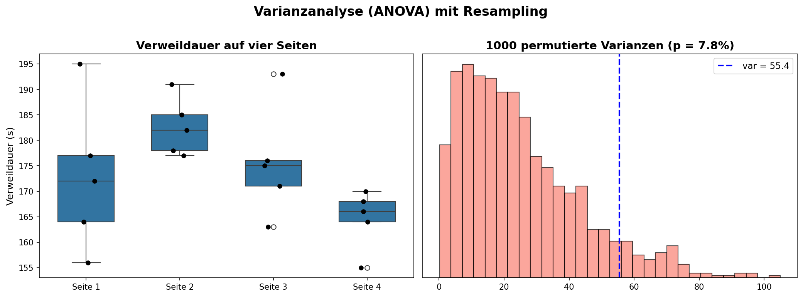
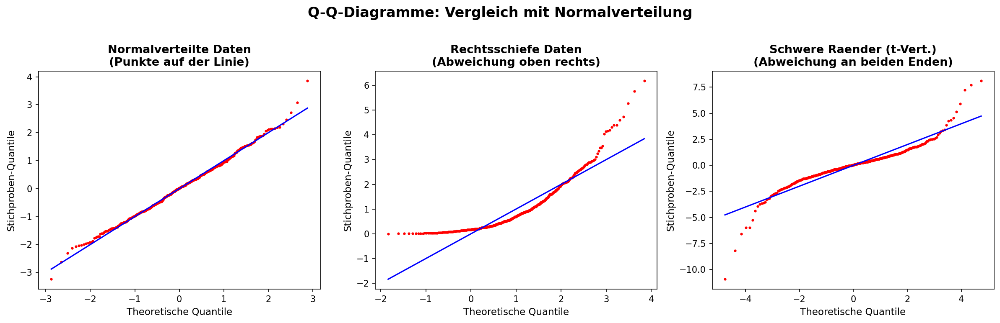
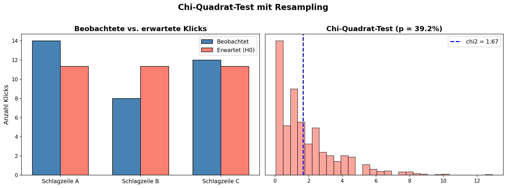
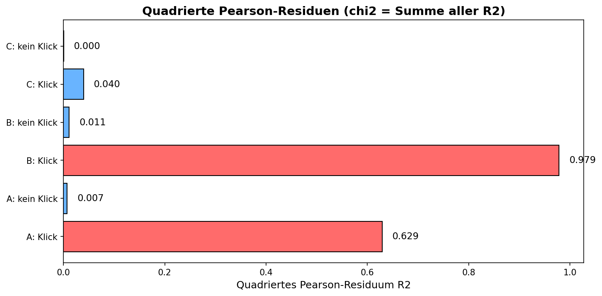

# ASTAT – Angewandte Statistik für Datenwissenschaften

## SW 08 – Testverfahren mit Resampling (Teil 2)

---

## Lernziele

1. Sie können eine **Varianzanalyse** (ANOVA) durchführen.
2. Sie verstehen, was ein **Q-Q-Diagramm** darstellt.
3. Sie können einen **Chi-Quadrat-Test** durchführen.

---

## Wichtigste Begriffe

| Begriff | Englisch | Definition |
| :--- | :--- | :--- |
| **Varianzanalyse (ANOVA)** | *Analysis of Variance* | Statistisches Verfahren zum Testen, ob sich die **Mittelwerte mehrerer Gruppen** signifikant unterscheiden. |
| **Q-Q-Diagramm** | *Q-Q plot (Quantile-Quantile plot)* | Graphische Methode zum **Vergleich zweier Verteilungen**, indem ihre Quantile gegeneinander aufgetragen werden. |
| **Chi-Quadrat-Test** | *Chi-squared test* | Test, der prüft, wie gut beobachtete Häufigkeiten einer **erwarteten Verteilung** entsprechen. |
| **Chi-Quadrat-Metrik** ($\chi^2$) | *Chi-squared statistic* | Summe der **quadrierten Pearson-Residuen** über alle Kategorien. |
| **Pearson-Residuum** ($R^2$) | *Pearson residual* | Mass für die Abweichung einer beobachteten von einer erwarteten Häufigkeit: $R^2 = \frac{(n_{\text{beobachtet}} - n_{\text{erwartet}})^2}{n_{\text{erwartet}}}$ |
| **Erwartete Häufigkeit** | *Expected frequency* | Die Häufigkeit, die man erwarten würde, wenn **$H_0$ gilt** (kein Unterschied zwischen den Gruppen). |
| **Quantil** | *Quantile* | Wert, unter dem ein bestimmter Anteil der Daten liegt (z.B. Median = 50%-Quantil). |
| **Referenzlinie** | *Reference line* | Die **Winkelhalbierende** im Q-Q-Diagramm – zeigt perfekte Übereinstimmung der Verteilungen. |

---

## Konzepte & Definitionen

### 1. Varianzanalyse (ANOVA)

> **Problem:** Bei **mehr als zwei Gruppen** gibt es viele paarweise Vergleiche. Bei $n$ Gruppen gibt es $\binom{n}{2} = \frac{n \cdot (n-1)}{2}$ mögliche Vergleiche. Je mehr Vergleiche → desto grösser die Gefahr, vom **Zufall getäuscht** zu werden.

> **Lösung:** Die ANOVA macht **einen einzigen Gesamttest**: Könnten die beobachteten Unterschiede zwischen allen Gruppen **allein durch Zufall** entstanden sein?

**Idee:** Statt die Differenz der Mittelwerte zu betrachten (wie beim A/B-Test), verwenden wir die **Varianz der Gruppenmittelwerte** als Teststatistik.

**Algorithmus (Resampling-ANOVA):**
1. Berechne die beobachtete Varianz $\sigma^2_{\text{beobachtet}}$ der Gruppenmittelwerte
2. Wiederhole viele Male:
   - a) Lege die Werte aus **allen Gruppen** zusammen
   - b) Teile sie **zufällig** in Gruppen gleicher Grösse
   - c) Berechne die Varianz $\sigma^2_{\text{resample}}$ der neuen Gruppenmittelwerte
3. **p-Wert** = relative Häufigkeit, wie oft $\sigma^2_{\text{resample}} > \sigma^2_{\text{beobachtet}}$

<center>

</center>

**Beispiel (vier Webseiten):** Bei 4 Gruppen gibt es $\binom{4}{2} = 6$ paarweise Vergleiche. Die ANOVA fasst alles in **einen Test** zusammen:
- $H_0$: Die mittlere Verweildauer auf allen vier Seiten ist gleich
- $H_1$: Die mittlere Verweildauer auf den vier Seiten ist unterschiedlich

---

### 2. Q-Q-Diagramm (Quantil-Quantil-Diagramm)

> **Definition:** Ein Q-Q-Diagramm vergleicht zwei Verteilungen, indem die **Quantile** der einen gegen die **Quantile** der anderen aufgetragen werden.

**Interpretation:**

| Muster im Q-Q-Plot | Bedeutung |
|:---|:---|
| Punkte **auf der Linie** | Die Verteilungen stimmen **gut überein** |
| Punkte **oberhalb** der Linie | Beobachtete Werte sind **grösser** als erwartet |
| Punkte **unterhalb** der Linie | Beobachtete Werte sind **kleiner** als erwartet |
| **S-förmige** Abweichung | Die Daten haben **schwerere Ränder** als die Referenzverteilung |
| Abweichung nur **oben rechts** | Die Daten sind **rechtsschief** |

> **Merksatz:** Die **Winkelhalbierende** ist immer die **Referenzlinie** im Q-Q-Diagramm. Kleine Abweichungen an den Enden sind normal (zufällige Streuung).

<center>

</center>

**Typische Anwendung:** Prüfen, ob Daten **normalverteilt** sind → Quantile der Stichprobe gegen Quantile der Normalverteilung auftragen.

---

### 3. Chi-Quadrat-Test

> **Definition:** Der Chi-Quadrat-Test prüft, ob beobachtete Häufigkeiten einer **erwarteten Verteilung** entsprechen. Er wurde 1900 von **Karl Pearson** entwickelt.

#### Schritt 1: Erwartete Häufigkeiten berechnen

Unter $H_0$ (alle Gruppen gleich) berechnen wir die **gemeinsame Rate** und daraus die erwarteten Häufigkeiten.

**Beispiel (drei Schlagzeilen, je 1000 Besucher):**

$$\text{Gemeinsame Klickrate} = \frac{14 + 8 + 12}{3000} = \frac{34}{3000} = 0.0113$$

$$\Rightarrow \text{Erwartete Klicks pro Schlagzeile} = 1000 \cdot 0.0113 = 11.33$$

#### Schritt 2: Quadrierte Pearson-Residuen berechnen

$$R^2 = \frac{(n_{\text{beobachtet}} - n_{\text{erwartet}})^2}{n_{\text{erwartet}}}$$

#### Schritt 3: Chi-Quadrat-Metrik berechnen

$$\chi^2 = \sum_{\text{alle Zellen}} R^2 = \sum \frac{(n_{\text{beobachtet}} - n_{\text{erwartet}})^2}{n_{\text{erwartet}}}$$

#### Schritt 4: Resampling-Test

Wie bei der ANOVA: Daten permutieren, $\chi^2_{\text{resample}}$ berechnen, p-Wert bestimmen.

<center>

</center>

---

## Formeln & Rechenregeln

### Formel 1: Anzahl paarweiser Vergleiche

$$\binom{n}{2} = \frac{n \cdot (n-1)}{2}$$

| $n$ Gruppen | Paarweise Vergleiche |
|---|---|
| 2 | 1 |
| 3 | 3 |
| 4 | 6 |
| 5 | 10 |

---

### Formel 2: Varianz der Gruppenmittelwerte (ANOVA-Teststatistik)

$$\sigma^2_{\text{Gruppen}} = \frac{1}{k-1} \sum_{i=1}^{k} (\bar{x}_i - \bar{\bar{x}})^2$$

| Variable | Bedeutung |
|---|---|
| $k$ | Anzahl Gruppen |
| $\bar{x}_i$ | Mittelwert der $i$-ten Gruppe |
| $\bar{\bar{x}}$ | Gesamtmittelwert |

**Beispiel (vier Webseiten):** Gruppenmittelwerte: $\bar{x}_1 = 172.8$, $\bar{x}_2 = 182.6$, $\bar{x}_3 = 175.6$, $\bar{x}_4 = 164.6$:

$$\sigma^2_{\text{Gruppen}} = \frac{1}{3}\left[(172.8 - 173.9)^2 + (182.6 - 173.9)^2 + (175.6 - 173.9)^2 + (164.6 - 173.9)^2\right] \approx 55.4$$

---

### Formel 3: Quadriertes Pearson-Residuum

$$R^2 = \frac{(n_{\text{beobachtet}} - n_{\text{erwartet}})^2}{n_{\text{erwartet}}}$$

**Beispiel:** Schlagzeile A: 14 Klicks beobachtet, 11.33 erwartet:
$$R^2 = \frac{(14 - 11.33)^2}{11.33} = \frac{7.13}{11.33} \approx 0.629$$

---

### Formel 4: Chi-Quadrat-Metrik

$$\chi^2 = \sum_{\text{alle Zellen}} \frac{(n_{\text{beobachtet}} - n_{\text{erwartet}})^2}{n_{\text{erwartet}}}$$

**Beispiel:** Drei Schlagzeilen mit Klicks und Nicht-Klicks:
$$\chi^2 = R^2_{A,\text{Klick}} + R^2_{A,\text{kein Klick}} + R^2_{B,\text{Klick}} + R^2_{B,\text{kein Klick}} + R^2_{C,\text{Klick}} + R^2_{C,\text{kein Klick}} \approx 1.666$$

<center>

</center>

---

### Formel 5: Theoretische Quantile für Q-Q-Plot

Für eine Stichprobe der Grösse $n$:
1. Berechne $n$ gleichmässig verteilte Wahrscheinlichkeiten: $P_i = \frac{i}{n+1}$ für $i = 1, \ldots, n$
2. Bestimme die theoretischen Quantile: $q_i = F^{-1}(P_i)$ (Inverse der Verteilungsfunktion)

In Python:
```python
P = np.linspace(0, 1, n+2)[1:n+1]
q = norm(loc=mu, scale=sigma).ppf(P)
```

---

## Vergleiche & Klassifizierungen

### I. A/B-Test vs. ANOVA

| | **A/B-Test (SW 07)** | **ANOVA (SW 08)** |
|:---|:---|:---|
| **Anzahl Gruppen** | 2 | 2 oder mehr |
| **Teststatistik** | Differenz der Mittelwerte ($\Delta$) | Varianz der Gruppenmittelwerte ($\sigma^2$) |
| **Problem bei vielen Gruppen** | Nicht anwendbar | Löst das Multiple-Testing-Problem |
| **Resampling** | Gruppenzugehörigkeit permutieren | Gruppenzugehörigkeit permutieren |

### II. ANOVA vs. Chi-Quadrat-Test

| | **ANOVA** | **Chi-Quadrat-Test** |
|:---|:---|:---|
| **Datentyp** | Numerische (metrische) Daten | Häufigkeiten / kategoriale Daten |
| **Teststatistik** | Varianz der Mittelwerte | $\chi^2$-Metrik |
| **Fragestellung** | Unterscheiden sich die **Mittelwerte**? | Unterscheidet sich die **Verteilung** von der erwarteten? |
| **Resampling** | Permutation der Werte | Permutation der Kategorien |

### III. Q-Q-Plot Muster

| Q-Q-Plot Muster | Verteilungseigenschaft | Beispiel |
|:---|:---|:---|
| Punkte auf der Geraden | Verteilung stimmt überein | Normalverteilte Eierdaten |
| S-förmig (Enden weg) | Schwere Ränder | $t$-Verteilung vs. Normalverteilung |
| Konvex oben rechts | Rechtsschiefe | Einkommensdaten (loans_income) |
| Punktewolke | Starke Abweichung | Ganz andere Verteilung |

---

## Code-Beispiele (Python)

### Konzept 1: Varianzanalyse (ANOVA) mit Resampling

Wir testen, ob sich die Verweildauer auf vier Webseiten signifikant unterscheidet.

```python
import numpy as np
import pandas as pd
import matplotlib.pyplot as plt
import seaborn as sns

# Daten laden
four_sessions = pd.read_csv("Daten/four_sessions.csv")

# Beobachtete Varianz der Gruppenmittelwerte
mittlereZeiten = four_sessions.groupby("Page").mean()
var_beobachtet = mittlereZeiten.var(ddof=1).iloc[0]

# Resampling-ANOVA
n = four_sessions.shape[0]
idx = np.arange(n)

var_permutiert = []
for _ in range(1000):
    idx_permutiert = np.random.permutation(idx)
    mu_perm_1 = four_sessions["Time"].loc[idx_permutiert[:5]].mean()
    mu_perm_2 = four_sessions["Time"].loc[idx_permutiert[5:10]].mean()
    mu_perm_3 = four_sessions["Time"].loc[idx_permutiert[10:15]].mean()
    mu_perm_4 = four_sessions["Time"].loc[idx_permutiert[15:]].mean()
    var_perm = np.array([mu_perm_1, mu_perm_2, mu_perm_3, mu_perm_4]).var(ddof=1)
    var_permutiert.append(var_perm)

# p-Wert
p_value = (np.array(var_permutiert) > var_beobachtet).mean()
print(f"Beobachtete Varianz: {var_beobachtet:.2f}")
print(f"p-Wert: {p_value*100:.1f}%")
```

**Output:**
```
Beobachtete Varianz: 55.43
p-Wert: 7.0%
```

**Interpretation:** In ca. 7% der permutierten Daten entsteht eine noch grössere Varianz. Da $p = 7\% > 5\% = \alpha$ → $H_0$ wird **nicht verworfen**.

---

### Konzept 2: Q-Q-Plot zeichnen

Wir prüfen mit einem Q-Q-Plot, ob die Eierdaten (Breite, Höhe, Gewicht) normalverteilt sind.

```python
import numpy as np
import pandas as pd
import matplotlib.pyplot as plt
from scipy.stats import norm

# Daten laden
eggs = pd.read_spss("Daten/Palette.sav")

# Theoretische Quantile berechnen
n = eggs.shape[0]
P = np.linspace(0, 1, n+2)[1:n+1]

mu_B = eggs["Breite"].mean()
std_B = eggs["Breite"].std(ddof=1)
X_B = norm(loc=mu_B, scale=std_B)
q_B = X_B.ppf(P)

# Q-Q-Plot zeichnen
fig, ax = plt.subplots(figsize=(6, 5))
ax.plot(q_B, eggs["Breite"].sort_values(), 'ro', markersize=1)
ax.plot([q_B.min(), q_B.max()], [q_B.min(), q_B.max()], 'b-', lw=1)
ax.set_title("Q-Q-Plot: Breite der Eier")
ax.set_xlabel("Quantile der Normalverteilung")
ax.set_ylabel("Quantile der Eierdaten")
plt.show()
```

**Interpretation:** Weil die Punkte nahezu **auf einer Linie** liegen, sind die Merkmale Breite, Höhe und Gewicht näherungsweise **normalverteilt**. Die Lohndaten (`loans_income`) dagegen liegen **nicht** auf der Linie → **nicht normalverteilt**.

---

### Konzept 3: Chi-Quadrat-Test mit Resampling

Wir testen, ob sich die Klickraten dreier Schlagzeilen signifikant unterscheiden.

```python
import numpy as np

# Beobachtete und erwartete Häufigkeiten
beobachtet = np.array([14, 986, 8, 992, 12, 988])
erwartet = np.array([11.33, 988.67] * 3)

# Chi-Quadrat berechnen
def chi2(n_beobachtet, n_erwartet):
    return sum((n_beobachtet - n_erwartet)**2 / n_erwartet)

chi2_beobachtet = chi2(beobachtet, erwartet)

# Resampling
lst_clicks = np.array([1]*34 + [0]*2966)
chi2_permutiert = []
for _ in range(1000):
    lst = np.random.permutation(lst_clicks)
    A = lst[0:1000].sum()
    B = lst[1000:2000].sum()
    C = lst[2000:3000].sum()
    sample = np.array([A, 1000-A, B, 1000-B, C, 1000-C])
    chi2_permutiert.append(chi2(sample, erwartet))

# p-Wert
p_value = (np.array(chi2_permutiert) > chi2_beobachtet).mean()
print(f"Chi-Quadrat (beobachtet): {chi2_beobachtet:.4f}")
print(f"p-Wert: {p_value*100:.1f}%")
```

**Output:**
```
Chi-Quadrat (beobachtet): 1.6659
p-Wert: 40.0%
```

**Interpretation:** In ca. 40% der permutierten Daten entsteht ein noch grösserer $\chi^2$-Wert. → $H_0$ wird **nicht verworfen**. Die Klickraten unterscheiden sich nicht signifikant.

---

### Konzept 4: Chi-Quadrat-Test – Datenfälschung erkennen

Anhand der inneren Ziffern von Imanishi-Karis Labordaten wird geprüft, ob diese gleichverteilt sind.

```python
from scipy.stats import randint

# Erwartete Häufigkeit (Gleichverteilung)
N = 315  # Gesamtanzahl Ziffern
erwartet = np.array(10 * [N / 10])

# Beobachtete Häufigkeiten
beobachtet = np.array([14, 71, 7, 65, 23, 12, 54, 28, 15, 26])

chi2_beobachtet = chi2(beobachtet, erwartet)

# Resampling unter H0 (Gleichverteilung)
X = randint(low=0, high=10)
chi2_permutiert = []
for _ in range(1000):
    lst = X.rvs(size=N)
    werte, sample = np.unique(lst, return_counts=True)
    chi2_permutiert.append(chi2(sample, erwartet))

p_value = (np.array(chi2_permutiert) > chi2_beobachtet).mean()
print(f"Chi-Quadrat: {chi2_beobachtet:.2f}")
print(f"p-Wert: {p_value*100:.3f}%")
```

**Output:**
```
Chi-Quadrat: 174.37
p-Wert: 0.000%
```

**Interpretation:** Der $\chi^2$-Wert ist extrem hoch und wird in keinem Resample übertroffen. → $H_0$ wird **verworfen**. Die Ziffern sind **nicht gleichverteilt** – ein Hinweis auf mögliche Datenmanipulation.

> **Wichtig:** Statistik kann **Hinweise auf Unregelmässigkeiten** geben, aber **kein Motiv, keine Absicht und keine Kausalität beweisen**.

---

## Konzept-Code-Zuordnung

| Konzept | Python-Funktion/Code | Library | Beschreibung |
|:---|:---|:---|:---|
| Gruppierte Mittelwerte | `df.groupby("Page").mean()` | `pandas` | Mittelwert pro Gruppe |
| Varianz berechnen | `data.var(ddof=1)` | `pandas/numpy` | Varianz mit Bessel-Korrektur |
| Q-Q-Plot Quantile | `norm(loc, scale).ppf(P)` | `scipy.stats` | Theoretische Quantile |
| Sortierte Werte | `data.sort_values()` | `pandas` | Für Q-Q-Plot |
| Chi-Quadrat berechnen | `sum((beob - erw)**2 / erw)` | `numpy` | $\chi^2$-Metrik |
| Gleichverteilte Zufallszahlen | `randint(low=0, high=10).rvs(n)` | `scipy.stats` | Für Chi-Quadrat-Resampling |
| SPSS-Dateien laden | `pd.read_spss("Datei.sav")` | `pandas` | Eier-Daten laden |
| Regenwolkenplot | `sns.boxplot() + sns.stripplot()` | `seaborn` | Boxplot mit Datenpunkten |

---

## Übungsaufgaben-Zusammenfassung

### Aufgabe 1: Verweildauer auf vier Webseiten (ANOVA)

| Aspekt | Detail |
|---|---|
| **Szenario** | Vergleich der Verweildauer auf 4 Webseiten, je 5 Besucher |
| **Datei** | `Daten/four_sessions.csv` |
| **Test** | Resampling-ANOVA, $\alpha = 5\%$ |
| **Ergebnis** | p-Wert $\approx 7\%$ → $H_0$ **nicht verworfen**, Unterschiede sind mit Zufall erklärbar |

---

### Aufgabe 2: Q-Q-Plots (Normalverteilungsprüfung)

| Aspekt | Detail |
|---|---|
| **Datei** | `Daten/Palette.sav` (750 Hühnereier) und `Daten/loans_income.csv` |
| **Ergebnis Eier** | Breite, Höhe, Gewicht → Punkte auf der Linie → **normalverteilt** |
| **Ergebnis Löhne** | Punkte nicht auf der Linie → **nicht normalverteilt** |

---

### Aufgabe 3: Klickraten dreier Schlagzeilen (Chi-Quadrat-Test)

| Aspekt | Detail |
|---|---|
| **Szenario** | 3 Schlagzeilen, je 1000 Besucher, Klicks: A=14, B=8, C=12 |
| **Datei** | `Daten/click_rates.csv` |
| **Test** | Chi-Quadrat-Test mit Resampling, $\alpha = 5\%$ |
| **Ergebnis** | p-Wert $\approx 40\%$ → $H_0$ **nicht verworfen**, Unterschiede sind zufällig |

---

### Aufgabe 4: Imanishi-Kari Datenfälschung (Chi-Quadrat-Test)

| Aspekt | Detail |
|---|---|
| **Szenario** | Prüfung, ob innere Ziffern in Labordaten gleichverteilt sind |
| **Datei** | `Daten/imanishi_data.csv` |
| **Test** | Chi-Quadrat-Test mit Resampling (gegen Gleichverteilung) |
| **Ergebnis** | p-Wert $\approx 0\%$ → $H_0$ **verworfen**, Ziffern sind nicht gleichverteilt → Hinweis auf mögliche Manipulation |

---

## Prüfungsrelevante Hinweise

### Typische SC/MC-Fallen

| Falle | Warum falsch? | Richtige Aussage |
|---|---|---|
| "ANOVA vergleicht paarweise alle Gruppen." | ANOVA macht **einen Gesamttest**, keine paarweisen Vergleiche! | ANOVA prüft, ob es **insgesamt** einen signifikanten Unterschied gibt. |
| "Im Q-Q-Plot liegen normalverteilte Daten immer perfekt auf der Geraden." | Auch normalverteilte Stichproben zeigen **zufällige Abweichungen**! | Kleine Abweichungen an den Enden sind **normal** und zeigen die zufällige Streuung. |
| "Chi-Quadrat misst die Differenz von beobachtet und erwartet." | $\chi^2$ verwendet die **quadrierten und normierten** Differenzen! | $R^2 = \frac{(n_b - n_e)^2}{n_e}$ – die Normierung durch $n_e$ ist entscheidend. |
| "Bei ANOVA ist die Teststatistik der Mittelwert." | Die Teststatistik ist die **Varianz der Gruppenmittelwerte**! | Grosse Varianz zwischen den Gruppen → Hinweis auf echte Unterschiede. |
| "Chi-Quadrat-Test beweist Datenfälschung." | Statistik kann **Hinweise** geben, aber keine **Absicht** beweisen! | Der Test zeigt nur, dass die Daten **unwahrscheinlich** unter $H_0$ sind. |

### Formeln auswendig / auf das A4-Blatt

| Formel | Auswendig? | Begründung |
|---|---|---|
| $\binom{n}{2} = \frac{n(n-1)}{2}$ | Auswendig | Paarweise Vergleiche, einfach |
| $R^2 = \frac{(n_b - n_e)^2}{n_e}$ | A4-Blatt | Pearson-Residuum |
| $\chi^2 = \sum R^2$ | Auswendig | Chi-Quadrat ist die Summe der Residuen |
| ANOVA: Varianz der Gruppenmittel | A4-Blatt | Teststatistik |
| Q-Q-Plot: Quantile = `norm.ppf(P)` | A4-Blatt | Für Code-Aufgaben |

### Merkregeln & Eselsbrücken

- **"ANOVA = Ein Test für alle"**: Statt viele paarweise Vergleiche → ein einziger Test für alle Gruppen.
- **"Q-Q-Plot: Gerade = gut"**: Wenn die Punkte auf der Geraden liegen, stimmen die Verteilungen überein.
- **"Chi-Quadrat: Quadrieren und Normieren"**: Differenz quadrieren (immer positiv) und durch erwartete Häufigkeit teilen (normieren).
- **"Pearson = Karl, nicht Korrelation"**: Karl Pearsons Chi-Quadrat-Test (1900) – nicht verwechseln mit dem Korrelationskoeffizienten.
- **"ANOVA-Teststatistik = Varianz"**: Nicht der Mittelwert, sondern die **Varianz der Mittelwerte** ist die Teststatistik.

### Hinweise für numerische Antworten

- **ANOVA:** Die Varianz der Gruppenmittelwerte wird mit `ddof=1` berechnet.
- **Chi-Quadrat:** Alle Zellen der Tabelle (auch "kein Klick") in die Berechnung einbeziehen!
- **Q-Q-Plot:** Die Wahrscheinlichkeiten für die Quantile werden mit `np.linspace(0, 1, n+2)[1:n+1]` berechnet (ohne 0 und 1).
- **Testentscheid:** Immer gleich: $p \leq \alpha$ → verwerfen; $p > \alpha$ → nicht verwerfen.

---

## Verbindung zu vorherigen/folgenden Wochen

### Rückbezug

| Vorherige Woche | Verbindung zu SW 08 |
|---|---|
| **SW 06** (Schätzverfahren) | Die **Normalverteilung** aus SW 06 ist die Referenzverteilung für Q-Q-Plots. |
| **SW 07** (Testverfahren Teil 1) | Die Grundkonzepte **$H_0$, $H_1$, p-Wert** und das **Resampling-Prinzip** aus SW 07 werden direkt auf ANOVA und Chi-Quadrat erweitert. |

### Vorausschau

| Folgende Woche | Warum SW 08 wichtig ist |
|---|---|
| **SW 09** (Zusammenhangsanalyse) | Der **Chi-Quadrat-Test** und die **$\chi^2$-Metrik** werden zur Berechnung des **korrigierten Kontingenzkoeffizienten** verwendet, um die Stärke des Zusammenhangs zweier nominaler Merkmale zu messen. |
| **SW 11/12** (Regression) | Q-Q-Plots werden verwendet, um die **Normalverteilung der Residuen** in Regressionsmodellen zu prüfen. |
