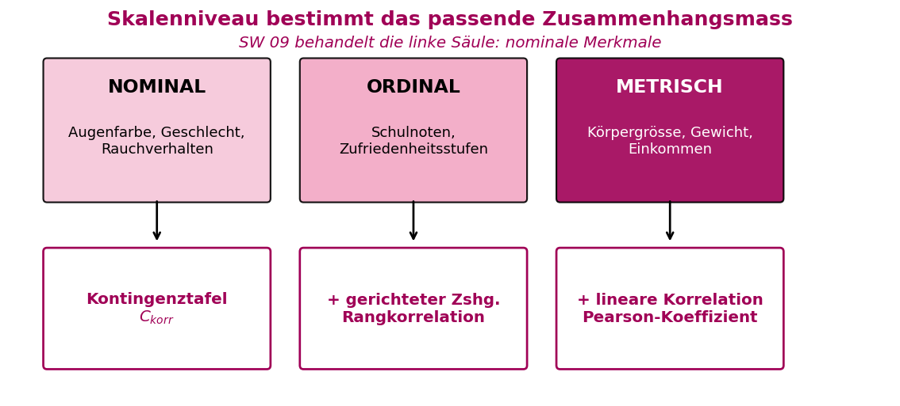
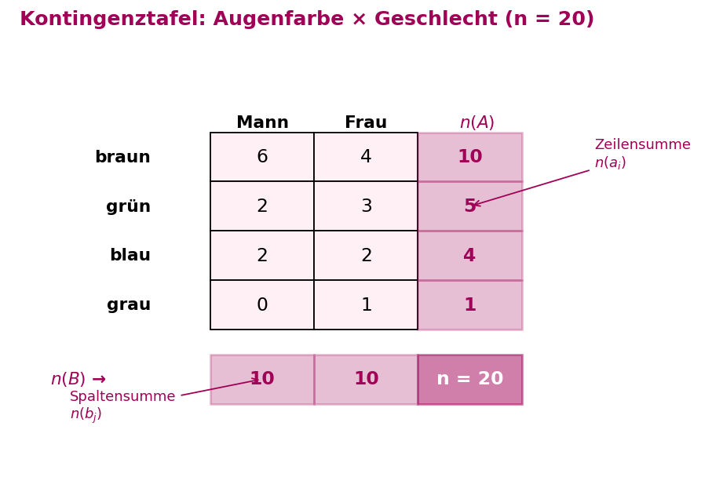
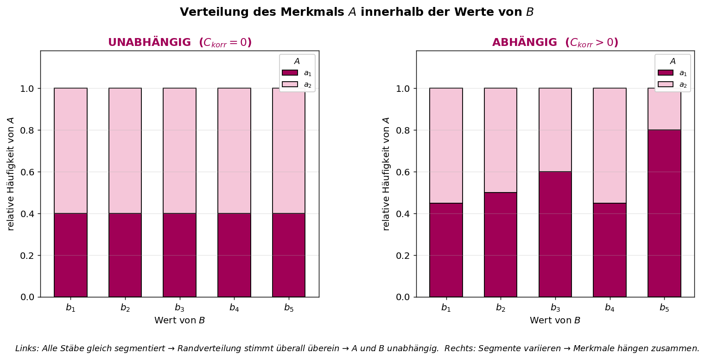
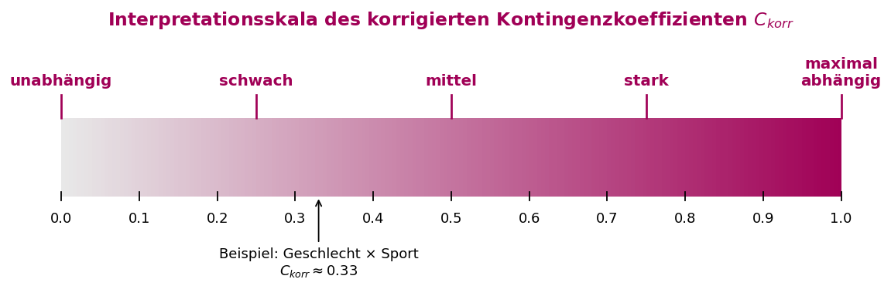
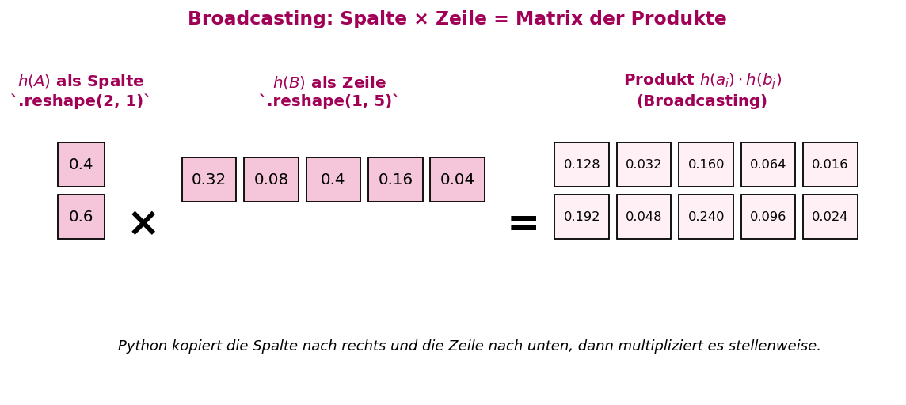
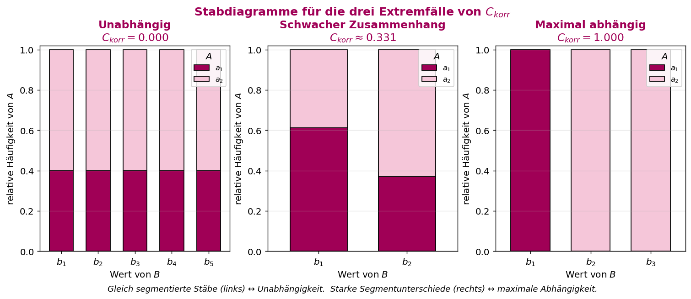
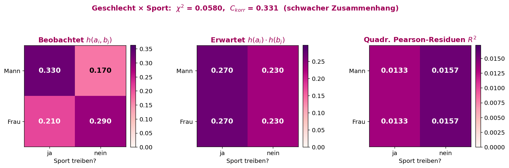

# ASTAT – Angewandte Statistik für Datenwissenschaften

## SW 09 – Zusammenhangsanalyse

---

## Lernziele

1. Sie verstehen den **Sinn einer Zusammenhangsanalyse**.
2. Sie können eine **Kontingenztafel** lesen.
3. Sie können für nominale Daten den **korrigierten Kontingenzkoeffizienten** berechnen.
4. Sie können mit dem korrigierten Kontingenzkoeffizienten **Abhängigkeit** und **Unabhängigkeit** in den Daten finden.
5. Sie können **Stabdiagramme** für nominale Merkmale richtig interpretieren.

---

## Wichtigste Begriffe

| Begriff | Englisch | Definition |
| :--- | :--- | :--- |
| **Zusammenhangsanalyse** | *Association analysis* | Teilbereich der Statistik, der prüft, ob und wie stark **zwei oder mehr Merkmale** miteinander zusammenhängen. |
| **Kontingenztafel** | *Contingency table* | Tabellarische Darstellung der **gemeinsamen Häufigkeit** zweier Merkmale $A$ und $B$. |
| **Randverteilung** | *Marginal distribution* | Verteilung **eines einzelnen Merkmals**, erhalten durch Summation über die Zeilen bzw. Spalten der Kontingenztafel. |
| **Gemeinsame Häufigkeit** | *Joint frequency* | Absolute bzw. relative Häufigkeit einer Merkmalskombination $(a_i, b_j)$. |
| **Unabhängigkeit** | *Independence* | Zwei Merkmale sind unabhängig, wenn $h(a_i, b_j) = h(a_i) \cdot h(b_j)$ für alle $i, j$ gilt. |
| **Pearson-Residuum** ($R^2$) | *Pearson residual* | Quadratische, normierte Abweichung der beobachteten von der bei Unabhängigkeit erwarteten Häufigkeit. |
| **Chi-Quadrat-Metrik** ($\chi^2$) | *Chi-squared statistic* | Summe der quadrierten Pearson-Residuen über alle Zellen der Kontingenztafel. |
| **Korrigierter Kontingenzkoeffizient** ($C_{\text{korr}}$) | *Corrected contingency coefficient* | Auf das Intervall $[0, 1]$ normierte Masszahl für die **Stärke des Zusammenhangs** zweier nominaler Merkmale. |
| **Broadcasting** | *Broadcasting* | Python-Mechanismus, um Spalten und Zeilen automatisch zu vervielfältigen und stellenweise zu multiplizieren. |
| **Stabdiagramm (gestapelt)** | *Stacked bar chart* | Graphische Darstellung der Verteilung eines Merkmals **innerhalb der Werte** eines zweiten Merkmals. |
| **Nominale Merkmale** | *Nominal variables* | Kategoriale Merkmale **ohne Rangfolge** (z.B. Geschlecht, Augenfarbe). |
| **Ordinale Merkmale** | *Ordinal variables* | Kategoriale Merkmale **mit Rangfolge** (z.B. Schulnoten, Zufriedenheit). |
| **Metrische Merkmale** | *Metric variables* | Zahlenwertige Merkmale auf einer Zahlenachse (z.B. Körpergrösse, Gewicht). |

---

## Konzepte & Definitionen

### 1. Was ist eine Zusammenhangsanalyse?

> **Merksatz:** Die Zusammenhangsanalyse untersucht, **ob und wie stark** zwei oder mehr Merkmale miteinander zusammenhängen.

Je nach **Skalenniveau** der Merkmale kommen unterschiedliche Verfahren zum Einsatz:

| Skalenniveau | Beispiele | Verfahren in SW 09 |
|:---|:---|:---|
| **Nominal** | Geschlecht, Rauchverhalten, Augenfarbe | **Kontingenztafel + $C_{\text{korr}}$** |
| **Ordinal** | Schulnoten, Zufriedenheit | zusätzlich: gerichteter Zusammenhang (→ spätere Wochen) |
| **Metrisch** | Körpergrösse, Gewicht | zusätzlich: lineare Korrelation (→ spätere Wochen) |

Für **ordinale** Merkmale kann man zusätzlich zwischen **positivem** (beide steigen) und **negativem** (eins steigt, das andere sinkt) Zusammenhang unterscheiden. Bei **metrischen** Merkmalen lässt sich zudem die lineare **Korrelation** messen.

<center>

</center>

> Die Zusammenhangsanalyse ist wichtig, um **Muster in Daten** zu erkennen und **fundierte Entscheidungen** auf Datenbasis zu treffen. Die passende Methode richtet sich immer nach dem **Skalenniveau** der Merkmale – SW 09 behandelt den linken Fall (nominale Merkmale).

---

### 2. Kontingenztafel

Eine **Kontingenztafel** zeigt die **gemeinsame Häufigkeit** zweier Merkmale $A$ (Zeilen) und $B$ (Spalten):

$$\begin{array}{c|cccc|c}
    & b_1 & b_2 & b_3 & \cdots & n(A)\\ \hline
a_1 & n(a_1,b_1) & n(a_1,b_2) & n(a_1,b_3) & \cdots & n(a_1)\\
a_2 & n(a_2,b_1) & n(a_2,b_2) & n(a_2,b_3) & \cdots & n(a_2)\\
a_3 & n(a_3,b_1) & n(a_3,b_2) & n(a_3,b_3) & \cdots & n(a_3)\\
\vdots & \vdots & \vdots & \vdots & \ddots & \vdots\\ \hline
 n(B)   & n(b_1) & n(b_2) & n(b_3) & \cdots & n
\end{array}$$

| Kennzahl | Bedeutung |
|:---|:---|
| $n(a_i, b_j)$ | Absolute Häufigkeit der Kombination $(a_i, b_j)$ |
| $n(a_i)$ | **Zeilensumme** = Randverteilung von $A$ |
| $n(b_j)$ | **Spaltensumme** = Randverteilung von $B$ |
| $n$ | **Gesamtsumme** aller Beobachtungen |

**Beispiel (Augenfarbe × Geschlecht, $n = 20$):**

<center>

</center>

> **Lesehilfe zur Grafik:** Die **hellrosa Zellen** in der Mitte enthalten die **gemeinsamen Häufigkeiten** $n(a_i, b_j)$. Die **dunklere rechte Spalte** zeigt die **Zeilensummen** $n(a_i)$ (= Randverteilung der Augenfarbe), die **dunklere untere Zeile** zeigt die **Spaltensummen** $n(b_j)$ (= Randverteilung des Geschlechts). Unten rechts steht die **Gesamtzahl** $n$ aller Beobachtungen.

Durch Division aller Zellen durch $n$ erhalten wir die **relativen Häufigkeiten** $h(a_i, b_j)$ mit Gesamtsumme 1.

---

### 3. Unabhängigkeit zweier Merkmale

Zwei Merkmale $A$ und $B$ sind **unabhängig**, wenn ihre Verteilung innerhalb **jeder Spalte/Zeile** mit der **Randverteilung** übereinstimmt. Gleichwertig gilt die **Produktregel**:

> **Merksatz:** $A$ und $B$ sind **unabhängig** $\Longleftrightarrow$ $h(a_i, b_j) = h(a_i) \cdot h(b_j)$ für alle $i, j$.

**Herleitung der Produktregel:**

$$\frac{n(a_i, b_j)}{n(a_i)} = \frac{n(b_j)}{n} \;\;\Longleftrightarrow\;\; \frac{n(a_i, b_j)}{n} = \frac{n(a_i)}{n} \cdot \frac{n(b_j)}{n}$$

**Beispiel (unabhängig):** Kontingenztafel mit $n = 125$:

$$\begin{array}{c|ccccc|c}
    & b_1 & b_2 & b_3 & b_4 & b_5 &\\ \hline
a_1 & 16 & 4 & 20 &  8 & 2 & 50\\
a_2 & 24 & 6 & 30 & 12 & 3 & 75\\ \hline
    & 40 & 10 & 50 & 20 & 5 & 125
\end{array}$$

Randverteilungen: $h(A) = (0.4, 0.6)$ und $h(B) = (0.32, 0.08, 0.40, 0.16, 0.04)$. Das Produkt $h(A) \cdot h(B)$ reproduziert genau die Tafel → **unabhängig**.

**Beispiel (maximal abhängig):**

$$\begin{array}{c|ccc|c}
    & d_1 & d_2 & d_3 &\\ \hline
c_1 & 40 & 0 & 0 &  40\\
c_2 & 0 & 40 & 20 & 60\\ \hline
    & 40 & 40 & 20 & 100
\end{array}$$

Hier lässt sich **aus $D$ eindeutig auf $C$ schliessen** → maximale Abhängigkeit.

<center>

</center>

> **Lesehilfe zur Grafik:** Beide Plots zeigen, wie sich das Merkmal $A$ **innerhalb jedes Wertes** von $B$ verteilt. **Links (unabhängig):** In jedem Stab ist der dunkle Anteil ($a_1$) genau gleich gross – die bedingten Verteilungen sind identisch mit der Randverteilung. **Rechts (abhängig):** Die Segmentgrössen variieren von Stab zu Stab – bei $b_3$ dominiert $a_1$, bei $b_5$ sogar massiv. Je stärker sich die Stäbe unterscheiden, desto grösser ist $C_{\text{korr}}$.

---

### 4. Korrigierter Kontingenzkoeffizient $C_{\text{korr}}$

Die **Chi-Quadrat-Metrik** aus SW 08 misst die Abweichung von der Unabhängigkeit:

$$\chi^2 = \sum_{i,j} \frac{\big(h(a_i, b_j) - h(a_i) \cdot h(b_j)\big)^2}{h(a_i) \cdot h(b_j)}$$

Bei Unabhängigkeit gilt $\chi^2 = 0$. Die Obergrenze hängt jedoch von der Tafelgrösse ab:

$$0 \leqslant \chi^2 \leqslant \underbrace{\min(\text{Anzahl Zeilen}, \text{Anzahl Spalten}) - 1}_{C_{\text{max}}}$$

Um einen **auf $[0, 1]$ normierten** Wert zu erhalten, wird der **korrigierte Kontingenzkoeffizient** definiert:

$$\boxed{\;C_{\text{korr}} = \sqrt{1 + \frac{1}{C_{\text{max}}}} \cdot \sqrt{\frac{\chi^2}{1 + \chi^2}}\;}$$

**Interpretation:**

| $C_{\text{korr}}$ | Bedeutung |
|:---:|:---|
| $0$ | Merkmale sind **unabhängig** |
| nahe $0$ | **schwacher** Zusammenhang |
| $\approx 0.5$ | **mittlerer** Zusammenhang |
| nahe $1$ | **starker** Zusammenhang |
| $1$ | **maximal abhängig** |

<center>

</center>

> **Lesehilfe zur Grafik:** Der Farbverlauf geht von hellgrau ($C_{\text{korr}} = 0$, unabhängig) bis zum HSLU-Bordeauxton ($C_{\text{korr}} = 1$, maximal abhängig). Die **Wortmarker oberhalb** geben die Interpretation an. Der Pfeil zeigt die Einordnung des konkreten Beispiels **Geschlecht × Sport** ($C_{\text{korr}} \approx 0.33$) – links der Mitte, also ein **schwacher** Zusammenhang.

---

### 5. Broadcasting mit numpy

Um aus den Randverteilungen $h(A)$ und $h(B)$ die Produkte $h(a_i) \cdot h(b_j)$ zu berechnen, nutzt Python **Broadcasting**:

- Mit `reshape(AnzZeilen, AnzSpalten)` wird ein Array in eine **Spalte** oder **Zeile** umgeformt.
- Multipliziert man **Spalte × Zeile**, so kopiert numpy die Werte entlang der fehlenden Achse und berechnet die **stellenweisen Produkte**.

$$\begin{bmatrix}a\\b\\c\\d\end{bmatrix} \cdot \begin{bmatrix}x & y & z\end{bmatrix} = \begin{bmatrix}a \cdot x & a \cdot y & a \cdot z\\b \cdot x & b \cdot y & b \cdot z\\c \cdot x & c \cdot y & c \cdot z\\d \cdot x & d \cdot y & d \cdot z\end{bmatrix}$$

<center>

</center>

> **Lesehilfe zur Grafik:** Links steht die Randverteilung $h(A)$ als **Spalte** (2 Zeilen), in der Mitte $h(B)$ als **Zeile** (5 Spalten). Python vervielfältigt die Spalte nach rechts und die Zeile nach unten, bis beide Seiten eine $2 \times 5$-Form haben, und multipliziert dann **zellenweise**. Das Resultat rechts ist die **bei Unabhängigkeit erwartete Kontingenztafel** – genau das, was im Nenner der $\chi^2$-Formel steht.

> **Merksatz:** Bei **unabhängigen** Merkmalen ergibt Broadcasting der Randverteilungen genau die Kontingenztafel. Bei **abhängigen** Merkmalen weicht das Ergebnis ab.

---

### 6. Stabdiagramme für zwei nominale Merkmale

Zwei nominale Merkmale können graphisch mit **gestapelten Stabdiagrammen** verglichen werden:

- Für jeden Wert $b_j$ zeichnet man die Verteilung von $A$: $\frac{n(a_1, b_j)}{n(b_j)}, \frac{n(a_2, b_j)}{n(b_j)}, \ldots$
- Für jeden Wert $a_i$ zeichnet man die Verteilung von $B$: $\frac{n(a_i, b_1)}{n(a_i)}, \frac{n(a_i, b_2)}{n(a_i)}, \ldots$

In Python mit `df.plot.bar(stacked=True)` bzw. `df.plot.barh(stacked=True)`.

<center>

</center>

> **Lesehilfe zur Grafik:** Die drei Plots zeigen die **gesamte Bandbreite** möglicher Zusammenhänge zwischen zwei nominalen Merkmalen.
> - **Links ($C_{\text{korr}} = 0$):** Alle fünf Stäbe sind **exakt gleich** segmentiert (40% dunkel, 60% hell) – die Randverteilung $h(A) = (0.4, 0.6)$ stimmt für jeden Wert von $B$. Unabhängigkeit.
> - **Mitte ($C_{\text{korr}} \approx 0.33$):** Der dunkle Anteil variiert leicht zwischen den Stäben ($\approx 0.61$ vs. $\approx 0.37$) – erkennbarer, aber eher schwacher Zusammenhang.
> - **Rechts ($C_{\text{korr}} = 1$):** Der erste Stab ist **zu 100%** $a_1$, die anderen zwei zu 100% $a_2$ – aus dem Wert von $B$ kann man perfekt auf $A$ schliessen. Maximale Abhängigkeit.

> **Merksatz:** Wenn sich die **Verteilungen nicht unterscheiden** (gleich grosse Segmente in allen Stäben), sind die zwei Merkmale **unabhängig**.

---

## Formeln & Rechenregeln

### Formel 1: Produktregel bei Unabhängigkeit

$$h(a_i, b_j) = h(a_i) \cdot h(b_j)$$

---

### Formel 2: Chi-Quadrat-Metrik (SW 08 → SW 09)

$$\chi^2 = \sum_{i,j} \frac{\big(h(a_i, b_j) - h(a_i) \cdot h(b_j)\big)^2}{h(a_i) \cdot h(b_j)}$$

Mit absoluten Häufigkeiten gleichwertig:

$$\chi^2 = \sum_{i,j} \frac{\big(n(a_i, b_j) - n_{\text{erwartet}}(a_i, b_j)\big)^2}{n_{\text{erwartet}}(a_i, b_j)}$$

---

### Formel 3: Maximalwert $C_{\text{max}}$

$$C_{\text{max}} = \min(\text{Anzahl Zeilen}, \text{Anzahl Spalten}) - 1$$

| Tafelgrösse | $C_{\text{max}}$ |
|:---:|:---:|
| $2 \times 2$ | 1 |
| $2 \times 5$ | 1 |
| $3 \times 3$ | 2 |
| $4 \times 5$ | 3 |

---

### Formel 4: Korrigierter Kontingenzkoeffizient

$$C_{\text{korr}} = \sqrt{1 + \frac{1}{C_{\text{max}}}} \cdot \sqrt{\frac{\chi^2}{1 + \chi^2}}$$

**Beispiel (Geschlecht × Sporttreiben):**

$$\begin{array}{c|cc}
 & \text{ja} & \text{nein}\\ \hline
\text{Mann} & 33 & 17\\
\text{Frau} & 21 & 29
\end{array}$$

Ergebnis: $C_{\text{korr}} \approx 0.331$ → **schwacher Zusammenhang**.

<center>

</center>

> **Lesehilfe zur Grafik:** Drei Heatmaps zeigen den Rechenweg von $C_{\text{korr}}$ am Geschlecht × Sport-Beispiel.
> - **Links:** beobachtete relative Häufigkeiten $h(a_i, b_j)$. Männer treiben auffällig häufiger Sport (0.33) als erwartet.
> - **Mitte:** bei Unabhängigkeit **erwartete** Häufigkeiten $h(a_i) \cdot h(b_j)$ – in jeder Spalte identisch, weil die Randverteilung der Geschlechter symmetrisch ist.
> - **Rechts:** **quadrierte Pearson-Residuen** $R^2$ – die Abweichungsenergie pro Zelle. Ihre Summe ist $\chi^2 \approx 0.058$, was zu $C_{\text{korr}} \approx 0.331$ führt (siehe Titelzeile). Dunklere Farben = grössere Abweichung von der Unabhängigkeits-Hypothese.

---

## Vergleiche & Klassifizierungen

### I. Chi-Quadrat-Test (SW 08) vs. Kontingenzkoeffizient (SW 09)

| | **Chi-Quadrat-Test (SW 08)** | **$C_{\text{korr}}$ (SW 09)** |
|:---|:---|:---|
| **Frage** | Ist die Abweichung **signifikant**? | **Wie stark** ist der Zusammenhang? |
| **Ausgabe** | p-Wert | Zahl in $[0, 1]$ |
| **Entscheid** | Hypothesentest ($\alpha$) | Masszahl-Interpretation |
| **Basis** | $\chi^2$-Metrik via Resampling | $\chi^2$-Metrik normiert |

### II. Unabhängig vs. abhängig – woran erkennbar?

| Kriterium | Unabhängig | Abhängig |
|:---|:---|:---|
| **Produktregel** | $h(a_i, b_j) = h(a_i) \cdot h(b_j)$ | $\neq$ |
| **$\chi^2$** | $0$ | $> 0$ |
| **$C_{\text{korr}}$** | $0$ | $> 0$ (max. $1$) |
| **Stabdiagramm** | alle Stäbe gleich segmentiert | Segmente variieren zwischen den Stäben |
| **Bedingte Verteilungen** | gleich wie Randverteilung | unterschiedlich |

### III. Skalenniveau und mögliche Zusammenhangsmasse

| Skalenniveau | Beispiel | Mass für Zusammenhang |
|:---|:---|:---|
| **Nominal** | Augenfarbe, Geschlecht | $C_{\text{korr}}$ |
| **Ordinal** | Schulnoten, Zufriedenheit | Rangkorrelation (z.B. Spearman) |
| **Metrisch** | Grösse, Gewicht | Korrelationskoeffizient (Pearson) |

---

## Code-Beispiele (Python)

### Konzept 1: Produkte der Randverteilungen mit Broadcasting

```python
import numpy as np

# Randverteilungen
h_A = np.array([0.4, 0.6]).reshape(2, 1)          # Spalte mit 2 Zeilen
h_B = np.array([0.32, 0.08, 0.40, 0.16, 0.04]).reshape(1, 5)  # Zeile mit 5 Spalten

# Broadcasting → stellenweise Produkte
h_A * h_B
```

**Output:**
```
array([[0.128, 0.032, 0.16 , 0.064, 0.016],
       [0.192, 0.048, 0.24 , 0.096, 0.024]])
```

Stimmen die Produkte mit der Kontingenztafel überein → **unabhängig**.

---

### Konzept 2: Korrigierter Kontingenzkoeffizient berechnen

```python
import numpy as np

# Kontingenztafel (relative Häufigkeiten)
kontingenzTafel_absolut = np.array([[33, 17],
                                    [21, 29]])
kontingenzTafel = kontingenzTafel_absolut / kontingenzTafel_absolut.sum()

# Dimensionen
i, j = kontingenzTafel.shape
C_max = min(i, j) - 1

# Randverteilungen
h_A_rand = kontingenzTafel.sum(axis=1).reshape(i, 1)   # Spalte
h_B_rand = kontingenzTafel.sum(axis=0).reshape(1, j)   # Zeile

# Erwartete Häufigkeiten bei Unabhängigkeit
rand = h_A_rand * h_B_rand

# Chi-Quadrat
chi_square = ((kontingenzTafel - rand)**2 / rand).sum()

# Korrigierter Kontingenzkoeffizient
C_korr = np.sqrt(1 + 1 / C_max) * np.sqrt(chi_square / (1 + chi_square))
print(f"C_korr = {C_korr:.4f}")
```

**Output:**
```
C_korr = 0.3310
```

**Interpretation:** $C_{\text{korr}} \approx 0.33$ unter der Intervallmitte → **schwacher Zusammenhang** zwischen Geschlecht und Sporttreiben.

---

### Konzept 3: Gestapeltes Stabdiagramm zeichnen

```python
import pandas as pd
import numpy as np
import matplotlib.pyplot as plt

# Kontingenztafel (absolut)
data = np.array([[16, 4, 20,  8, 2],
                 [24, 6, 30, 12, 3]])

# Verteilung von A innerhalb jeder Spalte (B-Wert fix)
dataA = data / data.sum(axis=0)
df_A = pd.DataFrame(dataA,
                    columns=["B_1", "B_2", "B_3", "B_4", "B_5"],
                    index=["A_1", "A_2"])

# Verteilung von B innerhalb jeder Zeile (A-Wert fix)
dataB = data / data.sum(axis=1).reshape(2, 1)
df_B = pd.DataFrame(dataB,
                    columns=["B_1", "B_2", "B_3", "B_4", "B_5"],
                    index=["A_1", "A_2"])

# Figur erstellen
fig, (ax1, ax2) = plt.subplots(1, 2, figsize=(12, 5))

# Verteilung von A pro B-Wert (gestapelt, vertikal)
df_A.T.plot.bar(stacked=True, ax=ax1, width=0.5, edgecolor="black")
ax1.set_title("Verteilung des Merkmals A", size=15, pad=10)

# Verteilung von B pro A-Wert (gestapelt, horizontal)
df_B.plot.barh(stacked=True, ax=ax2, width=0.5, edgecolor="black")
ax2.set_title("Verteilung des Merkmals B", size=15, pad=10)

plt.show()
```

**Interpretation:** Sind alle Stäbe identisch segmentiert → **Unabhängigkeit**. Unterscheiden sich die Segmentgrössen zwischen den Stäben → **Abhängigkeit**.

---

## Konzept-Code-Zuordnung

| Konzept | Python-Funktion/Code | Library | Beschreibung |
|:---|:---|:---|:---|
| Kontingenztafel | `np.array([[...],[...]])` oder `pd.crosstab(a, b)` | `numpy / pandas` | Tafel als Matrix |
| Zeilen-/Spaltensummen | `data.sum(axis=1)` / `data.sum(axis=0)` | `numpy` | Randverteilungen |
| Spalte/Zeile formen | `arr.reshape(i, 1)` / `arr.reshape(1, j)` | `numpy` | Für Broadcasting |
| Broadcasting-Produkt | `h_A * h_B` | `numpy` | Produkte der Randverteilungen |
| Dimensionen auslesen | `data.shape[0]`, `data.shape[1]` | `numpy` | Anzahl Zeilen/Spalten |
| Chi-Quadrat | `((obs - exp)**2 / exp).sum()` | `numpy` | $\chi^2$-Metrik |
| Wurzel | `np.sqrt(...)` | `numpy` | Für $C_{\text{korr}}$-Formel |
| Gestapeltes Stabdiagramm (vertikal) | `df.plot.bar(stacked=True)` | `pandas/matplotlib` | Visualisierung |
| Gestapeltes Stabdiagramm (horizontal) | `df.plot.barh(stacked=True)` | `pandas/matplotlib` | Visualisierung |
| DataFrame transponieren | `df.T` | `pandas` | Zeilen/Spalten tauschen |

---

## Übungsaufgaben-Zusammenfassung

### Aufgabe 1: Bruttogehalt × Geschlecht

| Aspekt | Detail |
|---|---|
| **Szenario** | 10 000 Personen, 4 Gehaltsklassen × 2 Geschlechter |
| **Frage 1** | Sind die Merkmale **unabhängig**? |
| **Frage 2** | Hypothesentest auf $\alpha = 5\%$ |
| **Methode** | $C_{\text{korr}}$ berechnen + Chi-Quadrat-Test (Resampling) |

### Aufgabe 2: Ausbildung × Abteilung (Personalerhebung 2021)

| Aspekt | Detail |
|---|---|
| **Datei** | `Daten/2021_Personalerhebung.csv` |
| **Frage** | Sind **Ausbildung** und **Abteilung** unabhängig? |
| **Klassierung Ausbildung** | *Akademiker* (Bachelor, Master, Promotion) vs. *Nicht-Akademiker* (Mittlere Reife, Abitur) |
| **Klassierung Abteilung** | *Bereich I* (Geschäftsführung, Finanzen), *Bereich II* (Entwicklung, Test/Anwendungen), *Bereich III* (Schulung, Vertrieb) |
| **Methode** | $C_{\text{korr}}$ vor und nach Klassierung vergleichen |

### Aufgabe 3: Nutzungsdauer × Kursart (E-Learning)

| Aspekt | Detail |
|---|---|
| **Szenario** | 400 Nutzer, 4 Dauerklassen × 5 Kursarten |
| **Frage** | Besteht ein Zusammenhang zwischen **Nutzungsdauer** und **Kursart**? |
| **Methode** | $C_{\text{korr}}$ für $4 \times 5$-Tafel berechnen |

### Aufgabe 4: Nutzergruppe × Betriebssystem

| Aspekt | Detail |
|---|---|
| **Szenario** | 500 Nutzer, 4 Gruppen × 5 Betriebssysteme |
| **Frage** | Zusammenhang zwischen **Nutzergruppe** und **Betriebssystem**? |
| **Methode** | $C_{\text{korr}}$ für $4 \times 5$-Tafel berechnen |
| **Erwartung** | Entwickler nutzen überdurchschnittlich Linux → vermutlich starker Zusammenhang |

### Aufgabe 5: Stabdiagramme zu Aufgaben 1–4

| Aspekt | Detail |
|---|---|
| **Ziel** | Visualisierung der Kontingenztafeln aus Aufgaben 1–4 |
| **Methode** | `df.plot.bar(stacked=True)` bzw. `df.plot.barh(stacked=True)` |
| **Interpretation** | Gleiche Segmentierung → unabhängig; variierende Segmente → abhängig |

---

## Prüfungsrelevante Hinweise

### Typische SC/MC-Fallen

| Falle | Warum falsch? | Richtige Aussage |
|---|---|---|
| "$C_{\text{korr}} = 0.8$ bedeutet 80% der Fälle sind abhängig." | $C_{\text{korr}}$ ist **kein Prozentsatz**, sondern eine normierte Masszahl. | $C_{\text{korr}}$ misst die **relative Stärke** des Zusammenhangs im Intervall $[0, 1]$. |
| "Bei $\chi^2 = 0$ sind die Merkmale zufällig verteilt." | $\chi^2 = 0$ bedeutet **exakte Unabhängigkeit**, nicht Zufall. | $\chi^2 = 0 \Leftrightarrow$ Produktregel exakt erfüllt. |
| "Ein hoher $C_{\text{korr}}$ beweist Kausalität." | Zusammenhang $\neq$ Kausalität! | $C_{\text{korr}}$ misst nur **statistische Assoziation**, nicht Ursache-Wirkung. |
| "Man darf $C_{\text{korr}}$ auch bei metrischen Daten direkt anwenden." | $C_{\text{korr}}$ ist für **nominale** Daten gedacht. | Für metrische Daten: Korrelationskoeffizient. Metrische Daten müssten zuerst **klassiert** werden. |
| "Wenn die Randverteilungen gleich sind, sind die Merkmale unabhängig." | Entscheidend ist, ob die Zellen dem **Produkt** der Randverteilungen entsprechen, nicht die Randverteilungen selbst. | Unabhängigkeit: $h(a_i, b_j) = h(a_i) \cdot h(b_j)$. |
| "Grössere Tafel → automatisch grösserer $C_{\text{korr}}$." | $C_{\text{korr}}$ ist durch $C_{\text{max}}$ **korrigiert** und damit vergleichbar. | Gerade deshalb wird nicht $\chi^2$, sondern $C_{\text{korr}}$ zum Vergleichen benutzt. |

### Formeln auswendig / auf das A4-Blatt

| Formel | Auswendig? | Begründung |
|---|---|---|
| $h(a_i, b_j) = h(a_i) \cdot h(b_j)$ (bei Unabhängigkeit) | Auswendig | Zentrales Prinzip |
| $\chi^2 = \sum \frac{(h(a_i,b_j) - h(a_i) h(b_j))^2}{h(a_i) h(b_j)}$ | A4-Blatt | Bereits aus SW 08 bekannt |
| $C_{\text{max}} = \min(i, j) - 1$ | Auswendig | Einfach zu merken |
| $C_{\text{korr}} = \sqrt{1 + \frac{1}{C_{\text{max}}}} \cdot \sqrt{\frac{\chi^2}{1+\chi^2}}$ | A4-Blatt | Zu lang fürs Gedächtnis |
| Randverteilung: `data.sum(axis=0/1)` | Auswendig | Für Python-Aufgaben |

### Merkregeln & Eselsbrücken

- **"Unabhängig = Produkt"**: Zwei nominale Merkmale sind genau dann unabhängig, wenn die gemeinsame Häufigkeit das **Produkt der Randverteilungen** ist.
- **"$C_{\text{korr}}$ zwischen 0 und 1"**: $0$ = unabhängig, $1$ = maximal abhängig, dazwischen = Stärke des Zusammenhangs.
- **"Broadcasting = Spalte × Zeile"**: Spalte nach rechts kopieren, Zeile nach unten kopieren, dann stellenweise multiplizieren.
- **"Stabdiagramm: gleich = unabhängig"**: Sehen alle Stäbe gleich aus, sind die Merkmale unabhängig.
- **"$C_{\text{korr}}$ ist $\chi^2$ mit Normierung"**: Derselbe Kern wie in SW 08, nur auf $[0, 1]$ normiert.

### Hinweise für numerische Antworten

- **Kontingenztafel** kann aus **absoluten** oder **relativen** Häufigkeiten gebildet werden – das Endergebnis $C_{\text{korr}}$ ist identisch (Produkte und Differenzen skalieren mit).
- **`reshape(i, 1)` für Spalten**, **`reshape(1, j)` für Zeilen** – sonst funktioniert Broadcasting nicht korrekt.
- **`axis=0`** summiert über Zeilen (→ Spaltensummen), **`axis=1`** summiert über Spalten (→ Zeilensummen). Leicht zu verwechseln!
- **$C_{\text{max}} = \min(i, j) - 1$**: Nicht vergessen, die **kleinere** Dimension minus 1 zu nehmen.
- **Bei $2 \times 2$-Tafeln**: $C_{\text{max}} = 1$, der erste Faktor wird $\sqrt{2}$.

---

## Verbindung zu vorherigen/folgenden Wochen

### Rückbezug

| Vorherige Woche | Verbindung zu SW 09 |
|---|---|
| **SW 02** (Datenbeschreibung) | **Nominale / ordinale / metrische** Skalenniveaus bestimmen, welche Zusammenhangsmasse möglich sind. |
| **SW 03** (Datenvisualisierung) | Das **Stabdiagramm** wird hier zum gestapelten Stabdiagramm erweitert. |
| **SW 08** (Chi-Quadrat-Test) | Die **$\chi^2$-Metrik** und das **Pearson-Residuum** aus SW 08 sind die Grundlage für $C_{\text{korr}}$. |

### Vorausschau

| Folgende Woche | Warum SW 09 wichtig ist |
|---|---|
| **SW 10+** (Korrelation / Regression) | Nach dem nominalen Zusammenhangsmass folgt das metrische Pendant: **Korrelationskoeffizient** und **Regression**. |
| **SW 11/12** (Regression) | Die Grundidee "Wie hängen zwei Variablen zusammen?" wird auf metrische Daten erweitert – mit linearen Modellen statt Kontingenztafeln. |
