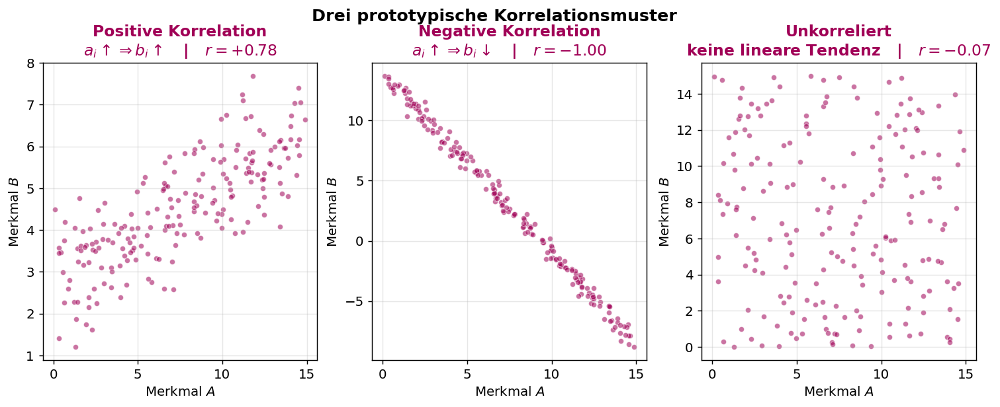
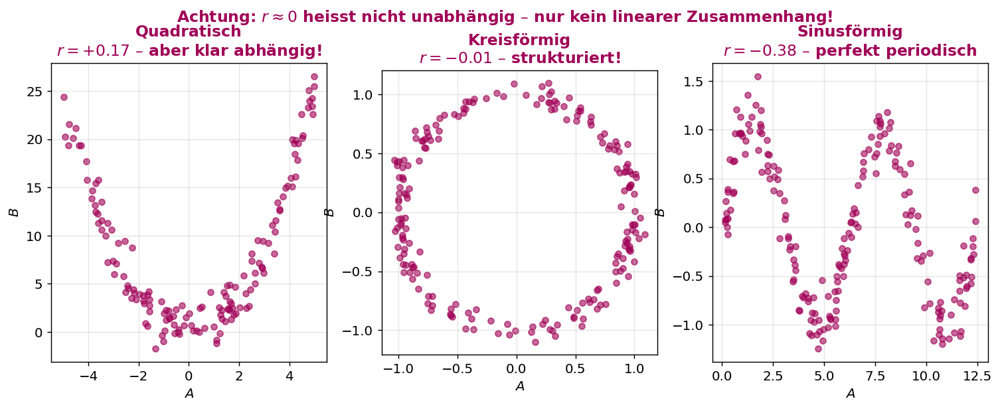
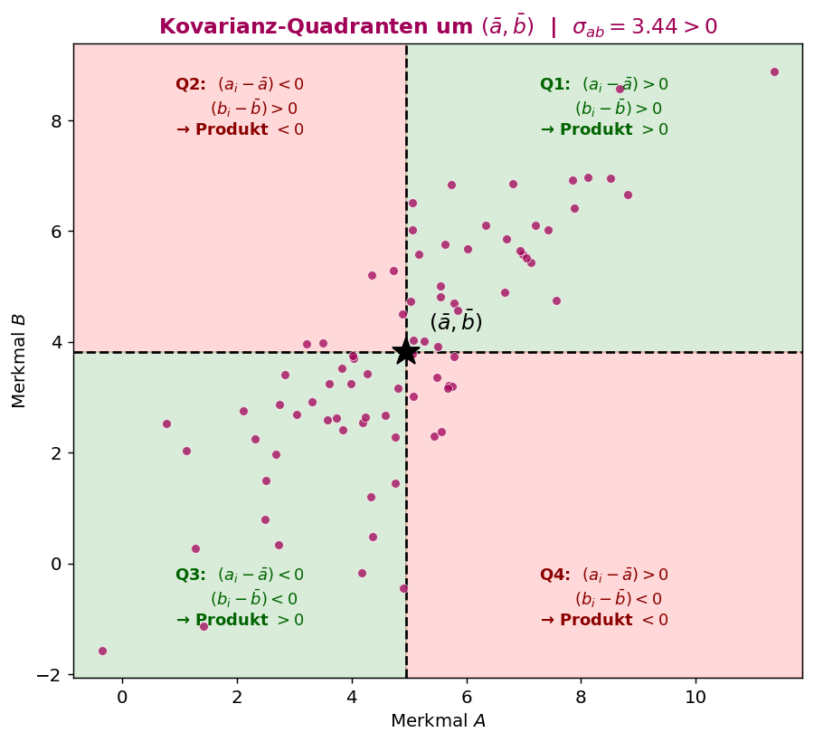
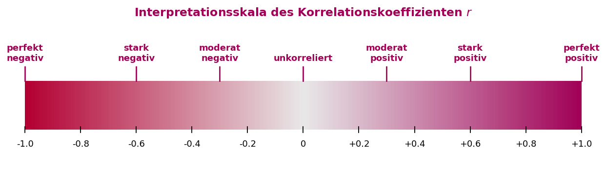
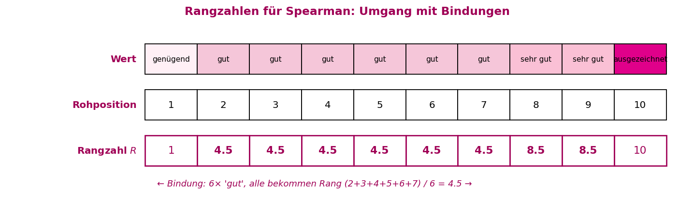
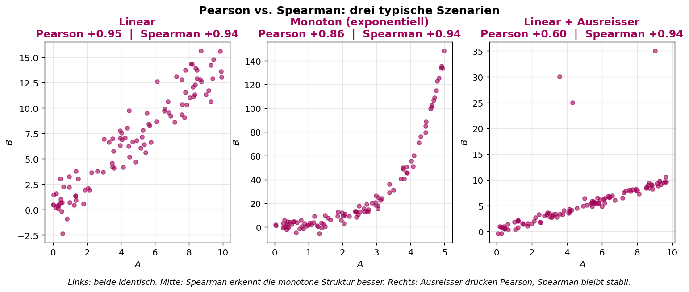
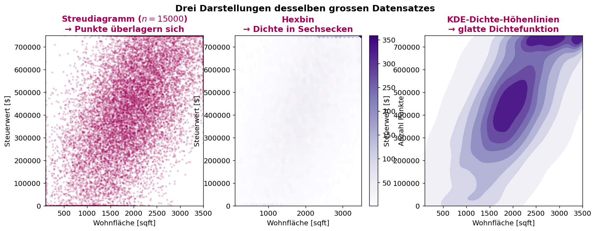
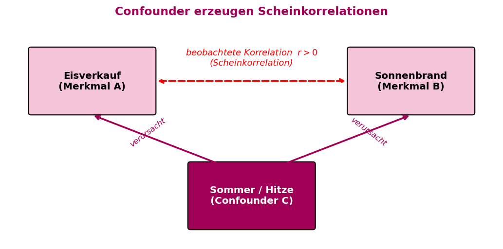
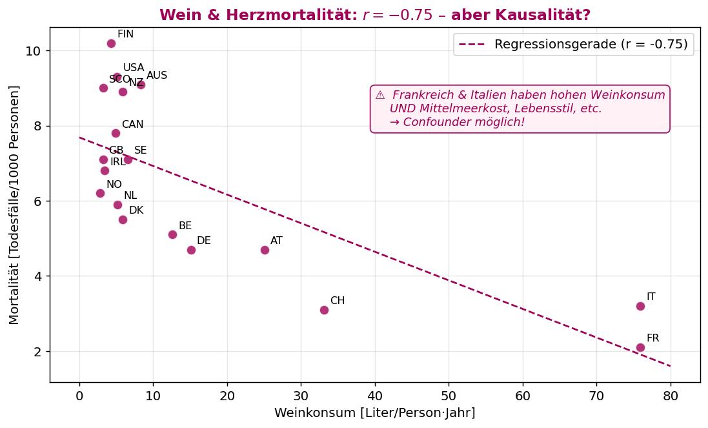

# ASTAT – Angewandte Statistik für Datenwissenschaften

## SW 10 – Zusammenhangsanalyse (Teil 2): Korrelation & Kausalität

---

## Lernziele

1. Sie können Zusammenhang in **ordinalen** und **metrischen** Daten analysieren und mit Python graphisch darstellen.
2. Sie kennen den **Korrelationskoeffizienten** (nach Bravais/Pearson) und den **Rangkorrelationskoeffizienten** (nach Spearman).
3. Sie verstehen den Unterschied zwischen **Kausalität** und **Korrelation**.

---

## Wichtigste Begriffe

| Begriff | Englisch | Definition |
| :--- | :--- | :--- |
| **Streudiagramm** | *Scatter plot* | Punktwolke mit je einem Punkt pro statistische Einheit, Koordinaten = Merkmalswerte. |
| **Kovarianz** ($\sigma_{ab}$) | *Covariance* | Mittelwert der Produkte der zentrierten Abweichungen beider Merkmale. |
| **Korrelationskoeffizient** ($r$) | *Pearson correlation coefficient* | Mit den Standardabweichungen normierte Kovarianz, $-1 \leqslant r \leqslant 1$. |
| **Rangkorrelationskoeffizient** ($r_{Sp}$) | *Spearman rank correlation* | Korrelationskoeffizient auf den **Rangzahlen** der Werte. |
| **Rangzahl** ($R(a_i)$) | *Rank* | Position eines Wertes in der sortierten Liste; bei Bindungen: arithmetisches Mittel der Positionen. |
| **Positive Korrelation** | *Positive correlation* | Je grösser $a_i$, desto grösser tendenziell $b_i$ ($r > 0$). |
| **Negative Korrelation** | *Negative correlation* | Je grösser $a_i$, desto kleiner tendenziell $b_i$ ($r < 0$). |
| **Unkorreliert** | *Uncorrelated* | Kein **linearer** Zusammenhang ($r \approx 0$) – andere, nicht-lineare Zusammenhänge möglich! |
| **Kausalität** | *Causality* | **Ursache-Wirkung**-Zusammenhang (Feuer → Wärme). |
| **Scheinkorrelation** | *Spurious correlation* | Statistisch gemessener Zusammenhang ohne kausalen Bezug (oft durch eine dritte Variable). |
| **Confounder** | *Confounding variable* | Dritte Variable, die scheinbaren Zusammenhang zwischen zwei Merkmalen erzeugt. |
| **Hexbin-Plot** | *Hexagonal binning* | Ersatz für Streudiagramm bei sehr grossen Datensätzen: Zählung der Punkte pro Sechseck. |
| **KDE** | *Kernel Density Estimation* | Glatte, kontinuierliche Dichtefunktion statt Histogramm/Hexbin. |
| **Bindung** | *Tie* | Gleiche Werte, die sich dieselbe (gemittelte) Rangzahl teilen. |
| **ddof** | *Delta degrees of freedom* | Parameter bei Kovarianz: `ddof=0` für Grundgesamtheit, `ddof=1` für Stichprobe. |

---

## Konzepte & Definitionen

### 1. Streudiagramm für zwei metrische Merkmale

Zwei metrische Merkmale $A = (a_1, a_2, \ldots)$ und $B = (b_1, b_2, \ldots)$ ergeben je statistische Einheit einen Punkt $P_i = (a_i, b_i)$ im Koordinatensystem.

**Drei prototypische Muster:**

| Muster | Tendenz | Korrelation |
|:---|:---|:---:|
| Punkte **steigen** von links unten nach rechts oben | $a_i \uparrow \Rightarrow b_i \uparrow$ | **positiv** ($r > 0$) |
| Punkte **fallen** von links oben nach rechts unten | $a_i \uparrow \Rightarrow b_i \downarrow$ | **negativ** ($r < 0$) |
| Punkte bilden **formlose Wolke** | keine lineare Tendenz | **unkorreliert** ($r \approx 0$) |

<center>

</center>

> **Lesehilfe zur Grafik:** Drei Streudiagramme mit je 200 Punkten, alle aus demselben $A$ erzeugt, aber mit unterschiedlichem $B$. **Links:** $B$ wächst mit $A$ → Punkte ziehen schräg nach oben, $r \approx +0.78$. **Mitte:** $B$ fällt mit $A$ → Punkte perfekt auf einer fallenden Linie, $r \approx -1$. **Rechts:** $B$ unabhängig gewürfelt → zufällige Wolke, $r \approx 0$. Das Vorzeichen zeigt die Richtung, der Betrag die Güte der Geraden.

> **Wichtig:** Korrelation beschreibt nur **lineare** Abhängigkeit. Unkorrelierte Merkmale können trotzdem **nicht-linear** voneinander abhängen (z.B. quadratisch, zirkulär).

<center>

</center>

> **Lesehilfe zur Grafik:** Alle drei Datensätze haben **strukturelle Abhängigkeit** zwischen $A$ und $B$ – trotzdem liefert Pearson fast Null. **Links:** $B = A^2$ (Parabel) – symmetrisch, daher heben sich positive und negative Beiträge zur Kovarianz auf. **Mitte:** Punkte auf einem Kreis – kein linearer, aber ein klarer geometrischer Zusammenhang. **Rechts:** Sinuskurve – perfekt periodisch, aber kein linearer Trend. **Lesson:** $r = 0$ ist nur die Aussage "keine Gerade passt", nicht "keine Beziehung".

---

### 2. Kovarianz als Grundmetrik

Für zwei metrische Merkmale $A$ und $B$ mit Mittelwerten $\bar{a}$ und $\bar{b}$:

$$\sigma_{ab} = \frac{1}{n} \sum_{i=1}^{n} (a_i - \bar{a}) \cdot (b_i - \bar{b})$$

**Geometrische Interpretation (vier Quadranten um $(\bar{a}, \bar{b})$):**

| Quadrant | $(a_i - \bar{a})$ | $(b_i - \bar{b})$ | Produkt |
|:---:|:---:|:---:|:---:|
| 1. (oben rechts) | $>0$ | $>0$ | **positiv** |
| 2. (oben links) | $<0$ | $>0$ | **negativ** |
| 3. (unten links) | $<0$ | $<0$ | **positiv** |
| 4. (unten rechts) | $>0$ | $<0$ | **negativ** |

- **Positive Korrelation** → viele Punkte in Q1 & Q3 → $\sigma_{ab} > 0$.
- **Negative Korrelation** → viele Punkte in Q2 & Q4 → $\sigma_{ab} < 0$.
- **Unkorreliert** → Punkte gleichmässig auf alle vier Quadranten → $\sigma_{ab} \approx 0$.

<center>

</center>

> **Lesehilfe zur Grafik:** Der schwarze Stern markiert den Mittelpunkt $(\bar{a}, \bar{b})$. Die gestrichelten Achsen teilen die Fläche in vier Quadranten. **Grüne Quadranten (Q1, Q3):** Produkt $(a_i - \bar{a})(b_i - \bar{b})$ ist **positiv** – ein Punkt hier "zieht" die Kovarianz ins Positive. **Rote Quadranten (Q2, Q4):** Produkt ist **negativ** – Punkt zieht nach unten. Im Beispiel liegen viele Punkte in Q1 und Q3, darum ist $\sigma_{ab} \approx 3.44 > 0$ und die Korrelation positiv.

> **Bemerkung:** Setzt man $B = A$, erhält man die mittlere quadratische Abweichung: $\sigma_{aa} = \frac{1}{n} \sum (a_i - \bar{a})^2$.

**Problem der Kovarianz:** Sie hat die **Einheit** von $a \cdot b$ (z.B. m · kg) und ist **nicht normiert** – absolute Werte sind schwer interpretierbar.

---

### 3. Korrelationskoeffizient nach Bravais/Pearson

Normierung der Kovarianz mit den Standardabweichungen $\sigma_a$ und $\sigma_b$:

$$\boxed{\;r = \frac{\sigma_{ab}}{\sigma_a \cdot \sigma_b}\;}$$

**Eigenschaften:**

| Eigenschaft | Bedeutung |
|:---|:---|
| **dimensionslos** | $r$ hat keine Einheit – nur eine Zahl |
| $-1 \leqslant r \leqslant 1$ | universelle Skala, unabhängig vom Datenbereich |
| $r = +1$ | alle Punkte **exakt auf einer steigenden Geraden** |
| $r = 0$ | **kein** linearer Zusammenhang |
| $r = -1$ | alle Punkte **exakt auf einer fallenden Geraden** |
| $\lvert r \rvert$ sagt **nichts** über die **Steigung** | nur über die **Güte** der linearen Anpassung |

**Interpretation in der Praxis:**

| $\lvert r \rvert$ | Zusammenhang |
|:---:|:---|
| $< 0.2$ | sehr schwach / keiner |
| $0.2 - 0.4$ | schwach |
| $0.4 - 0.6$ | moderat |
| $0.6 - 0.8$ | stark |
| $> 0.8$ | sehr stark |

<center>

</center>

> **Lesehilfe zur Grafik:** Der Farbverlauf geht von einem roten Bordeaux bei $r = -1$ (perfekt negative Korrelation) über Weiss bei $r = 0$ (unkorreliert) zum HSLU-Bordeaux bei $r = +1$ (perfekt positive Korrelation). Die **Marker oberhalb** zeigen typische Einordnungen. Anders als $C_{\text{korr}}$ aus SW 09 geht die $r$-Skala **bis −1**, weil Pearson auch die **Richtung** des Zusammenhangs mitmisst.

> **Hinweis:** Bei `df.corr()` wird `ddof` **nicht** benötigt, da sich die Faktoren $\frac{1}{n}$ bzw. $\frac{1}{n-1}$ aus Kovarianz und Standardabweichungen im Bruch **wegkürzen**.

---

### 4. Rangkorrelationskoeffizient nach Spearman

Wenn **mindestens eines** der Merkmale nur **ordinal** ist, können wir nicht mit den Werten rechnen. Stattdessen vergeben wir **Rangzahlen** $R(a_i)$ und $R(b_i)$:

- Kleinster Wert → Rang 1
- Zweitkleinster → Rang 2
- …
- Grösster Wert → Rang $n$

**Bei Bindungen** (gleiche Werte) bekommen alle das **arithmetische Mittel** der betreffenden Rangplätze.

**Beispiel (Schulnoten):**

| Wert | "genügend" | "gut" × 6 | "sehr gut" × 2 | "ausgezeichnet" |
|:---|:---:|:---:|:---:|:---:|
| **Rohposition** | 1 | 2–7 | 8–9 | 10 |
| **Rangzahl** | **1** | **4.5** | **8.5** | **10** |

(4.5 = Mittel von 2…7;  8.5 = Mittel von 8…9.)

<center>

</center>

> **Lesehilfe zur Grafik:** Die drei Zeilen zeigen dieselben 10 Werte in drei Darstellungen. **Zeile 1 (Wert):** Originaldaten – gleiche Kategorien haben gleiche Farbe. **Zeile 2 (Rohposition):** Einfach durchnummeriert 1…10. **Zeile 3 (Rangzahl):** Bei Bindungen werden die Positionen gemittelt – alle sechs "gut" bekommen $(2+3+4+5+6+7)/6 = 4.5$, die beiden "sehr gut" bekommen $(8+9)/2 = 8.5$. Auf diesen Rangzahlen rechnet Spearman die Pearson-Formel.

**Der Rangkorrelationskoeffizient** ist der Pearson-Koeffizient der **Rangzahlen**:

$$r_{Sp} = \frac{\sigma_{R(a)R(b)}}{\sigma_{R(a)} \cdot \sigma_{R(b)}}$$

**Vorteil:** Erfasst auch **monotone, nicht-lineare** Zusammenhänge, da nur die Reihenfolge zählt.

<center>

</center>

> **Lesehilfe zur Grafik:** Drei Szenarien vergleichen Pearson und Spearman direkt.
> - **Links (linear):** Beide Koeffizienten liegen bei ≈ +0.95 – bei sauberen linearen Daten liefern sie dasselbe.
> - **Mitte (exponentiell):** Pearson unterschätzt den Zusammenhang (+0.86), weil die Kurve nicht gerade ist. Spearman erkennt die **monotone Struktur** perfekt (+0.94).
> - **Rechts (linear + Ausreisser):** Drei einzelne Extremwerte **drücken Pearson auf +0.60**, während Spearman stabil bei +0.94 bleibt – Ränge sind robust gegen Ausreisser.

---

### 5. Umgang mit sehr grossen Datensätzen

Bei vielen Tausenden Punkten überlappen sich die Punkte im Streudiagramm so stark, dass Muster **nicht mehr erkennbar** sind. Zwei Alternativen:

| Methode | Funktion | Idee |
|:---|:---|:---|
| **Hexbin-Plot** | `plt.hexbin()` | Fläche in sechseckige Zellen teilen, Punkte pro Zelle zählen, Farbe = Dichte |
| **KDE** | `sns.kdeplot()` | Glatte, kontinuierliche Dichtefunktion schätzen (Höhenlinien-Landschaft) |

<center>

</center>

> **Lesehilfe zur Grafik:** Exakt **derselbe** Datensatz ($n = 15\,000$) in drei Darstellungen.
> - **Links (Scatter):** Die Punkte überlappen sich so stark, dass die Wolke unleserlich wird – trotz niedriger Transparenz.
> - **Mitte (Hexbin):** Fläche wird in gleich grosse Sechsecke zerlegt, pro Zelle wird die Punktanzahl farblich codiert. Der dichte Bereich (hellere Farbe) wird sofort sichtbar.
> - **Rechts (KDE):** Glatte Dichteschätzung als Höhenlinien – wie auf einer topografischen Karte zeigt sie "Berge" (hohe Punktdichte) und "Täler". Kein Binning-Artefakt, dafür bandbreitenabhängig.

> **Analogie zur topografischen Karte:** Hohe Dichte = Berg (viele Punkte), niedrige Dichte = Ebene. Enge Konturlinien = steiler Anstieg, weit auseinander = flach.

---

### 6. Kausalität vs. Korrelation

| | **Korrelation** | **Kausalität** |
|:---|:---|:---|
| **Typ** | statistischer Zusammenhang | Ursache-Wirkung |
| **Beispiel** | Eisverkauf & Sonnenbrand ↑ im Sommer | Feuer → Wärme |
| **Erkennbar in Daten?** | ja (via $r$, $r_{Sp}$) | nein – nur über Experimente / Fachwissen |
| **Richtung?** | symmetrisch ($A$ ↔ $B$) | gerichtet ($A$ → $B$) |

> **Merksatz:** **"Correlation does not imply causation."** Ein hoher $r$ kann durch einen **Confounder** (dritte Variable) oder durch **reinen Zufall** entstehen.

<center>

</center>

> **Lesehilfe zur Grafik:** Die rote gestrichelte Linie oben zeigt die **beobachtete Korrelation** zwischen Eisverkauf und Sonnenbrand – statistisch real, denn beide steigen im Sommer. Aber: Eis verursacht keinen Sonnenbrand und umgekehrt. Der **Confounder** unten (Sommer / Hitze) verursacht **beide** Effekte gleichzeitig. Die beiden HSLU-farbigen Pfeile zeigen die **echten Ursachenpfeile**. Die horizontale Korrelation ist also eine **Scheinkorrelation**.

**Berühmtes Beispiel: Wein & Herzmortalität.** In 18 Ländern sinkt die Mortalität mit steigendem Weinkonsum ($r \approx -0.75$). Aber: Länder mit hohem Weinkonsum (Frankreich, Italien) haben auch **andere Lebensstil-Faktoren** (Mittelmeerkost, Bewegung, soziale Strukturen). Der Wein selbst ist vermutlich **nicht die alleinige Ursache**.

<center>

</center>

> **Lesehilfe zur Grafik:** Streudiagramm der 18 Länder mit Länder-Codes (FR = Frankreich, IT = Italien, usw.). Die gestrichelte HSLU-Linie ist die Regressionsgerade – sie fällt deutlich, daher $r = -0.75$. Aber: die beiden **extremsten Punkte rechts** (IT, FR) ziehen die Gerade stark. Diese Länder unterscheiden sich nicht nur im Weinkonsum, sondern in vielen Lebensstil-Faktoren gleichzeitig – ein klassischer Fall für **Confounder**. Der Plot ist ein gutes Beispiel dafür, dass man Korrelationen **immer im Kontext** interpretieren muss.

---

## Formeln & Rechenregeln

### Formel 1: Kovarianz (Grundgesamtheit)

$$\sigma_{ab} = \frac{1}{n} \sum_{i=1}^{n} (a_i - \bar{a}) \cdot (b_i - \bar{b}) \qquad (\texttt{ddof=0})$$

### Formel 2: Kovarianz (Stichprobe, erwartungstreu)

$$s_{ab} = \frac{1}{n - 1} \sum_{i=1}^{n} (a_i - \bar{a}) \cdot (b_i - \bar{b}) \qquad (\texttt{ddof=1})$$

### Formel 3: Pearson-Korrelationskoeffizient

$$r = \frac{\sigma_{ab}}{\sigma_a \cdot \sigma_b} = \frac{\sum (a_i - \bar{a})(b_i - \bar{b})}{\sqrt{\sum (a_i - \bar{a})^2} \cdot \sqrt{\sum (b_i - \bar{b})^2}}$$

### Formel 4: Spearman-Rangkorrelationskoeffizient

$$r_{Sp} = \frac{\sigma_{R(a) R(b)}}{\sigma_{R(a)} \cdot \sigma_{R(b)}}$$

= Pearson-Koeffizient angewendet auf $R(a_i)$ und $R(b_i)$ statt auf $a_i, b_i$.

### Formel 5: Wertebereich

$$-1 \;\leqslant\; r, \, r_{Sp} \;\leqslant\; 1$$

---

## Vergleiche & Klassifizierungen

### I. Pearson vs. Spearman

| | **Pearson ($r$)** | **Spearman ($r_{Sp}$)** |
|:---|:---|:---|
| **Skalenniveau** | metrisch | ordinal (oder metrisch) |
| **Erfasst** | linearen Zusammenhang | **monotonen** Zusammenhang |
| **Robust gegen Ausreisser** | nein | **ja** |
| **Nicht-lineare, monotone Daten** | unterschätzt | korrekt erfasst |
| **Python** | `df.corr()` | `df.corr(method="spearman")` |

### II. SW 09 (nominal) vs. SW 10 (ordinal/metrisch)

| | **SW 09 – $C_{\text{korr}}$** | **SW 10 – $r$ / $r_{Sp}$** |
|:---|:---|:---|
| **Skalenniveau** | nominal | ordinal / metrisch |
| **Wertebereich** | $[0, 1]$ | $[-1, +1]$ |
| **Richtung erkennbar?** | nein | **ja** (Vorzeichen) |
| **Basis** | Kontingenztafel & $\chi^2$ | Kovarianz & Standardabweichungen |
| **Visualisierung** | gestapeltes Stabdiagramm | Streudiagramm / Hexbin / KDE |

### III. Visualisierungen für metrische Daten

| Methode | Einsatz | Vorteil | Nachteil |
|:---|:---|:---|:---|
| **Streudiagramm** | kleine/mittlere Datensätze | einzelne Punkte erkennbar | bei $n > 10^4$ Überlagerung |
| **Hexbin** | grosse Datensätze | Dichte klar sichtbar | Zellgrösse beeinflusst Bild |
| **KDE** | sehr grosse Datensätze | glatte, "bandbreitenunabhängige" Darstellung | rechenintensiv, Bandbreite wählen |

### IV. Korrelation vs. Kausalität – Ursachen für Scheinkorrelation

| Ursache | Beispiel |
|:---|:---|
| **Confounder** (3. Variable) | Eisverkauf × Sonnenbrand ← Sommer |
| **Umgekehrte Richtung** | Regenschirme × Regen: Regen verursacht Schirme, nicht umgekehrt |
| **Zufall / kleine Stichprobe** | Spurious correlations von Tyler Vigen (Scheidungsrate × Margarine-Konsum) |
| **Auswahlverzerrung** (Selection bias) | Flugzeug-Einschussdaten WW2 (Abraham Wald) |

---

## Code-Beispiele (Python)

### Konzept 1: Streudiagramm mit drei Korrelationsmustern

```python
import numpy as np
import pandas as pd
import matplotlib.pyplot as plt
from scipy.stats import uniform, norm

# Künstliche Daten
A   = uniform.rvs(loc=0, scale=15, size=200)
B_p =  0.2 * A + 3  + norm.rvs(loc=0, scale=0.8, size=200)   # positiv
B_n = -1.5 * A + 14 + norm.rvs(loc=0, scale=0.5, size=200)   # negativ
B_u = uniform.rvs(loc=0, scale=15, size=200)                 # unkorreliert

# DataFrames
df_p = pd.DataFrame({"A": A, "B": B_p})
df_n = pd.DataFrame({"A": A, "B": B_n})
df_u = pd.DataFrame({"A": A, "B": B_u})

# Streudiagramme
fig, axes = plt.subplots(1, 3, figsize=(14, 4))
for ax, df, titel in zip(axes, [df_p, df_n, df_u],
                          ["Positiv", "Negativ", "Unkorreliert"]):
    ax.scatter(df["A"], df["B"], alpha=0.5)
    ax.set_title(f"{titel}  (r = {df.corr().iloc[0,1]:.2f})")
    ax.set_xlabel("A"); ax.set_ylabel("B")
plt.show()
```

---

### Konzept 2: Kovarianz & Korrelationskoeffizient

```python
# Kovarianz (Stichprobe: ddof=1)
df_p.cov(ddof=1)

# Korrelationskoeffizient (Pearson)
df_p.corr()
```

**Interpretation:** `df_p.corr()` gibt eine symmetrische Matrix zurück; die Nebendiagonale ist $r$ zwischen $A$ und $B$. Für `df_p` entsteht $r \approx 0.87$, für `df_n` $r \approx -0.99$, für `df_u` $r \approx 0$.

---

### Konzept 3: Grosse Datensätze – Hexbin und KDE

```python
import seaborn as sns

# Daten laden und filtern
kc_tax = pd.read_csv("Daten/kc_tax.csv.gz")
kc_tax0 = kc_tax[(kc_tax["TaxAssessedValue"] < 750_000) &
                 (kc_tax["SqFtTotLiving"].between(100, 3500))]

fig, axes = plt.subplots(1, 2, figsize=(14, 5))

# Hexbin
axes[0].hexbin(kc_tax0["SqFtTotLiving"], kc_tax0["TaxAssessedValue"],
               gridsize=30, cmap="Purples")
axes[0].set_title("Hexbin: Wohnfläche × Steuerwert")

# KDE (Höhenlinien)
sns.kdeplot(x=kc_tax0["SqFtTotLiving"], y=kc_tax0["TaxAssessedValue"],
            ax=axes[1], cmap="Purples", levels=8)
axes[1].set_title("KDE (Dichte-Höhenlinien)")
plt.show()

# Korrelationskoeffizient
kc_tax0[["SqFtTotLiving", "TaxAssessedValue"]].corr()
```

**Output:** $r \approx 0.53$ → **moderat positiver linearer Zusammenhang** (grössere Wohnfläche → tendenziell höherer Steuerwert).

---

### Konzept 4: Spearman-Rangkorrelation

```python
# Schulnoten als ordinales Merkmal
noten = pd.Series(["genügend", "gut", "gut", "gut", "gut",
                   "gut", "gut", "sehr gut", "sehr gut", "ausgezeichnet"])
stunden = pd.Series([2, 5, 6, 5, 7, 4, 6, 8, 9, 12])

# Noten in Rangzahlen umwandeln (pandas macht das automatisch)
ranking = {"genügend": 1, "gut": 2, "sehr gut": 3, "ausgezeichnet": 4}
df = pd.DataFrame({"Note": noten.map(ranking), "Stunden": stunden})

# Spearman-Korrelation
df.corr(method="spearman")
```

---

### Konzept 5: Kausalität – Wein × Herzmortalität

```python
import pandas as pd

df = pd.DataFrame({
    "Weinkonsum":  [2.8, 3.2, 3.2, 3.4, 4.3, 4.9, 5.1, 5.2, 5.9, 5.9,
                    6.6, 8.3, 12.6, 15.1, 25.1, 33.1, 75.9, 75.9],
    "Mortalität":  [6.2, 9.0, 7.1, 6.8, 10.2, 7.8, 9.3, 5.9, 8.9, 5.5,
                    7.1, 9.1, 5.1, 4.7, 4.7, 3.1, 3.2, 2.1],
})
df.corr()
```

**Output:** $r \approx -0.75$ → **moderat negativer linearer Zusammenhang**. **ABER:** Das beweist **nicht**, dass Wein die Herzmortalität senkt – andere Lebensstilfaktoren sind plausible Confounder.

---

### Konzept 6: Geysir Old Faithful

```python
geysir = pd.read_csv("Daten/geysir.dat", delimiter=" ")
geysir[["Zeitspanne", "Eruptionsdauer"]].corr()
```

**Output:** $r \approx 0.85$ → **starker positiver linearer Zusammenhang** zwischen Wartezeit und Eruptionsdauer. Je länger die Pause, desto länger die Eruption.

---

### Konzept 7: Börsendaten – ETFs

```python
sp500_px = pd.read_csv("Daten/sp500_data.csv.gz", index_col=0)
sp500_sym = pd.read_csv("Daten/sp500_sectors.csv")

# Nur ETFs ab Juli 2012
etfSym = sp500_sym[sp500_sym["sector"] == "etf"]["symbol"]
etfs = sp500_px.loc[sp500_px.index >= "2012-07-01", etfSym]

# Korrelationsmatrix
etfs.corr()
```

**Visualisierung als Ellipsen-Matrix** (`matplotlib.collections.EllipseCollection`):
- **Enge Ellipse** = hohe Korrelation, Orientierung zeigt Vorzeichen
- **Kreisförmig** = unkorreliert
- Typisch: Innerhalb einer Branche stark korreliert, zwischen Branchen schwächer.

---

## Konzept-Code-Zuordnung

| Konzept | Python-Funktion/Code | Library | Beschreibung |
|:---|:---|:---|:---|
| Streudiagramm | `ax.scatter(x, y)` | `matplotlib` | Punktwolke |
| Kovarianz-Matrix | `df.cov(ddof=1)` | `pandas` | Stichproben-Kovarianz |
| Pearson-Korrelation | `df.corr()` | `pandas` | Korrelationsmatrix |
| Spearman-Korrelation | `df.corr(method="spearman")` | `pandas` | Rangkorrelation |
| Hexbin | `plt.hexbin(x, y, gridsize=, cmap=)` | `matplotlib` | Dichte in Sechsecken |
| 2D-KDE | `sns.kdeplot(x=, y=)` | `seaborn` | Dichte-Höhenlinien |
| Rangzahlen | `series.rank()` | `pandas` | automatische Rangbildung |
| Ellipsen-Korrmatrix | `EllipseCollection(...)` | `matplotlib` | Visualisierung vieler Korrelationen |

---

## Übungsaufgaben-Zusammenfassung

### Aufgabe 1: Hühnereier (Palette.sav)

| Aspekt | Detail |
|---|---|
| **Datei** | `Daten/Palette.sav` |
| **Merkmale** | Breite, Höhe, Gewicht (alles metrisch) |
| **Aufgabe** | Zusammenhangsanalyse – Streudiagramme + Pearson-$r$ |
| **Erwartung** | Starke positive Korrelation zwischen allen drei Dimensionen |

### Aufgabe 2: Palmer Penguins

| Aspekt | Detail |
|---|---|
| **Datensatz** | palmerpenguins (siehe Serie 03) |
| **Merkmale** | Flossenlänge, Schnabellänge/-tiefe, Körpergewicht |
| **Aufgabe** | Korrelationsmatrix + Streudiagramme, evtl. nach Spezies gruppiert |
| **Hinweis** | Simpson-Paradoxon möglich: Korrelation innerhalb Gruppen ≠ über alle Daten |

### Aufgabe 3: Personalerhebung 2021 – weitere Merkmale

| Aspekt | Detail |
|---|---|
| **Datei** | `Daten/2021_Personalerhebung.csv` |
| **Aufgabe** | Zusammenhangsanalyse (Erweiterung von Aufgabe 2) für weitere Merkmalspaare |
| **Methoden** | Pearson bei metrischen, Spearman bei ordinalen Merkmalen |

---

## Prüfungsrelevante Hinweise

### Typische SC/MC-Fallen

| Falle | Warum falsch? | Richtige Aussage |
|---|---|---|
| "$r = 0$ bedeutet, die Merkmale sind unabhängig." | $r = 0$ bedeutet nur **kein linearer** Zusammenhang. | Nicht-lineare Abhängigkeiten sind weiterhin möglich (z.B. quadratisch). |
| "Ein hohes $r$ beweist, dass $A$ die Ursache von $B$ ist." | Korrelation $\neq$ Kausalität! | Kausalität erfordert Experimente oder Fachwissen, nicht nur Statistik. |
| "$\lvert r \rvert$ gibt die Steigung der Geraden an." | $\lvert r \rvert$ beschreibt nur die **Güte**, nicht die **Steigung**. | Die Steigung folgt aus linearer Regression (SW 11). |
| "Spearman ist immer schlechter als Pearson." | Bei Ausreissern und monoton-nichtlinearen Daten ist Spearman **besser**. | Wahl richtet sich nach Skalenniveau und Datenform. |
| "Die Kovarianz allein zeigt die Stärke der Korrelation." | Kovarianz ist **nicht normiert** und einheitsabhängig. | Immer mit $\sigma_a \cdot \sigma_b$ normieren → $r$. |
| "Bei `df.corr()` muss ich `ddof=1` setzen." | $\frac{1}{n}$ und $\frac{1}{n-1}$ **kürzen sich weg**. | `df.corr()` ohne Argument verwenden. |
| "Wenn $r = 0.95$, dann liegen fast alle Punkte auf einer Geraden durch den Ursprung." | Die Gerade muss **nicht** durch den Ursprung gehen. | $r$ misst nur die Güte der **Geraden** durch den Mittelpunkt $(\bar{a}, \bar{b})$. |

### Formeln auswendig / auf das A4-Blatt

| Formel | Auswendig? | Begründung |
|---|---|---|
| $r = \frac{\sigma_{ab}}{\sigma_a \cdot \sigma_b}$ | **Auswendig** | Kernformel der Korrelation |
| $\sigma_{ab} = \frac{1}{n} \sum (a_i - \bar{a})(b_i - \bar{b})$ | A4-Blatt | Herleitung, aber Rechnung meist mit `df.cov()` |
| $-1 \leqslant r \leqslant 1$ | **Auswendig** | Wertebereich ist prüfungsrelevant |
| Bindungen: $R(a_i)$ = arith. Mittel der Ränge | A4-Blatt | Detail bei Spearman |

### Merkregeln & Eselsbrücken

- **"Korrelation ist linear"** – für krumme Zusammenhänge braucht es Spearman oder andere Masse.
- **"Vorzeichen = Richtung, Betrag = Stärke"** – $r = -0.9$ ist genauso stark wie $r = +0.9$, nur umgekehrt.
- **"Korrelation ≠ Kausalität"** – das Mantra dieser Woche. Drittvariablen oder Zufall als Erklärung immer mitdenken.
- **"Pearson für Zahlen, Spearman für Ränge"**.
- **"Grosse Daten → Hexbin oder KDE"** – Streudiagramme werden bei $n > 10^4$ unlesbar.

### Hinweise für numerische Antworten

- **`df.corr()`** gibt eine **symmetrische Matrix** zurück. Den Wert zwischen zwei Merkmalen in `.iloc[0, 1]` oder `.loc["A", "B"]` auslesen.
- **`df.cov()`** braucht **`ddof=1`** für die Stichproben-Kovarianz (wie `var(ddof=1)` in SW 02).
- **`df.corr(method="spearman")`** für ordinale Daten oder bei vielen Ausreissern.
- **KDE** braucht eventuell Bandbreiten-Tuning (`bw_adjust=`) – Default ist meistens gut.
- Bei **fehlenden Werten**: `df.corr()` ignoriert NaN paarweise; bei Bedarf `df.dropna()`.

---

## Verbindung zu vorherigen/folgenden Wochen

### Rückbezug

| Vorherige Woche | Verbindung zu SW 10 |
|---|---|
| **SW 02** (Datenbeschreibung) | **Mittelwert** $\bar{a}$ und **Standardabweichung** $\sigma_a$ sind Bausteine der Kovarianz und des Korrelationskoeffizienten. |
| **SW 03** (Datenvisualisierung) | Streudiagramme gehören zum Standard-Werkzeugkasten; hier erweitert um Hexbin und KDE. |
| **SW 09** (Zusammenhangsanalyse nominal) | Nach dem **$C_{\text{korr}}$** für nominale Daten folgt hier $r$/$r_{Sp}$ für ordinale/metrische Daten – derselbe Grundgedanke. |

### Vorausschau

| Folgende Woche | Warum SW 10 wichtig ist |
|---|---|
| **SW 11** (Regression) | $r$ ist die Brücke zur **linearen Regression**: Die Steigung einer Regressionsgeraden ist $\hat{\beta} = r \cdot \frac{\sigma_b}{\sigma_a}$. |
| **SW 12** (Modellierung) | Kausalitäts-Überlegungen werden zentral, wenn aus Korrelationen Prognosemodelle werden. |
