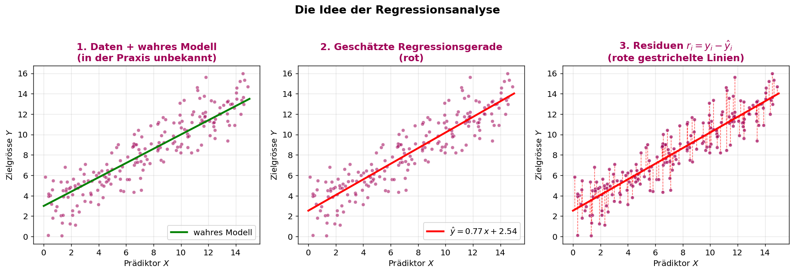
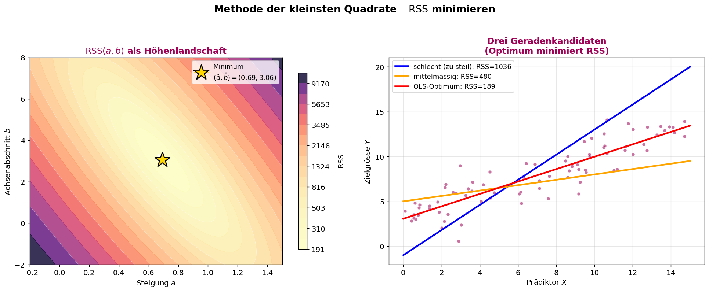
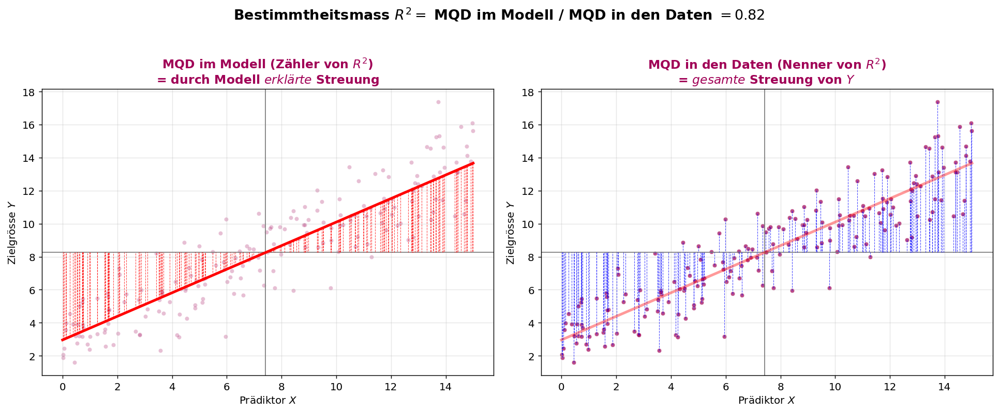
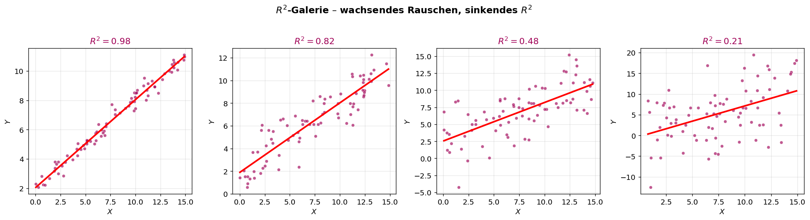
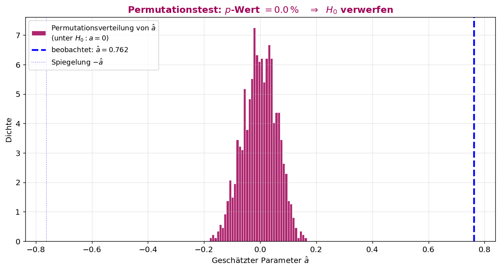
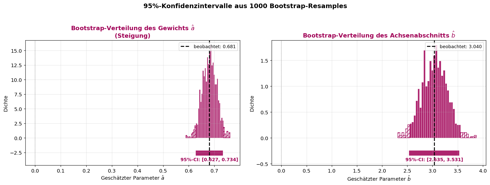
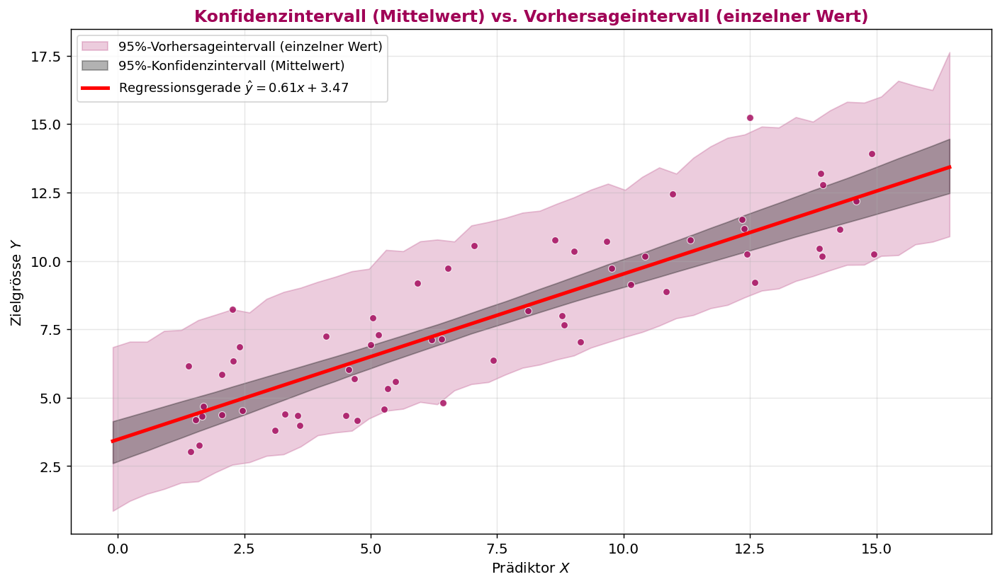
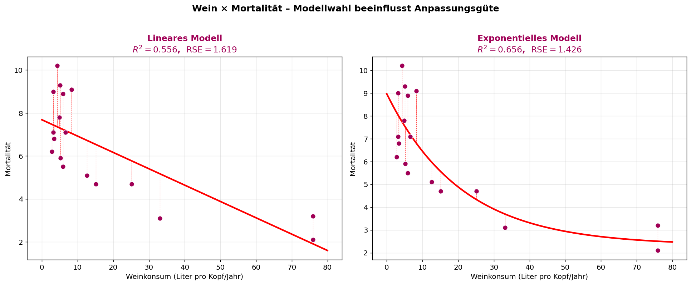

# ASTAT – Angewandte Statistik für Datenwissenschaften

## SW 11 – Regressionsanalyse

---

## Lernziele

1. Sie können mit der **Methode der kleinsten Quadrate** die Parameter eines Modells schätzen.
2. Sie kennen die Bedeutung des **Standardfehlers der Residuen** ($\mathsf{RSE}$) und des **Bestimmtheitsmasses** ($R^2$).
3. Sie können mit einem **Hypothesentest** prüfen, ob der Einfluss eines Prädiktors signifikant ist.
4. Sie können **Konfidenzintervalle** für die Regressionsparameter berechnen.
5. Sie können **Vorhersageintervalle** für Schätzungen neuer Werte berechnen.

---

## Wichtigste Begriffe

| Begriff | Englisch | Definition |
| :--- | :--- | :--- |
| **Prädiktor** ($X_i$) | *Predictor / feature* | Unabhängige Eingangsvariable, aus der die Zielgrösse vorhergesagt wird. |
| **Zielgrösse** ($Y$) | *Target / response* | Abhängige Variable, die durch die Prädiktoren erklärt werden soll. |
| **Modell** | *Model* | Funktion $\texttt{predict}(X_1,\ldots,X_m)$, die Prädiktoren auf die Zielgrösse abbildet. |
| **Lineare Einfachregression** | *Simple linear regression* | $Y = a\cdot X + b$ mit genau **einem** Prädiktor. |
| **Multiple lineare Regression** | *Multiple linear regression* | $Y = a_1X_1 + \ldots + a_mX_m + b$ mit mehreren Prädiktoren. |
| **Gewicht** ($\hat{a}_i$) | *Coefficient / weight* | Geschätzter Faktor des Prädiktors $X_i$ – misst dessen Einfluss auf $Y$. |
| **Achsenabschnitt** ($\hat{b}$) | *Intercept* | Modellwert bei $X_i = 0$ für alle $i$. |
| **Residuum** ($r_i$) | *Residual* | Abweichung Beobachtung minus Vorhersage: $r_i = y_i - \texttt{predict}(x_i)$. |
| **RSS** | *Residual sum of squares* | $\sum r_i^2$ – Zielfunktion, die durch die Schätzung minimiert wird. |
| **Methode der kleinsten Quadrate** | *Ordinary Least Squares (OLS)* | Suche nach den Parametern, die $\mathsf{RSS}$ minimal machen. |
| **RSE** | *Residual standard error* | $\sqrt{\mathsf{RSS}/(n-2)}$ – erwartungstreue Schätzung der Standardabweichung des Fehlers. |
| **Bestimmtheitsmass** ($R^2$) | *Coefficient of determination* | Anteil der Varianz von $Y$, den das Modell erklärt; $0 \leqslant R^2 \leqslant 1$. |
| **Permutationstest** | *Permutation test* | Resampling-Test, ob ein beobachtetes Gewicht $\hat{a}$ rein zufällig sein könnte. |
| **Konfidenzintervall (Parameter)** | *Confidence interval* | Bereich, der den **wahren Parameter** mit angegebener Wahrscheinlichkeit enthält. |
| **Vorhersageintervall** | *Prediction interval* | Bereich, in dem ein **neuer einzelner Beobachtungswert** $y_{\text{neu}}$ liegt. |
| **Bootstrap** | *Bootstrap* | Resampling mit Zurücklegen zur Schätzung von Verteilungen von Statistiken. |

---

## Konzepte & Definitionen

### 1. Was ist eine Regressionsanalyse?

Die **Regressionsanalyse** beschreibt **Zusammenhänge** zwischen einer Zielgrösse $Y$ und einem oder mehreren Prädiktoren $X_1, \ldots, X_m$ durch ein **Modell**:

$$Y = \texttt{predict}(X_1, X_2, \ldots, X_m)$$

Im **linearen Modell** wirkt jeder Prädiktor mit einem **Gewicht** $a_i$:

$$Y = a_1 X_1 + a_2 X_2 + \ldots + a_m X_m + b$$

| Gewicht | Bedeutung |
|:---|:---|
| $\hat{a}_i = 0$ | $X_i$ hat **keinen Einfluss** auf $Y$ |
| $\hat{a}_i > 0$ | je grösser $X_i$, desto **grösser** $Y$ |
| $\hat{a}_i < 0$ | je grösser $X_i$, desto **kleiner** $Y$ |

<center>

</center>

> **Lesehilfe zur Grafik:** Drei Schritte des Grundgedankens. **Links:** Punktwolke aus 200 simulierten Datenpunkten – die echte Beziehung $y = 0.7x + 3 + \text{Rauschen}$ ist die grüne Linie. **Mitte:** In der Realität sehen wir nur die Punkte, nicht die grüne Wahrheit – wir suchen die rote Gerade, die "möglichst gut passt". **Rechts:** Für jeden Punkt zeigt eine rote gestrichelte Linie das **Residuum** $r_i = y_i - \texttt{predict}(x_i)$, also die Abweichung Beobachtung minus Vorhersage. Diese Residuen sind das Material, aus dem die Methode der kleinsten Quadrate die beste Linie wählt.

---

### 2. Methode der kleinsten Quadrate (OLS)

Wir suchen die Parameter $\hat{a}, \hat{b}$, die die **Summe der Residuenquadrate** minimieren:

$$\boxed{\;\mathsf{RSS}(a, b) = \sum_{i=1}^{n} r_i^2 = \sum_{i=1}^{n} \big(y_i - (a\cdot x_i + b)\big)^2 \;\longrightarrow\; \text{Minimum}\;}$$

**Warum Quadrate** und nicht Beträge?
- Quadrate sind **differenzierbar** → analytische und numerische Optimierung sehr effizient.
- Grosse Abweichungen werden **stärker bestraft** als kleine.
- Resultat hat eine elegante geometrische Deutung (orthogonale Projektion auf die Modellebene).

In Python lösen wir das Optimierungsproblem mit **`scipy.optimize.minimize()`**.

<center>

</center>

> **Lesehilfe zur Grafik:** **Links:** $\mathsf{RSS}(a, b)$ als Höhenlandschaft über der Parameterebene – Konturlinien zeigen Bereiche gleicher Fehlerquadratsumme. Der **Stern** markiert das Minimum: das Paar $(\hat{a}, \hat{b})$, das `minimize()` zurückgibt. **Rechts:** Drei Geraden im Streudiagramm – die **schlechte** (zu flach), die **mittelmässige** und die **optimale** rote Gerade. Die Zahlen an den Geraden zeigen die zugehörige $\mathsf{RSS}$ – sie ist bei der roten Gerade am kleinsten. Anschaulich: Die rote Gerade balanciert **alle** vertikalen Abstände gleichzeitig.

---

### 3. Bewertung der Modellgüte

#### Standardfehler der Residuen ($\mathsf{RSE}$)

$$\boxed{\;\mathsf{RSE} = \sqrt{\frac{\mathsf{RSS}}{n - \textcolor{red}{2}}} = \sqrt{\frac{r_1^2 + r_2^2 + \ldots + r_n^2}{n - \textcolor{red}{2}}}\;}$$

- **Einheit** = Einheit von $Y$ (z.B. cm, kg, %).
- **Interpretation:** typische Abweichung der Beobachtungen von der Regressionsgerade.
- **Warum $n - \textcolor{red}{2}$?** Es werden **zwei Parameter** geschätzt ($\hat{a}, \hat{b}$) – jeder verbraucht einen Freiheitsgrad. Ohne diese Korrektur wäre $\mathsf{RSE}$ zu optimistisch. Bei multiplen Regressionen mit $p$ Parametern: $n - p$.

#### Bestimmtheitsmass ($R^2$)

$$\boxed{\;R^2 = \frac{\mathsf{MQD}\,\{\,\texttt{predict}(x_i)\,\}}{\mathsf{MQD}\,\{\,y_i\,\}} = \frac{\text{durch Modell erklärte Streuung}}{\text{Gesamtstreuung von }Y}\;}$$

| $R^2$ | Bedeutung |
|:---:|:---|
| $1$ | Modell erklärt **die gesamte** Streuung – alle Punkte liegen auf der Geraden |
| $0.8$ | Modell erklärt **80 %** – starker linearer Zusammenhang |
| $0.5$ | Modell erklärt **die Hälfte** – moderater Zusammenhang |
| $0$ | Modell erklärt **nichts** – Vorhersagen so gut wie der reine Mittelwert $\bar{y}$ |

> **Wichtige Beziehung für lineare Einfachregression:** $\;\;\boxed{\,R^2 = r^2\,}\;\;$ – das Bestimmtheitsmass ist das Quadrat des Pearson-Korrelationskoeffizienten aus SW 10.

<center>

</center>

> **Lesehilfe zur Grafik:** Beide Bilder zeigen denselben Datensatz – einmal die **vom Modell erklärte** und einmal die **gesamte** Streuung um den Mittelwert.
> - **Links (MQD im Modell, rot):** Die roten Striche gehen von der Regressionsgeraden zum horizontalen Mittelwert $\bar{y}$ – das ist die Streuung, die das Modell **erzeugt**.
> - **Rechts (MQD in den Daten, blau):** Die blauen Striche gehen von den Punkten zu $\bar{y}$ – das ist die **gesamte** Streuung von $Y$.
> - $R^2$ ist genau das Verhältnis dieser beiden Quadratsummen. Im Beispiel sind ca. 80 % der gesamten Streuung durch das Modell erklärt – das passt zu $r \approx 0.89$ und $r^2 \approx 0.80$.

<center>

</center>

> **Lesehilfe zur Grafik:** Vier Streudiagramme mit identischer wahrer Steigung, aber zunehmendem Rauschen. Von links nach rechts: $R^2 \approx 0.98, 0.82, 0.48, 0.21$. Das Bild trainiert das Auge: Wann reicht $R^2$ wirklich? Bei $R^2 \approx 0.48$ ist die Wolke schon **sichtbar breit**, der Trend trotzdem real. Bei $R^2 \approx 0.21$ verschwindet die Geradenführung optisch fast völlig – das Modell ist kaum besser als der reine Mittelwert.

---

### 4. Hypothesentest auf Signifikanz eines Prädiktors

**Frage:** Ist das geschätzte Gewicht $\hat{a}$ statistisch von Null verschieden – oder könnte es Zufall sein?

**Hypothesen:**
- $H_0: a = 0$ – der Prädiktor hat **keinen** Einfluss auf $Y$
- $H_1: a \neq 0$ – der Prädiktor hat einen Einfluss

**Permutationstest** (resampling-basiert):
1. $Y$-Werte zufällig durchmischen (so wird jeder Zusammenhang zerstört).
2. Auf den permutierten Daten erneut $\hat{a}^{(k)}$ schätzen.
3. Schritte 1–2 viele Male (z.B. 1000) wiederholen → Verteilung von $\hat{a}$ unter $H_0$.
4. **p-Wert** = Anteil der permutierten Werte mit $|\hat{a}^{(k)}| \geqslant |\hat{a}_{\text{beobachtet}}|$.

| p-Wert | Entscheidung |
|:---:|:---|
| $< 5\%$ | $H_0$ verwerfen → Prädiktor ist **signifikant** |
| $\geqslant 5\%$ | $H_0$ beibehalten → kein signifikanter Effekt nachweisbar |

<center>

</center>

> **Lesehilfe zur Grafik:** Histogramm der 1000 permutierten Gewichte $\hat{a}^{(k)}$ – sie streuen symmetrisch um Null, weil unter $H_0$ kein echter Zusammenhang besteht. Die **blaue gestrichelte Linie** markiert das tatsächlich beobachtete $\hat{a} \approx 0.70$. Es liegt **weit ausserhalb** der gesamten Permutationsverteilung – kein einziger zufälliger Lauf erreicht diesen Wert. Der p-Wert ist 0 % → wir verwerfen $H_0$ deutlich. Der Prädiktor $X$ hat einen signifikanten Einfluss auf $Y$.

---

### 5. Konfidenzintervall für die Regressionsparameter

Ein **95 %-Konfidenzintervall** für $\hat{a}$ ist ein Bereich, der bei wiederholten Stichproben in **95 %** der Fälle den **wahren** Parameter $a$ enthält.

**Berechnung mit Bootstrap:**
1. Aus dem Datensatz $(X, Y)$ ziehe **mit Zurücklegen** ein Resample der gleichen Grösse $n$.
2. Schätze auf dem Resample $\hat{a}^{(k)}, \hat{b}^{(k)}$ mit der Methode der kleinsten Quadrate.
3. Wiederhole sehr oft (z.B. 1000 mal).
4. Konfidenzintervall = $[Q_{2.5\%}, Q_{97.5\%}]$ der Resample-Werte.

**Interpretationsregel:**
> Liegt das **95 %-Konfidenzintervall vollständig oberhalb oder unterhalb von Null**, ist der Effekt auf dem 5 %-Niveau **signifikant** – die Aussage ist äquivalent zum p-Wert-Test.

<center>

</center>

> **Lesehilfe zur Grafik:** **Links:** Bootstrap-Verteilung des Gewichts $\hat{a}$ aus 1000 Resamples. Die schraffierten Flanken markieren die untersten und obersten 2.5 % – dazwischen liegt das 95 %-Konfidenzintervall (HSLU-Bordeaux Box unten). Das Intervall ist **vollständig positiv**, also liegt $a = 0$ klar ausserhalb → signifikant. **Rechts:** Dasselbe für den Achsenabschnitt $\hat{b}$. Beide Intervalle sind eng um die Punktschätzung konzentriert – ein Zeichen dafür, dass die 200 Datenpunkte genug Information liefern.

---

### 6. Vorhersageintervall für neue Beobachtungen

Mit der Prädiktorfunktion erhalten wir für jeden neuen Wert $x_{\text{neu}}$ eine **Punktschätzung** $\hat{y} = \texttt{predict}(x_{\text{neu}})$. Wie sicher ist diese?

| | **Konfidenzintervall (Mittelwert)** | **Vorhersageintervall (einzelner Wert)** |
|:---|:---|:---|
| **Was wird geschätzt?** | wahrer Mittelwert von $Y$ bei $x_{\text{neu}}$ | konkreter zukünftiger Beobachtungswert |
| **Berücksichtigt** | Unsicherheit der Modellschätzung | + zusätzlich Streuung neuer Daten |
| **Breite** | schmal | **breit** (immer breiter) |
| **Bootstrap-Trick** | $\hat{y}^{(k)} = \texttt{predict}^{(k)}(x_{\text{neu}})$ | $\hat{y}^{(k)} + \varepsilon^{(k)}$ mit $\varepsilon \sim$ Residuen |

**Berechnung des Vorhersageintervalls (Bootstrap):**
1. Resample ziehen, $\hat{a}^{(k)}, \hat{b}^{(k)}$ schätzen.
2. Punktvorhersage: $\hat{y}^{(k)} = \hat{a}^{(k)} \cdot x_{\text{neu}} + \hat{b}^{(k)}$.
3. **Zusätzlicher Schritt:** Zufälliges Residuum $\varepsilon$ aus dem Resample dazuaddieren.
4. Quantile $[Q_{2.5\%}, Q_{97.5\%}]$ über alle $\hat{y}^{(k)} + \varepsilon^{(k)}$.

<center>

</center>

> **Lesehilfe zur Grafik:** Streudiagramm mit Regressionsgerade (rot) und zwei Bändern.
> - **Schmales graues Band** = 95 %-**Konfidenzintervall des Mittelwerts** $\hat{y}(x)$. Es zeigt, wie sicher wir die Lage der **Geraden** kennen.
> - **Breites farbiges Band** = 95 %-**Vorhersageintervall** für eine **einzelne neue Beobachtung**. Es ist deutlich breiter, weil zusätzlich die Streuung der einzelnen Punkte um die Gerade einbezogen wird.
> - **Beide Bänder verbreitern sich an den Rändern**: weit ausserhalb des beobachteten $x$-Bereichs ist die Vorhersage unsicherer. **Lesson:** Vorhersage ≠ Mittelwertsschätzung – wer einzelne neue Werte prognostiziert, muss das **breitere** Intervall verwenden.

---

### 7. Wenn das lineare Modell nicht passt – nichtlineare Regression

Ist der Zusammenhang **gekrümmt**, liefert die lineare Anpassung systematische Residuen (über/unter der Geraden) und ein zu kleines $R^2$. Ein **nichtlineares Modell** kann denselben Datensatz erheblich besser beschreiben:

$$\texttt{predict}(x) = a \cdot e^{b \cdot x} + c$$

In `scipy.optimize.minimize` ändert sich nur die Modellfunktion – das Verfahren bleibt dasselbe.

<center>

</center>

> **Lesehilfe zur Grafik:** Wein × Mortalität für 18 Länder (Datensatz aus SW 10).
> - **Links (linear):** Gerade fällt; $R^2 \approx 0.56$, $\mathsf{RSE} \approx 1.62$. Die Punkte rechts (Frankreich, Italien) **drücken die Gerade nach unten** und Mittelwertspunkte werden schlecht getroffen.
> - **Rechts (exponentiell):** $\texttt{predict}(x) = a\cdot e^{bx} + c$ folgt der Krümmung; $R^2 \approx 0.66$, $\mathsf{RSE} \approx 1.43$. Beide Gütemasse sind besser.
> - **Lehre:** $R^2$ allein reicht nicht – Residuen plotten und die **Form der Punktwolke** mit dem Modell vergleichen!

---

### 8. Beispiel: Lungenkapazität & Baumwollstaub – schwacher Zusammenhang

Der Datensatz `LungDisease.csv` enthält Expositionsdauer und Lungenkapazität (PEFR) von 122 Arbeitern. Pearson-$r \approx -0.28$, also $R^2 \approx 0.08$ – das Modell erklärt nur **8 %** der Streuung.

> **Diagnose:** Selbst wenn der Permutationstest Signifikanz zeigt, ist die **praktische Aussagekraft** begrenzt. Eine Vorhersage mit so kleinem $R^2$ hat ein **sehr breites Vorhersageintervall** – Punktprognosen sind kaum nützlich. **Statistische Signifikanz $\neq$ praktische Relevanz.**

---

## Formeln & Rechenregeln

### Formel 1: Modell der linearen Einfachregression

$$\hat{y}_i = \hat{a} \cdot x_i + \hat{b}$$

### Formel 2: Residuum

$$r_i = y_i - \hat{y}_i = y_i - (\hat{a}\cdot x_i + \hat{b})$$

### Formel 3: Residuenquadratsumme (Zielfunktion)

$$\mathsf{RSS} = \sum_{i=1}^{n} r_i^2 = \sum_{i=1}^{n} \big(y_i - (a\cdot x_i + b)\big)^2$$

### Formel 4: Standardfehler der Residuen

$$\mathsf{RSE} = \sqrt{\frac{\mathsf{RSS}}{n - 2}}$$

(Bei multipler Regression mit $p$ Parametern: $\mathsf{RSE} = \sqrt{\mathsf{RSS}/(n - p)}$.)

### Formel 5: Bestimmtheitsmass

$$R^2 = \frac{\mathsf{MQD}(\hat{y})}{\mathsf{MQD}(y)} = \frac{\sum (\hat{y}_i - \bar{y})^2}{\sum (y_i - \bar{y})^2}$$

### Formel 6: Beziehung zu Pearson-$r$ (lineare Einfachregression)

$$R^2 = r^2 \qquad \text{und} \qquad \hat{a} = r \cdot \frac{\sigma_y}{\sigma_x}$$

### Formel 7: Multiple lineare Regression

$$\hat{y} = \hat{a}_1 X_1 + \hat{a}_2 X_2 + \ldots + \hat{a}_m X_m + \hat{b}$$

---

## Vergleiche & Klassifizierungen

### I. Konfidenzintervall vs. Vorhersageintervall

| | **Konfidenzintervall** | **Vorhersageintervall** |
|:---|:---|:---|
| **Worum geht's?** | wahrer **Mittelwert** $\mathbb{E}[Y \mid X = x]$ | **einzelne neue Beobachtung** $y_{\text{neu}}$ |
| **Quellen der Unsicherheit** | nur Modellschätzung | Modellschätzung **+** Streuung der Daten |
| **Breite** | schmal | breit (immer breiter) |
| **Verwendung** | "Wo liegt die Regressionsgerade wirklich?" | "Wo wird die nächste Messung liegen?" |

### II. Hypothesentest vs. Konfidenzintervall

| | **Permutations-p-Wert** | **Bootstrap-Konfidenzintervall** |
|:---|:---|:---|
| **Liefert** | Wahrscheinlichkeit, $\hat{a}$ unter $H_0$ zu sehen | Bereich plausibler Werte für $a$ |
| **Entscheidungsregel** | $p < \alpha$ → $H_0$ verwerfen | $0 \notin [Q_{2.5\%}, Q_{97.5\%}]$ → signifikant |
| **Information** | nur Ja/Nein | zusätzlich Grössenordnung des Effekts |
| **Resampling** | Permutation (ohne Zurücklegen) | Bootstrap (mit Zurücklegen) |

### III. RSS vs. RSE vs. R²

| Mass | Einheit | Wertebereich | Interpretation |
|:---|:---|:---:|:---|
| $\mathsf{RSS}$ | $[Y]^2$ | $\geqslant 0$ | "Gesamtfehler im Quadrat", **nicht** vergleichbar zwischen Datensätzen |
| $\mathsf{RSE}$ | $[Y]$ | $\geqslant 0$ | typische Abweichung in derselben Einheit wie $Y$ |
| $R^2$ | dimensionslos | $[0, 1]$ | Anteil erklärter Streuung, **vergleichbar** zwischen Modellen mit gleichem $Y$ |

### IV. Lineares vs. nichtlineares Modell

| | **Linear** | **Nichtlinear** |
|:---|:---|:---|
| **Form** | $a\cdot x + b$ | beliebig (z.B. $a e^{bx} + c$) |
| **Schätzung** | analytisch oder `minimize()` | meist nur numerisch (`minimize()`) |
| **Inkrementelle Interpretation** | "$+1$ Einheit $X$ → $+a$ Einheiten $Y$" | hängt vom $x$-Wert ab |
| **Wann?** | Punktwolke ist ungefähr eine Gerade | Punktwolke ist gekrümmt, sättigt, oszilliert |

---

## Code-Beispiele (Python)

### Konzept 1: Methode der kleinsten Quadrate mit `minimize()`

```python
import numpy as np
import pandas as pd
from scipy.optimize import minimize
from scipy.stats import uniform, norm

# Daten erzeugen
X = uniform.rvs(loc=0, scale=15, size=200)
Y = 0.7 * X + 3 + norm.rvs(loc=0, scale=1.5, size=200)
df = pd.DataFrame({"X": X, "Y": Y})

# Modell und Zielfunktion
def model(x, a=1, b=0):
    return a * x + b

def RSS(parameter):
    residuen = Y - model(X, a=parameter[0], b=parameter[1])
    return (residuen**2).sum()

# Optimierung
fit = minimize(RSS, x0=np.array([0.1, 0.1]))
a_hat, b_hat = fit.x
print(f"a_hat = {a_hat:.4f}, b_hat = {b_hat:.4f}")
```

---

### Konzept 2: Modellgüte – RSE und R²

```python
def predict(x):
    return model(x, a=fit.x[0], b=fit.x[1])

# Residual standard Error
RSE = np.sqrt(fit.fun / (df.shape[0] - 2))

# Bestimmtheitsmass R^2
R_squared = predict(X).var() / Y.var()

print(f"RSE      = {RSE:.4f}")
print(f"R^2      = {R_squared:.4f}")
print(f"r^2      = {df.corr().loc['X', 'Y']**2:.4f}")  # identisch zu R^2
```

---

### Konzept 3: Permutationstest auf Signifikanz von $\hat{a}$

```python
n_permutations = 1000
parameter_permuted = []

for _ in range(n_permutations):
    Y_permuted = np.random.permutation(Y)

    def RSS_perm(parameter):
        residuen = Y_permuted - model(X, a=parameter[0], b=parameter[1])
        return (residuen**2).sum()

    fit_p = minimize(RSS_perm, x0=np.zeros(2) + 0.1)
    parameter_permuted.append(fit_p.x[0])

parameter_permuted = np.array(parameter_permuted)
p_value = np.mean(np.abs(parameter_permuted) >= np.abs(fit.x[0]))
print(f"p-Wert (zweiseitig) = {100 * p_value:.1f}%")
```

---

### Konzept 4: Bootstrap-Konfidenzintervall für $\hat{a}$ und $\hat{b}$

```python
n_bootstrap = 1000
a_samples, b_samples = [], []
n = df.shape[0]

for _ in range(n_bootstrap):
    sample = df.sample(n, replace=True)
    Xs, Ys = sample["X"], sample["Y"]

    def RSS_b(parameter):
        residuen = Ys - model(Xs, a=parameter[0], b=parameter[1])
        return (residuen**2).sum()

    fit_b = minimize(RSS_b, x0=np.zeros(2))
    a_samples.append(fit_b.x[0])
    b_samples.append(fit_b.x[1])

print(f"95%-CI für a: [{np.quantile(a_samples, 0.025):.4f}, "
      f"{np.quantile(a_samples, 0.975):.4f}]")
print(f"95%-CI für b: [{np.quantile(b_samples, 0.025):.4f}, "
      f"{np.quantile(b_samples, 0.975):.4f}]")
```

---

### Konzept 5: Bootstrap-Vorhersageintervall für ein neues $x$

```python
x_new = 5.86
n_bootstrap = 1000
predictions = []
n = df.shape[0]

for _ in range(n_bootstrap):
    sample = df.sample(n, replace=True)
    Xs, Ys = sample["X"], sample["Y"]

    def RSS_b(parameter):
        residuen = Ys - model(Xs, a=parameter[0], b=parameter[1])
        return (residuen**2).sum()

    fit_b = minimize(RSS_b, x0=np.zeros(2))
    a_b, b_b = fit_b.x

    y_hat = a_b * x_new + b_b                       # Punktvorhersage
    residuals = Ys - (a_b * Xs + b_b)
    error = np.random.choice(residuals)             # zufälliges Residuum
    predictions.append(y_hat + error)               # = Vorhersage mit Rauschen

print(f"95%-Vorhersageintervall: "
      f"[{np.quantile(predictions, 0.025):.4f}, "
      f"{np.quantile(predictions, 0.975):.4f}]")
```

---

### Konzept 6: Nichtlineares Modell (exponentiell)

```python
def model_exp(x, a=1, b=1, c=0):
    return a * np.exp(b * x) + c

def RSS_exp(parameter):
    residuen = wein["Mortalität"] - model_exp(
        wein["Weinkonsum"],
        a=parameter[0], b=parameter[1], c=parameter[2])
    return (residuen**2).sum()

fit_exp = minimize(RSS_exp, x0=np.zeros(3))
```

---

## Konzept-Code-Zuordnung

| Konzept | Python-Funktion/Code | Library | Beschreibung |
|:---|:---|:---|:---|
| Numerische Minimierung | `minimize(f, x0=...)` | `scipy.optimize` | findet $\hat{a}, \hat{b}$ aus $\mathsf{RSS}$ |
| Residuum-Berechnung | `Y - model(X, a, b)` | NumPy | Vektor $r_i = y_i - \hat{y}_i$ |
| RSE | `np.sqrt(fit.fun / (n - 2))` | NumPy | Standardabweichung der Residuen |
| $R^2$ | `predict(X).var() / Y.var()` | NumPy/pandas | Anteil erklärter Streuung |
| Korrelation $r$ | `df.corr()` | pandas | Vorzeichen + Stärke (vgl. SW 10) |
| Permutationstest | `np.random.permutation(Y)` | NumPy | $H_0$-Verteilung von $\hat{a}$ |
| Bootstrap-Resample | `df.sample(n, replace=True)` | pandas | Konfidenz- und Vorhersageintervalle |
| Quantile | `np.quantile(samples, q)` | NumPy | Intervallgrenzen aus Resamples |

---

## Übungsaufgaben-Zusammenfassung

### Aufgabe 1: Lungenerkrankungen – Baumwollstaub & PEFR

| Aspekt | Detail |
|---|---|
| **Datei** | `Daten/LungDisease.csv` |
| **Merkmale** | `Exposure` (Jahre), `PEFR` (Lungenkapazität) |
| **Aufgaben** | (a) Hypothesentest auf $a = 0$, (b) 95 %-CI für $a$, (c) 95 %-Vorhersageintervall bei `Exposure = 10.7` |
| **Erwartung** | Schwacher, aber signifikanter negativer Effekt; sehr breites Vorhersageintervall (kleines $R^2$). |

### Aufgabe 2: Geysir Old Faithful

| Aspekt | Detail |
|---|---|
| **Datei** | `Daten/geysir.dat` |
| **Merkmale** | `Zeitspanne` (X), `Eruptionsdauer` (Y) |
| **Aufgabe** | Lineare Regression + 95 %-Vorhersageintervall bei Zeitspanne **75 Min** |
| **Erwartung** | Starke positive Beziehung (aus SW 10: $r \approx 0.85 \Rightarrow R^2 \approx 0.72$). |

### Aufgabe 3: ETF-Korrelation – QQQ ~ SPY

| Aspekt | Detail |
|---|---|
| **Datei** | `Daten/sp500_data.csv.gz` |
| **Aufgabe** | Lineare Regression von `QQQ` auf `SPY`, Vorhersageintervall am Median von `SPY` |
| **Hinweis** | Beta = $\hat{a}$ wird in der Finanztheorie als **Marktbeta** interpretiert. |

---

## Prüfungsrelevante Hinweise

### Typische SC/MC-Fallen

| Falle | Warum falsch? | Richtige Aussage |
|---|---|---|
| "RSE wird durch $n$ statt $n - 2$ geteilt." | Zwei Parameter werden geschätzt → 2 Freiheitsgrade verloren. | $\mathsf{RSE} = \sqrt{\mathsf{RSS}/(n - 2)}$. |
| "$R^2 = 1$ heisst, dass das Modell **kausal** korrekt ist." | $R^2$ misst nur **Anpassungsgüte**, nicht Kausalität (vgl. SW 10). | Kausalität braucht Experimente oder Fachwissen, nicht $R^2$. |
| "Konfidenzintervall = Vorhersageintervall." | Verschiedene Unsicherheitsquellen! | Vorhersageintervall ist immer **breiter** – Streuung neuer Daten kommt dazu. |
| "Wenn der p-Wert klein ist, ist der Effekt **gross**." | p-Wert sagt nur "nicht-zufällig" – nichts über Effektstärke. | Effektstärke an $\hat{a}$ und Konfidenzintervall ablesen. |
| "$R^2 = r^2$ gilt immer." | Nur in der **linearen Einfachregression** mit Pearson-$r$. | Bei multipler Regression: $R^2$ definieren, $r$ ist mehrdeutig. |
| "Bootstrap braucht eine Normalverteilungsannahme." | Bootstrap ist gerade frei davon. | Resampling-Verfahren funktionieren ohne Verteilungsannahme. |
| "Hohes $R^2$ ⇒ Modell prognostiziert neue Daten gut." | Hohes $R^2$ kann **Overfitting** sein – Test auf neuen Daten ist nötig. | $R^2$ misst In-Sample-Fit, nicht Generalisierung. |

### Formeln auswendig / auf das A4-Blatt

| Formel | Auswendig? | Begründung |
|---|---|---|
| $\mathsf{RSS} = \sum r_i^2$ | **Auswendig** | Zielfunktion der OLS – muss sitzen |
| $\mathsf{RSE} = \sqrt{\mathsf{RSS}/(n - 2)}$ | **Auswendig** | Inkl. **Begründung des $n - 2$** |
| $R^2 = \mathsf{MQD}(\hat{y}) / \mathsf{MQD}(y)$ | **Auswendig** | Zentrales Gütemass |
| $R^2 = r^2$ (linear) | **Auswendig** | Brücke zu SW 10 |
| Bootstrap-Schritte für CI | A4-Blatt | Genauer Ablauf mit `df.sample(n, replace=True)` |
| Permutationstest-Schritte | A4-Blatt | Inkl. zweiseitigem p-Wert |

### Merkregeln & Eselsbrücken

- **"Kleinste Quadrate – nicht kleinste Beträge."** Quadrate sind glatt und differenzierbar; Beträge führen zur **L1-Regression** (Median-Regression).
- **"Residuum = Beobachtung – Vorhersage"** (nicht umgekehrt!). Vorzeichen merken: Punkt **über** der Geraden ⇒ Residuum **positiv**.
- **"$R^2 = 1$ heisst Punkt auf Linie, nicht Linie ist wahr."** Es ist ein In-Sample-Mass.
- **"Vorhersage breiter als Konfidenz."** Wer Einzelwerte prognostiziert, braucht das **breite** Intervall.
- **"$n - 2$ wegen $a$ und $b$."** Bei multiplen Regressionen: $n - p$ mit $p$ = Anzahl Parameter.
- **"Permutation kappt Zusammenhänge, Bootstrap simuliert Stichproben."** Verschiedene Zwecke!

### Hinweise für numerische Antworten

- **`scipy.optimize.minimize`**: Default-Methode `BFGS` ist gut für glatte Probleme. Startwert `x0` muss vernünftig sein – bei nichtlinearen Modellen kann Optimierung in lokalen Minima hängenbleiben.
- **`fit.fun`** = $\mathsf{RSS}$ am Optimum; **`fit.x`** = $[\hat{a}, \hat{b}]$.
- **`predict(X).var()` und `Y.var()`** verwenden standardmässig $\texttt{ddof=1}$. Da das Verhältnis genommen wird, kürzen sich die Faktoren.
- **Bootstrap mit 1000 Resamples**: Faustregel – für ein 95 %-CI mindestens 1000, für ein 99 %-CI lieber 5000+.
- **Permutationstest p-Wert**: Bei $p = 0\%$ aus 1000 Permutationen heisst das eigentlich $p < 1/1000$ – nicht "exakt 0".
- **Vorhersageintervall**: Das zufällige Residuum wird **aus dem Resample** gezogen, nicht aus den Originaldaten – sonst wäre die Streuung leicht unterschätzt.

---

## Verbindung zu vorherigen/folgenden Wochen

### Rückbezug

| Vorherige Woche | Verbindung zu SW 11 |
|---|---|
| **SW 02** (Datenbeschreibung) | Mittelwert, Varianz, Standardabweichung sind Bausteine von $\mathsf{RSE}$ und $R^2$. |
| **SW 06** (Bootstrap & Resampling) | Bootstrap-Konfidenz- und Vorhersageintervalle sind direkte Anwendung. |
| **SW 07/08** (Permutationstests) | Der Test auf $a = 0$ ist ein klassischer Permutationstest – Methodik identisch. |
| **SW 09** (Zusammenhang nominal) | Erweitert das **Konzept Zusammenhang** auf metrische Daten + Modellschätzung. |
| **SW 10** (Korrelation) | $R^2 = r^2$ und $\hat{a} = r \cdot \sigma_y / \sigma_x$ – die Brücke. |

### Vorausschau

| Folgende Woche | Warum SW 11 wichtig ist |
|---|---|
| **SW 12** (Multiple Regression / Modellierung) | Verallgemeinerung auf mehrere Prädiktoren, Modellauswahl, Diagnostik. |
| **Spätere Module (Machine Learning)** | OLS ist die Mutter aller überwachten Lernverfahren – Verlustminimierung, Bias-Variance, Vorhersageintervalle bleiben zentrale Themen. |
