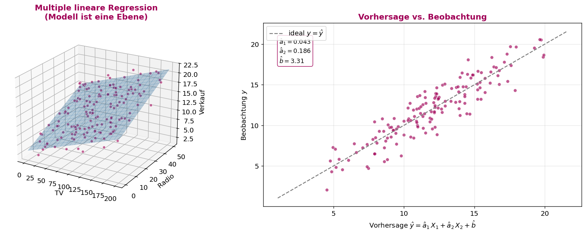
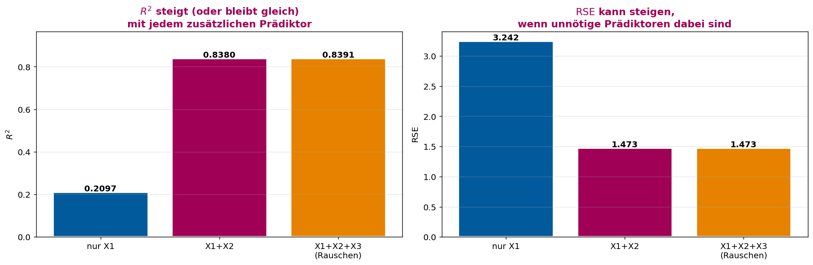
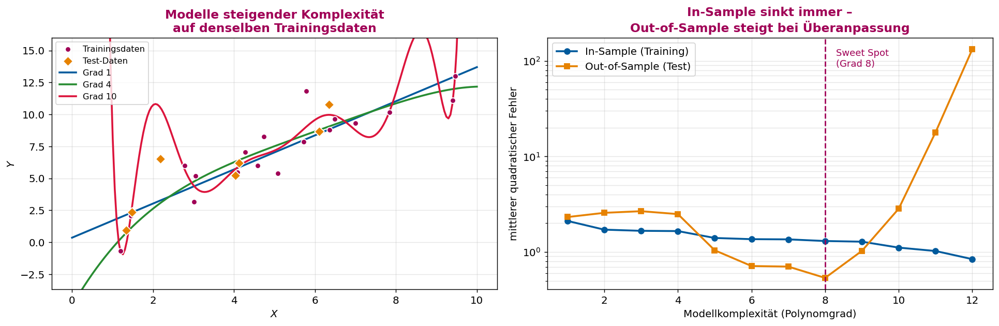
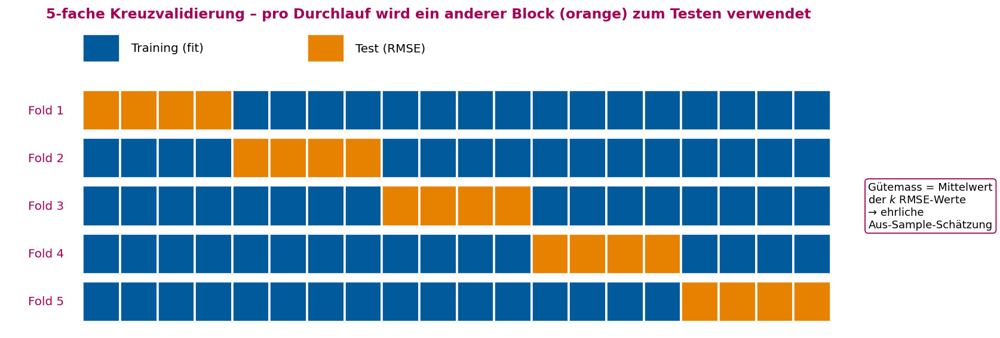
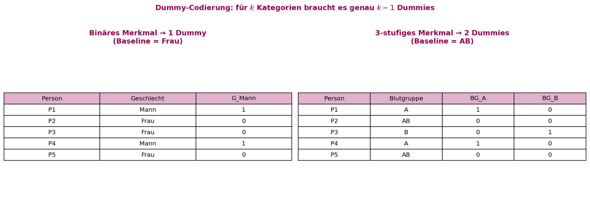
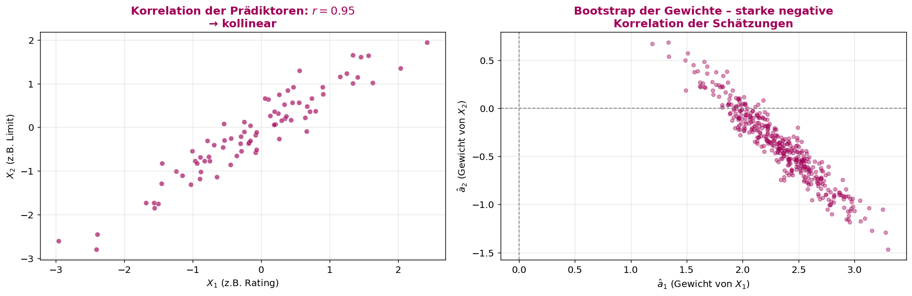
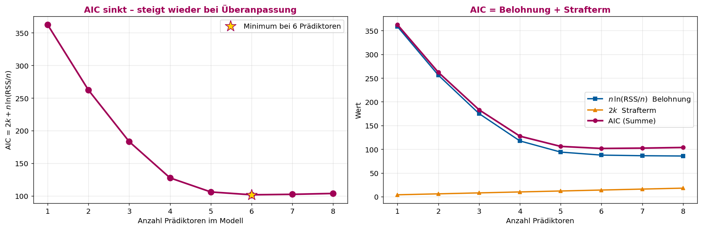
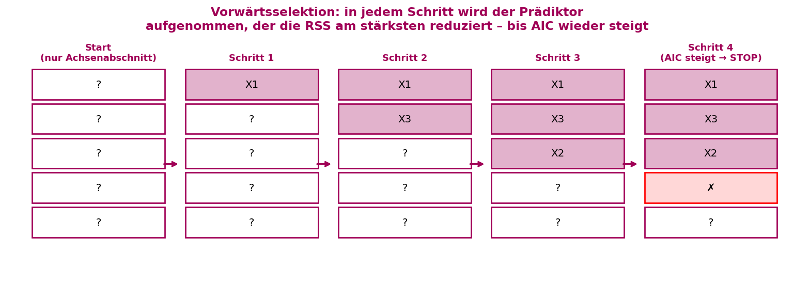

# ASTAT – Angewandte Statistik für Datenwissenschaften

## SW 12 – Multiple Regression, Kreuzvalidierung & Modellwahl

---

## Lernziele

1. Sie können eine **multiple lineare Regression** durchführen.
2. Sie verstehen den Unterschied zwischen **in-Sample** und **out-of-Sample** Validierung und können eine **Kreuzvalidierung** durchführen.
3. Sie können **nominale Merkmale** mit **Dummy-Variablen** in ein Modell einbeziehen.
4. Sie können eine **Vorwärtsselektion** durchführen und mit dem **AIC** das beste Modell wählen.

---

## Wichtigste Begriffe

| Begriff | Englisch | Definition |
| :--- | :--- | :--- |
| **Multiple lineare Regression** | *Multiple linear regression* | Lineares Modell $Y = a_1 X_1 + a_2 X_2 + \ldots + a_m X_m + b$ mit $m$ Prädiktoren. |
| **Modell als Hyperebene** | *Hyperplane model* | Bei 2 Prädiktoren ist die Vorhersage eine Ebene im 3D-Raum, bei $m \geqslant 3$ eine $m$-dimensionale Hyperebene. |
| **Freiheitsgrade** | *Degrees of freedom* | $n - (m+1)$: pro geschätztem Parameter wird ein Freiheitsgrad "verbraucht". |
| **In-Sample-Fehler** | *Training error* | Fehler auf den Daten, mit denen das Modell **geschätzt** wurde. Wird mit jedem Prädiktor kleiner. |
| **Out-of-Sample-Fehler** | *Test / generalization error* | Fehler auf Daten, die das Modell **noch nie gesehen** hat. Misst die echte Prognoseleistung. |
| **Überanpassung (Overfitting)** | *Overfitting* | Modell lernt das Rauschen der Trainingsdaten auswendig: in-Sample super, out-of-Sample miserabel. |
| **Hold-out-Stichprobe** | *Hold-out sample* | Datensatz wird einmalig in Train/Test geteilt; Test bleibt unangetastet. |
| **Kreuzvalidierung (k-fach)** | *k-fold cross-validation* | Datensatz in $k$ Blöcke teilen; jeder Block einmal Testset, die restlichen $k-1$ Trainingsset; Mittelwert der $k$ Test-RMSEs ist das Gütemass. |
| **RMSE** | *Root mean square error* | $\sqrt{\frac{1}{n_{\text{test}}}\sum r_i^2}$ – typische Abweichung in der Einheit von $Y$, hier als CV-Gütemass. |
| **Nominales Merkmal** | *Nominal feature* | Kategoriales Merkmal ohne Rangordnung (z.B. Blutgruppe, Geschlecht). Braucht Dummy-Codierung. |
| **Ordinales Merkmal** | *Ordinal feature* | Kategorial mit Rangordnung (z.B. Schulnote). Kann oft als Zahl behandelt werden. |
| **Dummy-Variable** | *Dummy / indicator variable* | 0/1-Variable, die eine Kategorie markiert. Für $k$ Kategorien braucht es **$k-1$** Dummies. |
| **Baseline-Kategorie** | *Reference category* | Die weggelassene Kategorie; der Achsenabschnitt $b$ bezieht sich auf diese. |
| **Multikollinearität** | *Multicollinearity* | Zwei oder mehr Prädiktoren sind stark korreliert. Folge: Gewichte werden instabil, Vorzeichen können kippen. |
| **Vorwärtsselektion** | *Forward selection* | Schrittweises Hinzufügen jenes Prädiktors, der die RSS am stärksten reduziert. |
| **AIC** | *Akaike's Information Criterion* | $\mathsf{AIC} = 2k + n\,\ln(\mathsf{RSS}/n)$. Belohnt gute Anpassung, bestraft jeden zusätzlichen Parameter. |
| **Strafterm / Belohnung** | *Penalty / fit term* | AIC = **Strafterm** $2k$ + **Belohnung** $n\ln(\mathsf{RSS}/n)$. Modell mit kleinstem AIC wählen. |
| **Prinzip der Sparsamkeit** | *Parsimony* | Bei vergleichbarer Güte das **einfachere** Modell wählen (Ockhams Rasiermesser). |

---

## Konzepte & Definitionen

### 1. Multiple lineare Regression – vom Strich zur Hyperebene

In SW 11 war das Modell ein **Strich** in der Ebene; mit $m$ Prädiktoren wird es zu einer **Hyperebene**:

$$\boxed{\;Y \;=\; \texttt{predict}(X_1, X_2, \ldots, X_m) \;=\; a_1 X_1 + a_2 X_2 + \ldots + a_m X_m + b\;}$$

Die **Methode der kleinsten Quadrate** funktioniert identisch wie bei der einfachen Regression – wir suchen $\hat a_1, \ldots, \hat a_m, \hat b$, die $\mathsf{RSS} = \sum r_i^2$ minimieren. In `scipy.optimize.minimize` ändert sich nur die Anzahl Parameter im Vektor `x0`.

**Aber zwei Dinge ändern sich:**

1. **Freiheitsgrade:** Wir schätzen $m+1$ Parameter, also wird $\mathsf{RSE}$ durch $n - (m+1)$ statt $n - 2$ geteilt:

    $$\boxed{\;\mathsf{RSE} = \sqrt{\frac{\mathsf{RSS}}{n - \textcolor{red}{(m+1)}}}\;}$$

2. **Visualisierung:** Ab $m \geqslant 3$ kann das Modell **nicht mehr als Bild dargestellt werden** – wir müssen uns auf die Rechnungen verlassen. Bei $m = 2$ hilft noch der 3D-Plot oder ein "predict vs. observed"-Streudiagramm.

<center>

</center>

> **Lesehilfe zur Grafik:** **Links:** Die geschätzte Regressions**ebene** in 3D – das Modell $\hat y = \hat a_1\cdot \text{TV} + \hat a_2\cdot \text{Radio} + \hat b$ ist die schattige Fläche. Jeder Punkt ist eine Beobachtung; die vertikalen Abstände zur Ebene sind die Residuen. **Rechts:** Sobald $m \geqslant 3$, gibt es keinen passenden 3D-Plot mehr. Stattdessen tragen wir **Vorhersage gegen Beobachtung** auf. Liegen die Punkte eng um die gestrichelte 45°-Linie, ist das Modell gut. Die kleinen Boxen rechts zeigen die geschätzten Gewichte – $\hat a_1, \hat a_2$ und $\hat b$.

---

### 2. Bestimmtheitsmass und RSE bei multipler Regression

| | $R^2$ | $\mathsf{RSE}$ |
|:---|:---|:---|
| **Formel** | $\mathsf{Var}(\hat y)/\mathsf{Var}(y)$ | $\sqrt{\mathsf{RSS}/(n-(m+1))}$ |
| **Verhalten** mit mehr Prädiktoren | **steigt monoton** (oder bleibt gleich) | kann **steigen oder sinken** |
| **Schlussfolgerung** | $R^2$ allein ist ein **schlechter Modellvergleicher**! | $\mathsf{RSE}$ berücksichtigt die Freiheitsgrade und ist fairer. |

> **Merksatz:** Allgemein wird das Bestimmtheitsmass **grösser oder bleibt gleich**, wenn wir mehr Prädiktoren ins Modell aufnehmen – auch wenn der neue Prädiktor reines Rauschen ist. Das ist der Grund, warum wir andere Kriterien (RSE, AIC, Kreuzvalidierung) brauchen.

<center>

</center>

> **Lesehilfe zur Grafik:** Drei Modelle mit denselben Daten, aber unterschiedlich vielen Prädiktoren. **Links ($R^2$):** Wert wächst von links nach rechts monoton – sogar der Rauschen-Prädiktor erhöht $R^2$ noch ein bisschen. **Rechts ($\mathsf{RSE}$):** Hier bricht die Monotonie. Beim Hinzufügen von $X_2$ (echter Effekt) sinkt $\mathsf{RSE}$ deutlich; beim Hinzufügen von Rauschen steigt $\mathsf{RSE}$ wieder, weil der Nenner $n-(m+1)$ kleiner wird, ohne dass $\mathsf{RSS}$ proportional sinkt. **Lehre:** Höheres $R^2$ ≠ besseres Modell.

---

### 3. In-Sample vs. Out-of-Sample – das Überanpassungsproblem

Mit komplexeren Modellen sinkt der **In-Sample-Fehler** immer weiter – im Extremfall liegen alle Punkte exakt auf der Vorhersagekurve. Das ist **nicht** das Ziel: das Modell soll **neue, ungesehene** Daten gut prognostizieren.

| | **In-Sample (Training)** | **Out-of-Sample (Test)** |
|:---|:---|:---|
| **Was wird gemessen?** | Fehler auf Trainingsdaten | Fehler auf zurückbehaltenen Daten |
| **Mit zunehmender Komplexität** | sinkt immer | sinkt zuerst, **steigt** dann wieder |
| **Schätzt** | Anpassungsgüte | Prognoseleistung |
| **Risiko** | Overfitting unsichtbar | echte Generalisierung sichtbar |

<center>

</center>

> **Lesehilfe zur Grafik:** **Links:** Drei Modelle steigender Komplexität auf denselben 18 Trainingspunkten (HSLU-Bordeaux). Die orangen Rauten sind die Testdaten, die das Modell **nie sieht**. Das Polynom vom Grad 10 (rot) windet sich durch jeden Trainingspunkt – aber zwischen den Punkten schiesst die Kurve weit über das Ziel hinaus. **Rechts:** Mittlerer quadratischer Fehler auf logarithmischer Skala. Die blaue Kurve (Training) fällt monoton – mehr Komplexität ist immer besser fürs Training. Die orange Kurve (Test) zeigt das klassische **U**: erst sinkt sie (Modell wird besser), dann steigt sie wieder (Modell merkt sich das Rauschen). Der **Sweet Spot** ist das Minimum der orangen Kurve. **Lehre:** Modellgüte misst man auf Daten, die das Modell nicht gesehen hat.

---

### 4. Hold-out-Validierung und k-fache Kreuzvalidierung

Wie schätzt man den Out-of-Sample-Fehler, wenn man nur einen einzigen Datensatz hat?

**Hold-out-Verfahren** (einfach):
1. Daten zufällig mischen.
2. Teile in **Trainings**- und **Test**-Set (z.B. 80 / 20).
3. Modell auf Training schätzen, Fehler auf Test berechnen.

Nachteil: Ergebnis hängt **stark** vom zufälligen Split ab.

**$k$-fache Kreuzvalidierung** (stabiler):
1. Daten mischen und in $k$ etwa gleich grosse Blöcke (Folds) aufteilen.
2. Für jeden Fold $i = 1, \ldots, k$: Modell auf den anderen $k-1$ Folds trainieren, Test-RMSE auf Fold $i$ berechnen.
3. Mittelwert der $k$ Test-RMSEs ist das **Gütemass**.

Beliebte Werte: $k=5$ oder $k=10$. Jede Beobachtung wird **genau einmal** zum Testen verwendet → Schätzung ist viel robuster als beim einmaligen Hold-out.

<center>

</center>

> **Lesehilfe zur Grafik:** Der Datensatz ist in 20 Blöcke aufgeteilt, zu **5 Folds** kombiniert. Pro Zeile (Fold 1–5) ist genau ein Block-Quintett orange (**Test**), der Rest blau (**Training**). Über alle Folds wird **jede Beobachtung genau einmal getestet**. Aus den 5 Test-RMSEs bilden wir den Mittelwert – das ist eine ehrliche Schätzung des Out-of-Sample-Fehlers, ohne dass wir auf einen einzelnen Split angewiesen sind.

---

### 5. Nominale Merkmale: Dummy-Variablen

Die OLS-Regression rechnet mit Zahlen. Wie bekommt man Kategorien wie "Mann/Frau" oder "A/B/AB" hinein?

**Vorgehen:**
- **Binär** (2 Kategorien): eine 0/1-Variable reicht.
- **$k$ Kategorien**: **$k-1$** Dummy-Variablen. Die weggelassene Kategorie ist die **Baseline** – der Achsenabschnitt $\hat b$ entspricht dann der mittleren Vorhersage für die Baseline.

In Python:

```python
pd.get_dummies(df["Geschlecht"], drop_first=True, dtype=int)
```

`drop_first=True` lässt automatisch eine Kategorie als Baseline weg und vermeidet **perfekte Multikollinearität** (sonst wären die Dummies linear abhängig).

<center>

</center>

> **Lesehilfe zur Grafik:** **Links:** Binäre Codierung – "Mann" wird zu `G_Mann = 1`, "Frau" zu `G_Mann = 0`. Die Frau ist die Baseline. **Rechts:** Drei Blutgruppen (A, B, AB) brauchen **2** Dummies. "AB" ist die Baseline – sie hat sowohl `BG_A = 0` als auch `BG_B = 0`. Ein neuer Patient mit Blutgruppe A bekommt $\hat y = \hat b + \hat a_{\text{BG\_A}}$, einer mit AB nur $\hat y = \hat b$. **Regel:** Für $k$ Kategorien immer **$k-1$** Spalten.

**Interpretation der Gewichte:**
- $\hat a_{\text{Mann}} > 0$: Männer haben im Schnitt einen um $\hat a_{\text{Mann}}$ höheren Wert von $Y$ als Frauen (Baseline), **bei sonst gleichen Prädiktoren**.

---

### 6. Multikollinearität – wenn Prädiktoren sich gegenseitig erklären

Sind zwei Prädiktoren stark korreliert (z.B. **Limit** und **Rating** im Credit-Datensatz, $r \approx 0.997$), gibt es **viele Parameterkombinationen**, die fast gleich gut passen. Folgen:

- **Gewichte werden instabil** – kleine Datenänderungen kippen die Schätzungen, Vorzeichen können wechseln.
- **Signifikanztests** liefern grosse p-Werte für beide Prädiktoren, obwohl der **gemeinsame** Effekt klar ist.
- Das Modell prognostiziert trotzdem gut – das Problem ist die **Interpretation**, nicht die Vorhersage.

<center>

</center>

> **Lesehilfe zur Grafik:** **Links:** Zwei Prädiktoren mit $r \approx 0.95$ – die Punkte liegen fast auf einer Geraden. Sie tragen kaum **unabhängige** Information. **Rechts:** Bootstrap-Verteilung der Gewichte $(\hat a_1, \hat a_2)$ über 400 Resamples. Die Wolke zieht sich **diagonal** von oben links nach unten rechts: wenn $\hat a_1$ in einem Resample gross wird, wird $\hat a_2$ klein und umgekehrt. Das Modell "schiebt" den Effekt frei zwischen beiden Prädiktoren – die Einzelgewichte sind nicht eindeutig identifizierbar. **Lehre:** Korrelation der Prädiktoren ist nicht harmlos – wer Effekte einzelnen Prädiktoren zuschreibt, sollte vorher die Korrelationsmatrix anschauen.

---

### 7. Vorwärtsselektion + AIC

**Frage:** Welche Prädiktoren gehören ins Modell? Brute Force über alle $2^m$ Teilmengen ist bei $m=20$ Prädiktoren bereits über 1 Million Modelle. Die **Vorwärtsselektion** ist eine effiziente Heuristik.

**Algorithmus:**
1. Starte mit dem leeren Modell (nur Achsenabschnitt).
2. Schritt $t$: füge denjenigen Prädiktor hinzu, der die **RSS am stärksten reduziert** (bzw. AIC am stärksten senkt).
3. Stoppe, sobald der **AIC nicht mehr sinkt** (= Strafterm überwiegt Belohnung).

$$\boxed{\;\mathsf{AIC} = \underbrace{2k}_{\text{Strafterm}} + \underbrace{n\,\ln(\mathsf{RSS}/n)}_{\text{Belohnung}}\;}$$

- **$k$** = Anzahl Modellparameter (Gewichte + Achsenabschnitt).
- **Strafterm** wächst linear mit jedem zusätzlichen Parameter.
- **Belohnung** sinkt mit besserer Anpassung ($\mathsf{RSS}$ kleiner $\Rightarrow$ $\ln$ kleiner $\Rightarrow$ Term negativer).

> **Hirotsugu Akaike (1927–2009):** japanischer Statistiker; AIC kommt aus der Informationstheorie und bestraft Modelle für jeden zusätzlichen Parameter unabhängig vom Datensatzumfang.

<center>

</center>

> **Lesehilfe zur Grafik:** **Links:** AIC-Kurve über die Anzahl Prädiktoren. Sie fällt zuerst stark (jeder relevante Prädiktor senkt $\mathsf{RSS}$), erreicht das **Minimum** (Stern) und steigt dann wieder, weil weitere Prädiktoren fast nichts mehr beitragen, aber der Strafterm $2k$ weiterwächst. **Rechts:** AIC zerlegt in Belohnung (blau, fällt) und Strafterm (orange, steigt linear). Die HSLU-Bordeaux-Kurve ist die Summe – ihr Minimum balanciert beide Effekte. **Regel:** Aufnehmen, solange AIC sinkt; stoppen, sobald AIC steigt.

<center>

</center>

> **Lesehilfe zur Grafik:** Vorwärtsselektion als Ablauf. Jeder Schritt fügt **einen** Prädiktor hinzu (Bordeaux-Felder). Im letzten Schritt würde ein vierter Prädiktor (rotes ✗) den AIC **erhöhen** – der Algorithmus stoppt und gibt das Modell mit drei Prädiktoren zurück. **Achtung:** Vorwärtsselektion ist **greedy** – sie garantiert nicht das global beste Modell, ist aber meist eine gute Wahl.

---

## Formeln & Rechenregeln

### Formel 1: Multiple lineare Regression

$$\hat y_i = \hat a_1\,x_{i,1} + \hat a_2\,x_{i,2} + \ldots + \hat a_m\,x_{i,m} + \hat b$$

### Formel 2: Residuum und RSS

$$r_i = y_i - \hat y_i \qquad\qquad \mathsf{RSS} = \sum_{i=1}^{n} r_i^2$$

### Formel 3: Residual Standard Error (mit $m$ Prädiktoren)

$$\mathsf{RSE} = \sqrt{\frac{\mathsf{RSS}}{n - (m+1)}}$$

### Formel 4: Bestimmtheitsmass

$$R^2 = \frac{\mathsf{MQD}(\hat y)}{\mathsf{MQD}(y)} = \frac{\mathsf{Var}(\hat y)}{\mathsf{Var}(y)}$$

### Formel 5: RMSE bei Kreuzvalidierung

$$\mathsf{RMSE}_{\text{fold}} = \sqrt{\frac{1}{n_{\text{test}}}\sum_{i \in \text{Test}} r_i^2}\qquad
\mathsf{RMSE}_{\text{CV}} = \frac{1}{k}\sum_{\text{fold}} \mathsf{RMSE}_{\text{fold}}$$

### Formel 6: AIC

$$\boxed{\;\mathsf{AIC} = 2k + n\,\ln(\mathsf{RSS}/n)\;}$$

mit $k$ = Anzahl Parameter (Gewichte $+$ Achsenabschnitt), $n$ = Anzahl Beobachtungen.

### Formel 7: Dummy-Codierung

Für ein Merkmal mit $k$ Kategorien: erstelle $k-1$ Indikator-Variablen $D_2, \ldots, D_k$ mit $D_j = 1$ wenn Kategorie $j$, sonst 0. Kategorie 1 ist die Baseline.

---

## Vergleiche & Klassifizierungen

### I. Einfache vs. multiple lineare Regression

| | **Einfach (SW 11)** | **Multiple (SW 12)** |
|:---|:---|:---|
| **Form** | $\hat y = \hat a\,x + \hat b$ | $\hat y = \hat a_1 X_1 + \ldots + \hat a_m X_m + \hat b$ |
| **Geometrie** | Gerade in 2D | Hyperebene in $m+1$ Dimensionen |
| **Freiheitsgrade** | $n-2$ | $n - (m+1)$ |
| **Visualisierung** | direkter Plot | bei $m\geqslant 3$ nicht mehr möglich – nur predict-vs-observed |
| **$R^2 = r^2$?** | ✅ ja | ❌ nein (mehrere Korrelationen möglich) |

### II. In-Sample- vs. Out-of-Sample-Validierung

| | **In-Sample** | **Hold-out** | **$k$-fache CV** |
|:---|:---|:---|:---|
| **Fehler-Schätzung** | optimistisch (zu klein) | unverzerrt, aber rauschig | unverzerrt und stabil |
| **Datennutzung** | 100 % Training | z.B. 80 % Training | jede Beobachtung einmal Test |
| **Aufwand** | 1 Fit | 1 Fit | $k$ Fits |
| **Wann?** | nie als alleiniges Kriterium | bei sehr grossen Datensätzen | Standard bei kleinen/mittleren Datensätzen |

### III. Nominale vs. ordinale Merkmale

| | **Nominal** | **Ordinal** |
|:---|:---|:---|
| **Beispiel** | Geschlecht, Blutgruppe | Schulnote, Kleidergrösse |
| **Rangordnung?** | nein | ja |
| **Codierung** | $k-1$ Dummies | meist als Zahl belassbar |
| **Achtung** | Reihenfolge ist beliebig | Abstände müssen sinnvoll sein |

### IV. Modellwahl-Kriterien

| | **$R^2$** | **$\mathsf{RSE}$** | **AIC** | **Kreuzvalidierung** |
|:---|:---|:---|:---|:---|
| **Bestraft Komplexität?** | ❌ nein | ✅ etwas | ✅ klar ($2k$) | ✅ implizit (Test-Daten) |
| **Skala** | $[0,1]$ | Einheit von $Y$ | dimensionslos | Einheit von $Y$ |
| **Modellvergleich** | irreführend | ok | gut | am ehrlichsten |
| **Aufwand** | trivial | trivial | trivial | $k\times$ |

---

## Code-Beispiele (Python)

### Konzept 1: Multiple lineare Regression mit `minimize()`

```python
import numpy as np
import pandas as pd
from scipy.optimize import minimize

werbung = pd.read_csv("Daten/Werbung.csv")

def model(TV, Radio, Zeitung, a1=1, a2=1, a3=1, b=0):
    return a1*TV + a2*Radio + a3*Zeitung + b

def RSS(parameter):
    pred = model(werbung["TV"], werbung["Radio"], werbung["Zeitung"],
                 a1=parameter[0], a2=parameter[1],
                 a3=parameter[2], b=parameter[3])
    return ((werbung["Verkauf"] - pred) ** 2).sum()

fit = minimize(RSS, x0=np.zeros(4), method="Powell")
a1, a2, a3, b = fit.x
RSE = np.sqrt(fit.fun / (werbung.shape[0] - 4))   # n - (m+1)
print(f"RSE = {RSE:.4f}")
```

---

### Konzept 2: $k$-fache Kreuzvalidierung – manuell

```python
def fit_and_evaluate(train, test):
    def RSS_t(p):
        pred = model(train["TV"], train["Radio"], train["Zeitung"],
                     a1=p[0], a2=p[1], a3=p[2], b=p[3])
        return ((train["Verkauf"] - pred) ** 2).sum()
    fit = minimize(RSS_t, x0=np.zeros(4), method="Powell")
    pred_test = model(test["TV"], test["Radio"], test["Zeitung"],
                      a1=fit.x[0], a2=fit.x[1], a3=fit.x[2], b=fit.x[3])
    res = test["Verkauf"] - pred_test
    return np.sqrt((res ** 2).mean())

# k=4 Folds
shuffled = werbung.sample(frac=1, random_state=0)
folds = np.array_split(shuffled, 4)
rmses = []
for i in range(4):
    test  = folds[i]
    train = pd.concat([folds[j] for j in range(4) if j != i])
    rmses.append(fit_and_evaluate(train, test))
print(f"CV-RMSE = {np.mean(rmses):.4f}")
```

---

### Konzept 3: Dummy-Variablen mit `pd.get_dummies`

```python
credit = pd.read_csv("Daten/Credit.csv").drop(columns=["Unnamed: 0"])

# Alle nominalen Spalten in 0/1-Dummies umwandeln
dummies = pd.get_dummies(
    credit[["Gender", "Student", "Married", "Ethnicity"]],
    drop_first=True, dtype=int,
)
credit = pd.concat([credit.drop(columns=dummies.columns.str.split("_").str[0].unique()),
                    dummies], axis=1)
```

`drop_first=True` lässt automatisch die erste Kategorie als Baseline weg – sonst bekäme man perfekt kollineare Spalten.

---

### Konzept 4: Vorwärtsselektion mit AIC

```python
def best_next_predictor(df, response, current, candidates):
    n = df.shape[0]
    best = (None, np.inf, np.inf)   # (Name, RSS, AIC)
    for pred in candidates:
        cols = current + [pred]
        X = np.column_stack([df[c].values for c in cols] + [np.ones(n)])
        coef, *_ = np.linalg.lstsq(X, df[response].values, rcond=None)
        rss = np.sum((df[response].values - X @ coef) ** 2)
        k = len(cols) + 1
        aic = 2 * k + n * np.log(rss / n)
        if aic < best[2]:
            best = (pred, rss, aic)
    return best


current, aic_prev = [], np.inf
candidates = ["SqFtTotLiving", "SqFtLot", "Bathrooms",
              "Bedrooms", "BldgGrade",
              "PropertyType_Single Family", "PropertyType_Townhouse"]

while candidates:
    pred, rss, aic = best_next_predictor(
        immo, "AdjSalePrice", current, candidates)
    if aic >= aic_prev:        # AIC steigt → STOP
        break
    current.append(pred)
    candidates.remove(pred)
    aic_prev = aic
    print(f"+ {pred:30s}  AIC = {aic:.2f}")
```

---

## Konzept-Code-Zuordnung

| Konzept | Python-Funktion/Code | Library | Beschreibung |
|:---|:---|:---|:---|
| Numerische Minimierung | `minimize(f, x0=..., method="Powell")` | `scipy.optimize` | Robust auch bei höherdimensionalen Problemen |
| Lineare Lösung (schnell) | `np.linalg.lstsq(X, y)` | NumPy | Direkte OLS-Schätzung ohne Iteration |
| Daten mischen | `df.sample(frac=1)` | pandas | Zufällige Reihenfolge für CV |
| In Blöcke teilen | `np.array_split(df, k)` | NumPy | $k$ gleich grosse Folds |
| Dummy-Codierung | `pd.get_dummies(s, drop_first=True, dtype=int)` | pandas | Nominale → 0/1-Spalten |
| Spalten kombinieren | `pd.concat([...], axis=1)` | pandas | Dummies an Datensatz hängen |
| AIC | `2*k + n*np.log(RSS/n)` | NumPy | Informationskriterium |
| Konstante als Spalte | `np.column_stack([X, np.ones(n)])` | NumPy | Intercept ins Design einbauen |

---

## Übungsaufgaben-Zusammenfassung

### Aufgabe 1: Hauspreise (`house_sales.csv`)

| Aspekt | Detail |
|---|---|
| **Datei** | `Daten/house_sales.csv` (Tab-separiert) |
| **Zielvariable** | `AdjSalePrice` |
| **Kandidaten** | `SqFtTotLiving`, `SqFtLot`, `Bathrooms`, `Bedrooms`, `BldgGrade`, plus 2 PropertyType-Dummies |
| **Aufgabe** | Vorwärtsselektion abschliessen, AIC minimieren |
| **Ergebnis** | Reihenfolge `SqFtTotLiving → BldgGrade → Bedrooms → Bathrooms`; im 5. Schritt steigt AIC → STOP. Endmodell mit 4 Prädiktoren. |

### Aufgabe 2: Credit-Karten-Daten (`Credit.csv`)

| Aspekt | Detail |
|---|---|
| **Datei** | `Daten/Credit.csv` |
| **Aufgaben** | (a) multiple Regression mit Zielvariable `Rating`, (b) mit Zielvariable `Balance` |
| **Vorgehen** | Dummies erzeugen, Vorwärtsselektion + Permutationstest pro Prädiktor |
| **Ergebnis (a) Rating** | `Limit → Cards → Married_Yes → Student_Yes → Education`; nur **`Limit`** ist im Permutationstest signifikant – wegen $r(Limit, Rating)\approx 0.997$ reicht praktisch das einfache Modell $\hat{\text{Rating}} = \hat a\cdot \text{Limit} + \hat b$ mit $R^2\approx 0.994$. |
| **Ergebnis (b) Balance** | `Rating → Income → Student_Yes → Limit → Cards`; im finalen Test ist `Cards` nicht signifikant (p ≈ 42 %) → fallen lassen. Endmodell mit 4 Prädiktoren, $R^2\approx 0.95$. |

---

## Prüfungsrelevante Hinweise

### Typische SC/MC-Fallen

| Falle | Warum falsch? | Richtige Aussage |
|---|---|---|
| "Höheres $R^2$ ⇒ besseres Modell." | $R^2$ steigt **immer**, wenn man Prädiktoren hinzufügt – auch Rauschen. | Vergleiche mit $\mathsf{RSE}$, AIC oder Kreuzvalidierung. |
| "RSE wird durch $n-2$ geteilt – auch bei multipler Regression." | Bei $m$ Prädiktoren werden $m+1$ Parameter geschätzt. | $\mathsf{RSE} = \sqrt{\mathsf{RSS}/(n-(m+1))}$. |
| "Für $k$ Kategorien brauche ich $k$ Dummies." | Das ergäbe perfekte Multikollinearität (Summe = 1). | $k-1$ Dummies + Achsenabschnitt = Baseline. |
| "p-Wert > 5 % ⇒ Prädiktor unnötig." | Bei Multikollinearität sind p-Werte einzeln gross, der **gemeinsame** Effekt kann trotzdem real sein. | Korrelationsmatrix anschauen, ggf. korrelierte Prädiktoren zusammenfassen. |
| "AIC ist eine Wahrscheinlichkeit." | AIC ist dimensionslos, aber kein p-Wert. | Niedrigerer AIC = besseres Modell; absolute Höhe ist nicht interpretierbar. |
| "Vorwärtsselektion findet das global beste Modell." | Sie ist **greedy** – kann lokale Optima erreichen. | Bei wenigen Prädiktoren alle Teilmengen testen; sonst Vorwärts + Rückwärts kombinieren. |
| "Hold-out-Validierung reicht immer." | Bei kleinen Datensätzen hängt das Ergebnis stark vom Split ab. | $k$-fache Kreuzvalidierung verwenden. |
| "Bei Dummies ist die Baseline frei wählbar." | Numerisch egal, **interpretativ** aber wichtig (Achsenabschnitt = Vorhersage für Baseline). | Sinnvolle Baseline wählen (z.B. häufigste Kategorie). |

### Formeln auswendig / auf das A4-Blatt

| Formel | Auswendig? | Begründung |
|---|---|---|
| $\hat y = \sum a_i X_i + b$ | **Auswendig** | Grundmodell |
| $\mathsf{RSE} = \sqrt{\mathsf{RSS}/(n-(m+1))}$ | **Auswendig** | Inkl. **Begründung der $m+1$** |
| $\mathsf{AIC} = 2k + n\ln(\mathsf{RSS}/n)$ | **Auswendig** | Modellwahl |
| $k-1$ Dummies bei $k$ Kategorien | **Auswendig** | Kommt sicher in MC |
| Vorwärtsselektion (Algorithmus) | A4-Blatt | 3-4 Sätze Pseudocode |
| Kreuzvalidierungs-Ablauf | A4-Blatt | Mittelwert der $k$ Test-RMSEs |

### Merkregeln & Eselsbrücken

- **"$R^2$ lügt, AIC straft."** – $R^2$ alleine taugt nicht zum Modellvergleich; AIC bestraft jeden zusätzlichen Parameter.
- **"$k$ Kategorien – $k-1$ Dummies."** Eine bleibt als Baseline, sonst Multikollinearität.
- **"In-Sample lacht, Out-of-Sample weint."** Komplexe Modelle sehen auf Trainingsdaten immer besser aus – die Wahrheit zeigt sich am Test.
- **"Vorwärts greedy, AIC bremst."** Solange AIC sinkt, weitere Prädiktoren aufnehmen; sobald er steigt, sofort stoppen.
- **"Kollinear heisst austauschbar."** Bei $r(X_1, X_2) \approx 1$ ist der Effekt nicht eindeutig zuordenbar – nicht aber unsignifikant!
- **"$n - (m+1)$ – Gewichte und Intercept zählen alle."** Ein neuer Parameter kostet immer einen Freiheitsgrad.

### Hinweise für numerische Antworten

- **`method="Powell"`** ist robuster als das Default-BFGS, wenn das Problem schlechte Kondition hat (z.B. durch korrelierte Prädiktoren).
- **Startwerte**: bei multipler Regression `np.zeros(m+1)` ist meistens stabil. Bei Schwierigkeiten skalieren (z.B. `np.ones(...) * 0.1`).
- **AIC im Vergleich**: Differenzen ab $\Delta \mathsf{AIC} > 2$ sind relevant; kleinere Unterschiede unklar.
- **Kreuzvalidierung**: bei $k=10$ hat man stabilere Schätzungen, aber 10× Rechenaufwand. Für die Übungen reicht $k=4$ oder $k=5$.
- **`pd.get_dummies(..., dtype=int)`**: ohne `dtype=int` werden Booleans erzeugt – die kann `minimize()` nicht direkt verarbeiten.

---

## Verbindung zu vorherigen/folgenden Wochen

### Rückbezug

| Vorherige Woche | Verbindung zu SW 12 |
|---|---|
| **SW 10** (Korrelation) | Multikollinearität ist hohe Pearson-Korrelation **zwischen Prädiktoren**. |
| **SW 11** (Einfache Regression) | Methode der kleinsten Quadrate, RSS, RSE, $R^2$ werden 1:1 verallgemeinert. |
| **SW 07/08** (Permutationstests) | Pro Prädiktor weiterhin Permutationstest auf $a_i = 0$. |
| **SW 06** (Bootstrap) | Konfidenzintervalle für Parameter funktionieren analog. |

### Vorausschau

| Folgende Woche | Warum SW 12 wichtig ist |
|---|---|
| **SW 13** (Zeitreihen) | Trendmodelle sind multiple Regression mit `Zeit` und Saisondummies. |
| **Spätere Module (Machine Learning)** | OLS + Kreuzvalidierung + Modellwahl ist die Grundlage von Ridge/Lasso, Random Forest, Gradient Boosting & Co. |
