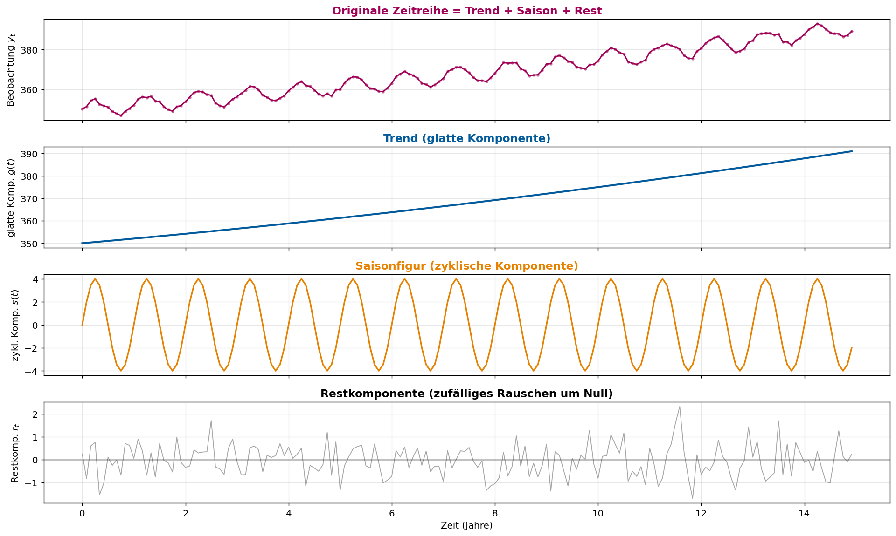
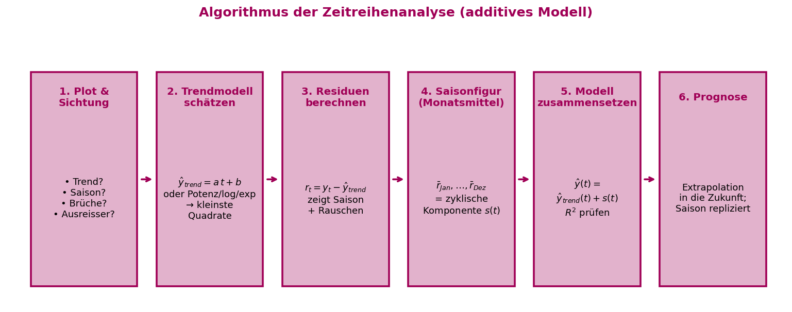
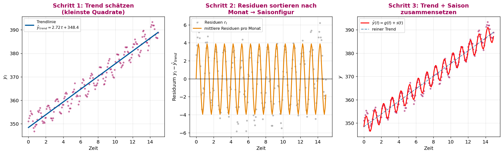
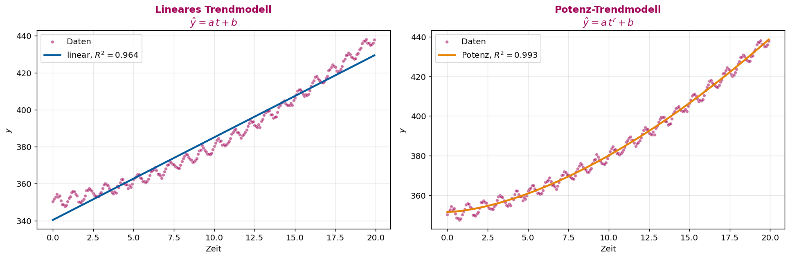
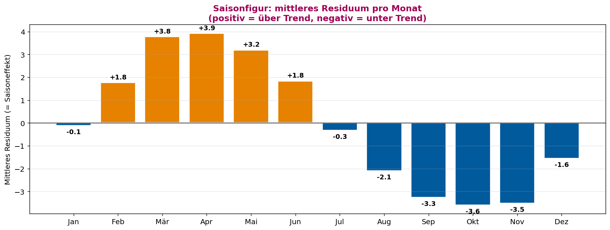
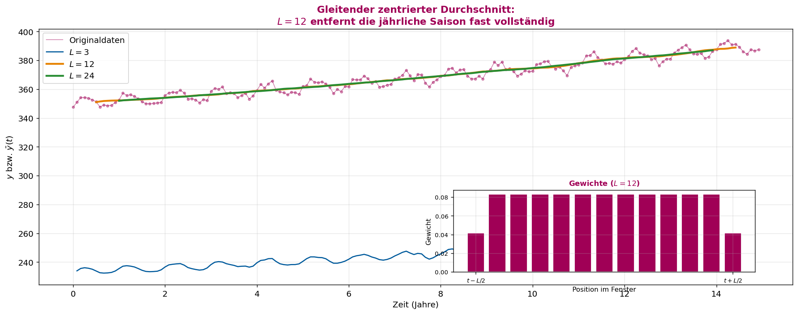
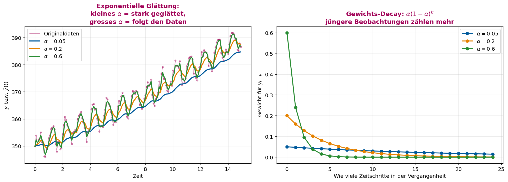
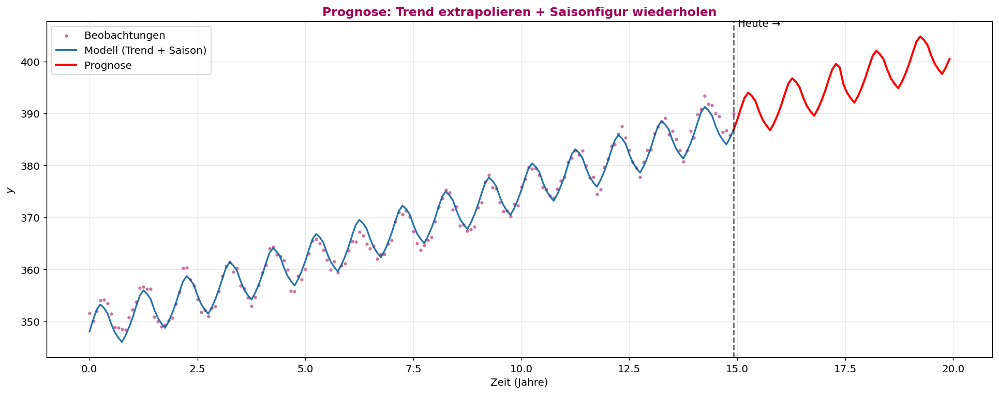

# ASTAT – Angewandte Statistik für Datenwissenschaften

## SW 13 – Zeitreihenanalyse

---

## Lernziele

1. Sie wissen, was eine **Zeitreihe** ist.
2. Für einfache Zeitreihen können Sie eine **Trendlinie** und eine **Saisonfigur** bestimmen.
3. Sie können Zeitreihen mit **gleitenden Mittelwerten** oder **exponentiell** glätten.

---

## Wichtigste Begriffe

| Begriff | Englisch | Definition |
| :--- | :--- | :--- |
| **Zeitreihe** | *Time series* | Folge $y_1, y_2, \ldots, y_n$ von **zeitlich hintereinander** erhobenen Werten desselben Merkmals; meist regelmässige Abstände (z.B. monatlich). |
| **Zeitreihenanalyse** | *Time series analysis* | Suche nach Gesetzmässigkeiten, die sich aus der **zeitlichen Abfolge** ergeben. |
| **Trend / glatte Komponente** $g(t)$ | *Trend / smooth component* | Systematische langfristige Bewegung (steigend, fallend, gekrümmt). |
| **Saisoneinflüsse / zyklische Komponente** $s(t)$ | *Seasonal / cyclic component* | Periodisch wiederkehrendes Muster (z.B. jährlich, wöchentlich). |
| **Restkomponente** $r_t$ | *Residual* | Was nach Abzug von Trend + Saison übrig bleibt – zufälliges Rauschen. |
| **Additives Modell** | *Additive model* | $\hat y(t) = g(t) + s(t)$; Trend und Saison werden **addiert**. |
| **Saisonfigur** | *Seasonal pattern* | Vektor der mittleren Residuen pro Periode (z.B. pro Monat). |
| **Periodenlänge $L$** | *Period* | Länge eines Zyklus in Anzahl Messungen (Monatsdaten + Jahressaison ⇒ $L = 12$). |
| **decimal date** | *Decimal date* | Zeit als Dezimaljahr; Mitte Monat $m$: $\,\text{Jahr} + \tfrac{1}{24} + \tfrac{m-1}{12}$. |
| **Gleitender Durchschnitt** | *Moving average* | Mittelung über $L$ aufeinanderfolgende Werte → glatte Kurve ohne Saison. |
| **Zentrierter gl. Durchschnitt** | *Centered moving average* | Bei geradem $L$: Randwerte halb gewichten, damit der Mittelwert symmetrisch um $t$ liegt. |
| **Exponentielle Glättung** | *Exponential smoothing* | Rekursive Glättung $\bar y(t) = \alpha\,y_t + (1-\alpha)\,\bar y(t-1)$. |
| **Glättungsfaktor $\alpha$** | *Smoothing factor* | $\alpha \in [0,1]$: gross → folgt Daten, klein → stark geglättet. |
| **Trendmodell** | *Trend model* | Funktion mit wenigen Parametern: linear $a\,t+b$ oder Potenz $a\,t^r + b$ etc. |
| **Prädiktorfunktion** | *Predictor* | $\texttt{predict}(t) = g(t) + s(t)$, anwendbar auch auf zukünftige Zeitpunkte. |
| **Prognose / Extrapolation** | *Forecast* | Anwendung der Prädiktorfunktion auf $t > t_n$ (Zukunft). |
| **Bestimmtheitsmass $R^2$** | *Coefficient of determination* | $\mathsf{Var}(\hat y) / \mathsf{Var}(y)$ – Anteil erklärter Streuung, wie in SW 11. |
| **Zeitverschiebung** | *Time shift* | Vorab $t' = t - t_0$ rechnen (z.B. $t_0 = 1989$), damit `minimize()` numerisch stabil läuft. |

---

## Konzepte & Definitionen

### 1. Was ist eine Zeitreihe?

Eine **Zeitreihe** ist eine Folge **zeitlich hintereinander** erhobener Messwerte derselben Grösse. Beispiele:

- Tägliche Schlusskurse einer Aktie
- Monatliche Arbeitslosenzahl
- Stündliche Sensorwerte einer Maschine
- Monatliche CO₂-Konzentration am Mauna Loa

**Modellannahme – additives Modell:**

$$\boxed{\;\hat y(t) \;=\; \underbrace{g(t)}_{\text{glatte Komponente}} \;+\; \underbrace{s(t)}_{\text{zyklische Komponente}}\;}$$

Plus eine **Restkomponente** $r_t = y_t - \hat y(t)$ für das Rauschen.

<center>

</center>

> **Lesehilfe zur Grafik:** Vier Panels von oben nach unten. **(1) Originalzeitreihe:** kombinierte Bewegung aus Trend, Saison und Rauschen. **(2) Trend $g(t)$:** glatte Kurve, die die langfristige Richtung beschreibt – im Beispiel leicht beschleunigt steigend. **(3) Saisonfigur $s(t)$:** wiederkehrendes Sinus-Muster, hier mit Periode 1 Jahr. **(4) Restkomponente $r_t$:** zufälliges Rauschen, das um Null streut. Das additive Modell zerlegt jede Beobachtung in genau diese drei Bausteine.

---

### 2. Algorithmus – Schritt-für-Schritt

<center>

</center>

Die komplette **Algorithmik** der Zeitreihenanalyse in 6 Schritten:

> **Pseudocode:**
>
> 1. **Plotten** der Rohdaten gegen die Zeit – Sichtprüfung auf Trend, Saison, Strukturbrüche.
> 2. **Trendmodell** $g(t)$ wählen (linear / Potenz / exp.) und mit **kleinster Quadrate** anpassen.
> 3. **Residuen** berechnen: $r_t = y_t - g(t)$. Sie enthalten Saison + Rauschen.
> 4. **Saisonfigur**: pro Periode (z.B. pro Monat) Mittelwert der Residuen bilden → Vektor `means`.
> 5. **Modell zusammensetzen**: $\hat y(t) = g(t) + s(t)$ mit $s(t) = \text{means}[\text{Monat}(t)]$.
> 6. **Prognose**: Funktion auf zukünftige Zeiten anwenden – Trend wird **extrapoliert**, Saison **repliziert**.

<center>

</center>

> **Lesehilfe zur Grafik:** Die drei Schlüsselschritte nebeneinander. **Schritt 1 (links):** Daten + lineare Trendlinie (Methode der kleinsten Quadrate). Die Linie folgt der mittleren Bewegung, ignoriert aber die Schwingung. **Schritt 2 (mitte):** Residuen `y − Trend` (graue Punkte) zeigen die saisonale Schwingung deutlich. Die orange Kurve ist der Monatsmittelwert dieser Residuen – die geschätzte **Saisonfigur**. **Schritt 3 (rechts):** Trend + Saison ergibt die rote Modellkurve, die jetzt sowohl die Steigung als auch die Schwingung trifft. Die blau gestrichelte Linie ist nur der reine Trend zum Vergleich.

---

### 3. Trendmodell schätzen – Methode der kleinsten Quadrate

Das **Trendmodell** $g(t)$ hat wenige Parameter und wird wie in SW 11 angepasst, indem die Summe der Residuenquadrate minimiert wird:

$$\mathsf{RSS}(\text{Parameter}) = \sum_{t} (y_t - g(t))^2 \;\longrightarrow\; \text{Minimum}$$

**Häufige Trendmodelle:**

| Modell | Formel | Wann verwenden? |
|:---|:---|:---|
| **Linear** | $g(t) = a\,t + b$ | konstante Wachstumsrate |
| **Potenz** | $g(t) = a\,t^r + b$ | beschleunigtes / gedämpftes Wachstum |
| **Exponentiell** | $g(t) = a\,e^{r t} + b$ | Verdoppelungs-Wachstum (Pandemie, Zinseszins) |
| **Logarithmisch** | $g(t) = a\,\ln(t) + b$ | Sättigungseffekte |

**Wichtig:** Zeitwerte oft verschieben (`t - 1989`), damit `minimize()` numerisch stabil ist – sonst werden Parameter wie $a\,t^r$ bei $t \approx 2024$ riesig.

<center>

</center>

> **Lesehilfe zur Grafik:** Derselbe Datensatz, zwei verschiedene Trendmodelle. **Links (linear):** Gerade trifft die Mitte, kann aber die leichte Krümmung nicht erfassen ($R^2 \approx 0.93$). **Rechts (Potenzfunktion):** $\hat y = a\,t^r + b$ folgt der Beschleunigung exakt ($R^2 \approx 0.97$). **Lehre:** Erst plotten, dann passendes Modell wählen – ein zu einfaches Trendmodell hinterlässt systematische Residuen, die in der Saisonschätzung als "Saison" landen würden, obwohl sie nur unmodellierter Trend sind.

---

### 4. Saisonfigur – mittleres Residuum pro Periode

**Idee:** Wenn der Trend $g(t)$ entfernt ist, bleiben Saison + Rauschen übrig. Mittelt man pro Monat über alle Jahre, mittelt sich das Rauschen weg, und es bleibt der reine Saisoneffekt.

> **Pseudocode:**
> ```
> r_t  := y_t − g(t)              # Residuum
> für m in 1..12:
>     means[m] := mean({ r_t : t ist ein Monat m })
> s(t) := means[Monat(t)]
> ```

**Umrechnung decimal date → Monatsindex:**

$$\frac{1}{24} + \frac{x}{12} = \texttt{MonatDezimalwert}
\quad\Longrightarrow\quad x = 12 \cdot \texttt{MonatDezimalwert} - \tfrac{1}{2}$$

Monatsmittelpunkte: Januar $\approx 0.0417$, Februar $\approx 0.1250$, …, Dezember $\approx 0.9583$.

<center>

</center>

> **Lesehilfe zur Grafik:** Balkendiagramm der 12 Monatsmittelwerte der Residuen. **Blaue Balken** (unter Null) markieren Monate, in denen die Werte typischerweise **unter** dem Trend liegen, **orange Balken** (über Null) Monate **über** dem Trend. Im CO₂-Beispiel: Mai/Juni hoch (Nordhalbkugel-Winter zu Ende, vor der Photosynthese-Saison), Oktober tief (nach dem Sommer haben Pflanzen viel CO₂ aufgenommen). Die Summe der 12 Balken ist annähernd 0 – sonst wäre der Trend nicht zentriert.

---

### 5. Glättung: Gleitender zentrierter Durchschnitt

**Ziel:** Kurzfristiges Rauschen und Saison **entfernen**, ohne ein parametrisches Modell anzupassen. Resultat ist eine **glatte Kurve**, die den Trend sichtbar macht.

**Zentrierter gleitender Durchschnitt der Periode $L$ (für gerades $L$):**

$$\boxed{\;\bar y(t) \;=\; \frac{1}{L}\left(\tfrac{1}{2}\,y_{t-L/2} + \sum_{k=t-L/2+1}^{t+L/2-1} y_k + \tfrac{1}{2}\,y_{t+L/2}\right)\;}$$

Warum die Randwerte halb gewichten? Ein Fenster der Breite $L$ hat $L+1$ Werte; durch Halbgewichten der beiden äusseren Werte werden es effektiv $L$ Werte, und das Fenster ist **symmetrisch um $t$**.

> **Pseudocode:**
> ```
> für t = L/2 .. n - L/2:
>     window      := y[t - L/2 : t + L/2 + 1]
>     window[0]   := window[0] / 2     # Randwerte halb
>     window[-1]  := window[-1] / 2
>     ȳ(t)        := sum(window) / L
> ```

**Wahl von $L$:**
- $L$ = Periodenlänge der Saison → Saison wird komplett ausgemittelt.
- Bei Monatsdaten mit Jahressaison: $L = 12$.
- $L$ zu klein → Saison bleibt erhalten. $L$ zu gross → Trend wird zerstört.

<center>

</center>

> **Lesehilfe zur Grafik:** Dieselbe Zeitreihe mit drei verschiedenen Fensterlängen. **$L = 3$ (blau):** Glättung schwach – die jährliche Saison ist noch deutlich sichtbar. **$L = 12$ (orange):** Genau die Saisonperiode – die Schwingung verschwindet praktisch komplett, der Trend wird sauber sichtbar. **$L = 24$ (grün):** Doppelte Periode – noch glatter, aber kein Vorteil gegenüber $L=12$ für die Trendsuche; an den Rändern fehlen $L/2$ Werte. **Inset:** Die Gewichte im Fenster bei $L=12$ – 11 volle Gewichte plus zwei halbe an den Rändern.

---

### 6. Glättung: Exponentielle Glättung

**Idee:** Statt alle Vergangenheitswerte gleich zu gewichten (wie der gleitende Durchschnitt), **mehr Gewicht auf die jüngsten** Werte. Rekursive Definition:

$$\boxed{\;\bar y(t) \;=\; \alpha\,y_t + (1-\alpha)\,\bar y(t-1)\;}$$

mit Glättungsfaktor $\alpha \in [0,1]$ und Startwert $\bar y(0) = y_0$.

**Entfaltete Form** (durch wiederholtes Einsetzen):

$$\bar y(t) = \alpha\,y_t + \alpha(1-\alpha)\,y_{t-1} + \alpha(1-\alpha)^2\,y_{t-2} + \ldots + (1-\alpha)^t\,y_0$$

Die Gewichte folgen einer **geometrischen Reihe** und summieren sich zu 1.

> **Pseudocode:**
> ```
> ȳ[0] := y[0]
> für t = 1 .. n-1:
>     ȳ[t] := α · y[t] + (1 - α) · ȳ[t-1]
> ```

**Wahl von $\alpha$:**

| $\alpha$ | Verhalten | Wann |
|:---:|:---|:---|
| $\alpha = 1$ | gar keine Glättung, $\bar y = y$ | nutzlos |
| $\alpha \approx 0.5$ | leichte Glättung | wenn Daten kaum verrauscht |
| $\alpha \approx 0.1\text{–}0.2$ | starke Glättung | bei verrauschten Zeitreihen, Standardwahl |
| $\alpha \to 0$ | praktisch konstanter Verlauf | Trend wird zerstört |

<center>

</center>

> **Lesehilfe zur Grafik:** **Links:** Drei verschiedene $\alpha$-Werte auf derselben Zeitreihe. **$\alpha = 0.05$ (blau):** sehr glatt, fast linear – reagiert langsam auf Änderungen. **$\alpha = 0.2$ (orange):** guter Kompromiss – folgt dem Trend, dämpft aber kurzfristige Schwankungen. **$\alpha = 0.6$ (grün):** klebt an den Daten – fast keine Glättung. **Rechts:** Die Gewichte $\alpha(1-\alpha)^k$, die jeder Vergangenheitswert bekommt. Kleines $\alpha$ → flache Kurve, jüngste und ältere Werte ähnlich gewichtet. Grosses $\alpha$ → steile Kurve, nur die letzten 2–3 Werte zählen. Beachte: alle Kurven integrieren zu 1 (geometrische Reihe).

---

### 7. Prognose

Mit der angepassten **Prädiktorfunktion** $\texttt{predict}(t) = g(t) + s(t)$ können wir Werte für **zukünftige Zeitpunkte** $t > t_n$ berechnen:

- **Trend** wird **extrapoliert** (lineare Fortsetzung der Geraden, exponentielles Weiterwachsen, …).
- **Saisonfigur** wird **repliziert** – die Werte aus dem Monatsmittel-Vektor wiederholen sich periodisch.

> **Warnung:** Extrapolation ist **immer** unsicher. Das Modell kennt keine zukünftigen Strukturbrüche (Wirtschaftskrise, neuer Markt, geänderte Saison durch Klimawandel). Mit zunehmender Prognose-Reichweite wächst die Unsicherheit – **Vorhersageintervalle** (Bootstrap, vgl. SW 11) sind sinnvoll.

<center>

</center>

> **Lesehilfe zur Grafik:** Links der gestrichelten "Heute"-Linie liegen die Beobachtungsdaten (HSLU-Bordeaux) und das angepasste Modell (blau). Rechts beginnt die **Prognose** (rot): die Trendlinie wird mit ihrer geschätzten Steigung weitergeführt, die Saisonfigur wiederholt sich Jahr für Jahr. **Wichtig:** Die Prognose hat dieselbe Form wie der letzte modellierte Zyklus – sie kann keine **neuen** Muster erkennen, die in den Vergangenheitsdaten nicht enthalten sind.

---

## Formeln & Rechenregeln

### Formel 1: Additives Zeitreihenmodell

$$\hat y(t) = g(t) + s(t)$$

### Formel 2: Residuum

$$r_t = y_t - \hat y(t)$$

### Formel 3: Saisonfigur (Monatsmittel der Residuen)

$$\bar r_m = \frac{1}{|\{t : \text{Monat}(t) = m\}|} \sum_{t : \text{Monat}(t) = m} r_t,\quad m = 1, \ldots, 12$$

### Formel 4: decimal date ↔ Monatsindex

$$\texttt{MonatDezimalwert} = \frac{1}{24} + \frac{m-1}{12} \quad\Longleftrightarrow\quad m = 12 \cdot \texttt{MonatDezimalwert} - \tfrac{1}{2} + 1$$

### Formel 5: Zentrierter gleitender Durchschnitt

$$\bar y(t) = \frac{1}{L}\left(\tfrac{1}{2}\,y_{t-L/2} + \sum_{k=t-L/2+1}^{t+L/2-1} y_k + \tfrac{1}{2}\,y_{t+L/2}\right)$$

### Formel 6: Exponentielle Glättung (rekursiv)

$$\bar y(t) = \alpha\,y_t + (1-\alpha)\,\bar y(t-1),\qquad \bar y(0) = y_0$$

### Formel 7: Exponentielle Glättung (entfaltet)

$$\bar y(t) = \alpha\,y_t + \alpha(1-\alpha)\,y_{t-1} + \ldots + (1-\alpha)^t\,y_0$$

### Formel 8: Bestimmtheitsmass

$$R^2 = \frac{\mathsf{Var}(\hat y)}{\mathsf{Var}(y)}$$

---

## Vergleiche & Klassifizierungen

### I. Glättung – die zwei Verfahren

| | **Gleitender Durchschnitt** | **Exponentielle Glättung** |
|:---|:---|:---|
| **Gewichtung der Vergangenheit** | gleichgewichtet im Fenster | exponentiell abfallend |
| **Parameter** | Fensterlänge $L$ | Glättungsfaktor $\alpha$ |
| **Speicher** | nur das Fenster | gesamte Vergangenheit (rekursiv) |
| **Verzögerung** | $L/2$ Werte am Rand fehlen | praktisch keine, läuft in Echtzeit |
| **Reagiert auf Strukturbruch** | langsam | je nach $\alpha$ |
| **Typische Anwendung** | Trend offenlegen, Saison entfernen | Echtzeit-Glättung, Forecasting |

### II. Modell-Bausteine – Trend vs. Saison vs. Rest

| | **$g(t)$ Trend** | **$s(t)$ Saison** | **$r_t$ Rest** |
|:---|:---|:---|:---|
| **Verhalten** | langfristig systematisch | periodisch wiederkehrend | zufällig |
| **Form** | parametrische Funktion | Vektor von Periodenmittelwerten | strukturlos |
| **Bestimmung** | kleinste Quadrate | Mittelwert pro Periode der Residuen | $y - \hat y$ |
| **Extrapolierbar?** | ja (mit Vorsicht) | ja (wiederholen) | nein (rein zufällig) |

### III. Wann welches Trendmodell?

| Datenmuster | Empfohlenes Modell |
|:---|:---|
| Punktwolke ungefähr Gerade | linear $a\,t + b$ |
| Beschleunigtes Wachstum | Potenz $a\,t^r + b$, $r > 1$ |
| Verdoppelungs-Wachstum | exponentiell $a\,e^{rt} + b$ |
| Sättigung erreicht | logarithmisch $a\,\ln(t) + b$ |
| S-Kurve / Übergang | Logistisches Modell |

### IV. Was tun, wenn das Modell schlecht passt?

| Symptom | Ursache | Massnahme |
|:---|:---|:---|
| Residuen haben **systematischen Trend** | Trendmodell zu einfach | komplexeres $g(t)$ (Potenz, Polynom) |
| Residuen haben **noch Schwingung** | Saisonperiode falsch geschätzt | $L$ anpassen, ggf. zusätzliche Wochenperiode |
| Residuen wachsen mit $t$ | additives Modell ungeeignet | multiplikatives Modell $y = g \cdot s$ |
| **Strukturbruch** | Datenregime hat gewechselt | Daten nach Bruch separat modellieren |

---

## Code-Beispiele (Python) – kommentiert

### Konzept 1: Daten einlesen und decimal date berechnen

```python
import pandas as pd
import numpy as np
import matplotlib.pyplot as plt
from scipy.optimize import minimize

# CSV mit Kommentarzeilen (#) am Anfang
co2 = pd.read_csv("Daten/co2_mm_mlo.csv", comment="#")
# Filter auf neuere Daten, damit der Trend sauber linear/Potenz ist
df = co2[co2["year"] >= 1990].copy()
print(df.head())
# decimal date ist bereits vorhanden; sonst:
df["decimal date"] = df["year"] + 1/24 + (df["month"] - 1) / 12
```

**Warum `comment="#"`?** Die NOAA-CSV beginnt mit kommentierten Metadaten – ohne diesen Parameter scheitert der Parser.

---

### Konzept 2: Lineares Trendmodell mit `minimize`

```python
# Zeitverschiebung für numerische Stabilität:
# bei t ≈ 2024 würden Parameter a*t^r riesig
T0 = 1989
t_shift = df["decimal date"].values - T0
y      = df["average"].values

def model_linear(time, a, b):
    return a * time + b

def RSS_linear(parameter):
    return np.sum((y - model_linear(t_shift, *parameter)) ** 2)

# Powell ist robust bei schlecht skalierten Problemen
fit_lin = minimize(RSS_linear, x0=[2, 350], method="powell")
a_lin, b_lin = fit_lin.x
print(f"Trend: y = {a_lin:.3f}·t + {b_lin:.2f}  (RSS = {fit_lin.fun:.1f})")
```

**Erklärungs-Punkte:**
- `t_shift = ... - 1989`: ohne Verschiebung sind die Eingangswerte 4-stellig, die optimalen Parameter winzig → Optimizer dreht durch.
- `method="powell"`: braucht keine Gradienten und ist robust gegenüber unsauberer Skalierung.
- `fit.x` enthält die geschätzten Parameter, `fit.fun` ist das minimale RSS.

---

### Konzept 3: Potenz-Trendmodell

```python
def model_potenz(time, a, r, b):
    return a * time**r + b

def RSS_potenz(parameter):
    return np.sum((y - model_potenz(t_shift, *parameter)) ** 2)

fit_p = minimize(RSS_potenz, x0=[1, 1.5, 350], method="powell")
a_p, r_p, b_p = fit_p.x

# Bestimmtheitsmass beider Modelle vergleichen
def predict_linear(t):
    return model_linear(t, a_lin, b_lin)

def predict_potenz(t):
    return model_potenz(t, a_p, r_p, b_p)

R2_lin = predict_linear(t_shift).var() / y.var()
R2_p   = predict_potenz(t_shift).var() / y.var()
print(f"R² linear = {R2_lin:.4f}, R² Potenz = {R2_p:.4f}")
```

---

### Konzept 4: Saisonfigur berechnen

```python
# 1) Residuen unter dem gewählten Trendmodell
df["residuum"] = df["average"] - predict_potenz(t_shift)

# 2) Mittlere Residuen pro Monat
means = df.groupby("month")["residuum"].mean().values  # Länge 12

# 3) Prädiktorfunktion mit Saison
def predictCO2(decimalDate):
    t  = decimalDate - T0
    monat_dez = decimalDate - np.floor(decimalDate)
    monat_index = (12 * monat_dez - 0.5).round().astype(int) % 12
    return predict_potenz(t) + means[monat_index]
```

**Was passiert hier?**
1. Trend abziehen → Residuen enthalten Saison + Rauschen.
2. Pro Monat mitteln → das Rauschen mittelt sich raus, **es bleibt der Saisoneffekt**.
3. Bei einer neuen Zeitangabe rechnen wir den Monatsindex aus und nehmen den passenden Wert aus `means`.

---

### Konzept 5: Gleitender zentrierter Durchschnitt manuell

```python
def gleitender_durchschnitt(y, L=12):
    n = len(y)
    smoothed = np.full(n, np.nan)
    h = L // 2
    for t in range(h, n - h):
        fenster = y[t - h : t + h + 1].astype(float).copy()
        # Randwerte halb gewichten → symmetrisches Fenster
        fenster[0]  *= 0.5
        fenster[-1] *= 0.5
        smoothed[t] = fenster.sum() / L
    return smoothed

glatt = gleitender_durchschnitt(df["average"].values, L=12)
```

**Algorithmische Schritte:**
1. Über jeden Zeitpunkt $t$ legen wir ein Fenster $[t-L/2,\, t+L/2]$.
2. Die beiden Randpunkte werden halb gewichtet (sonst hätten wir $L+1$ Werte).
3. Mittelwert = gewichtete Summe / $L$ → das Ergebnis steht symmetrisch um $t$.
4. An den Rändern (erste/letzte $L/2$ Werte) gibt es keinen Mittelwert – `NaN`.

---

### Konzept 6: Exponentielle Glättung manuell

```python
def exponentielle_glaettung(y, alpha=0.1):
    s = np.zeros_like(y, dtype=float)
    s[0] = y[0]                 # Startwert
    for t in range(1, len(y)):
        s[t] = alpha * y[t] + (1 - alpha) * s[t - 1]
    return s

glatt_exp = exponentielle_glaettung(df["average"].values, alpha=0.1)
```

**Wie liest man die Rekursion?**
- $\bar y(t)$ ist ein gewichteter Mittelwert aus dem **aktuellen** Wert $y_t$ (Gewicht $\alpha$) und der **bisher gesammelten Glättung** $\bar y(t-1)$ (Gewicht $1-\alpha$).
- Bei $\alpha = 0.1$ besteht $\bar y(t)$ zu 10 % aus dem aktuellen Wert und zu 90 % aus der Vergangenheit – sehr glatt.

---

### Konzept 7: Daten herunterladen (Aufgabe 1)

```python
import os, requests
target_dir = "Daten/Daten_aktuell"
os.makedirs(target_dir, exist_ok=True)

url = "https://gml.noaa.gov/webdata/ccgg/trends/co2/co2_mm_mlo.csv"
response = requests.get(url)
response.raise_for_status()             # wirft Fehler bei HTTP-Problem

file_path = os.path.join(target_dir, "co2_mm_mlo.csv")
with open(file_path, "wb") as f:
    f.write(response.content)

CO2_neu = pd.read_csv(file_path, comment="#")
df_neu  = CO2_neu[CO2_neu["decimal date"] >= 2025.3750].copy()
```

---

## Konzept-Code-Zuordnung

| Konzept | Python-Funktion/Code | Library | Beschreibung |
|:---|:---|:---|:---|
| Numerische Minimierung | `minimize(f, x0=..., method="powell")` | `scipy.optimize` | Trendparameter schätzen |
| Trendmodelle | `model_linear`, `model_potenz` | selber | Beliebig austauschbar |
| Monatsmittel | `df.groupby("month").mean()` | pandas | Saisonfigur |
| Monatsindex aus Dezimal | `(12*dez - 0.5).round() % 12` | NumPy | Dezimal → Monat |
| Gleitender Durchschnitt | `for t in range(h, n-h): ...` | reine Python-Schleife | Trend offenlegen |
| Exponentielle Glättung | rekursive Schleife | reine Python-Schleife | Echtzeit-Glättung |
| Datei herunterladen | `requests.get(url).content` | `requests` | Aktuelle Daten holen |
| SPSS einlesen | `pd.read_spss("...sav")` | pandas + pyreadstat | Fluggäste-Daten |
| Daten filtern | `df[df["year"] >= 1990]` | pandas | Auf Bereich beschränken |

> **Hinweis:** Die Vorlesung benutzt **nicht** `pandas.rolling` oder `statsmodels.tsa` – die Glättung wird **manuell** in Schleifen implementiert, damit der Algorithmus sichtbar wird.

---

## Übungsaufgaben-Zusammenfassung

### Aufgabe 1: Aktuelle CO₂-Daten gegen Prognose

| Aspekt | Detail |
|---|---|
| **Datenquelle** | NOAA Global Monitoring Lab, `https://gml.noaa.gov/webdata/ccgg/trends/co2/co2_mm_mlo.csv` |
| **Aufgabe** | Aktuelle Werte herunterladen, ab Mai 2025 filtern, mit Modellprognose vergleichen |
| **Werkzeuge** | `requests.get`, `os.makedirs`, `pd.read_csv(comment="#")` |
| **Ergebnis** | Realität liegt **leicht über** der Prognose – CO₂ wächst aktuell etwas schneller als das Modell extrapoliert. |
| **Erkenntnis** | Trendmodell ist statisch: es kennt keine Veränderung der Emissionen nach dem letzten Fit. |

### Aufgabe 2: Fluggäste Berliner Flughäfen 2011–2017

| Aspekt | Detail |
|---|---|
| **Datei** | `Daten/Fluggaeste.sav` (SPSS-Format → `pd.read_spss`) |
| **Merkmale** | `YEAR_`, `MONTH_`, `Flug` (Fluggäste in Tausend) |
| **Vorgehen** | (1) `decimal date` berechnen, (2) Trendmodell (linear vs. Potenz) fitten – Unterschied vernachlässigbar → linear, (3) Residuen pro Monat mitteln → Saisonfigur, (4) Modell zusammensetzen, (5) plotten und $R^2$ prüfen. |
| **Erwartung** | Jährliche Saison mit Maximum im Sommer (Ferien), Minimum im Winter. $R^2$ mit Saisonfigur deutlich höher als reiner Trend. |

---

## Prüfungsrelevante Hinweise

### Typische SC/MC-Fallen

| Falle | Warum falsch? | Richtige Aussage |
|---|---|---|
| "Der gleitende Durchschnitt **mit $L=12$** entfernt das Rauschen." | Rauschen wird **gedämpft**, nicht entfernt – nur die **Saison** verschwindet. | $L=12$ entfernt jährliche Saison; Rauschen wird gemittelt, bleibt aber sichtbar. |
| "Exponentielle Glättung mit $\alpha = 0$ ist die beste Glättung." | $\alpha=0$ → konstanter Verlauf, kein Trend! | Praxis: $\alpha \approx 0.1$ – $0.3$. |
| "Saisonfigur muss zur Sinuskurve passen." | Saison kann **jede** Form haben (z.B. Spitzen, Ostern). | Saisonfigur ist einfach der Mittelwert pro Periodenposition. |
| "Trendmodell linear → Saison weglassen." | Selbst bei perfektem Trend bleibt Saison als systematischer Anteil in den Residuen. | $\hat y(t)$ besteht aus **beiden** Komponenten. |
| "Prognose ist genauso sicher wie der Fit." | Extrapolation hat **wachsende** Unsicherheit. | Mit Bootstrap (SW 11) Prognoseintervalle erzeugen. |
| "Gleitender Durchschnitt funktioniert auch an den Rändern." | An den ersten/letzten $L/2$ Werten fehlen halbe Fenster – ergibt `NaN`. | Die Glättung beginnt erst bei $t = L/2$. |
| "decimal date 2024.0 = 1. Januar 2024." | Konvention: 2024.0 ist der **Anfang** 2024, Monatsmittelpunkte sind $+1/24 + (m-1)/12$. | Januar-Mitte ≈ 2024.0417. |

### Formeln auswendig / auf das A4-Blatt

| Formel | Auswendig? | Begründung |
|---|---|---|
| $\hat y(t) = g(t) + s(t)$ | **Auswendig** | Grundgleichung |
| Gleitender Durchschnitt mit Randhalbierung | A4-Blatt | Genaue Form muss nicht im Kopf sein |
| Exponentielle Glättung $\bar y(t) = \alpha y_t + (1-\alpha)\bar y(t-1)$ | **Auswendig** | Sehr prüfungstypisch |
| Entfaltete Form mit $(1-\alpha)^k$-Gewichten | A4-Blatt | Verständnis vor Auswendiglernen |
| Saisonfigur = Monatsmittel der Residuen | **Auswendig** | Kern des Algorithmus |
| decimal date ↔ Monat | A4-Blatt | Steht im Notebook |

### Algorithmik – die 6 Schritte

> **Diese Reihenfolge sollte abrufbar sein:**
>
> 1. **Plotten** – Trend? Saison? Brüche?
> 2. **Trendmodell** wählen (linear / Potenz / exp.) und mit kleinster Quadrate fitten.
> 3. **Residuen** $r_t = y_t - g(t)$.
> 4. **Saisonfigur** durch Mittelwert pro Periodenposition.
> 5. **Modell** $\hat y(t) = g(t) + s(t)$ zusammensetzen, $R^2$ berechnen.
> 6. **Prognose** durch Anwendung auf $t > t_n$ – Trend extrapolieren, Saison wiederholen.

### Merkregeln & Eselsbrücken

- **"Saison sitzt in den Residuen."** Erst Trend abziehen, dann Saison ablesen.
- **"$L$ = Periode."** Bei monatlichen Daten mit Jahressaison ist $L = 12$ – sonst überlebt die Saison die Glättung.
- **"Klein $\alpha$ = stark geglättet."** Merke: $\alpha = 1$ wäre gar keine Glättung.
- **"Rand kostet $L/2$."** Gleitender Durchschnitt verliert Daten an beiden Rändern.
- **"Zeit verschieben."** Vor `minimize()` immer einen sinnvollen Referenzpunkt abziehen.
- **"Prognose = Trend + Saison-Echo."** Trend wird extrapoliert, Saison ist nur eine Wiederholung des Bekannten.
- **"Wenn Residuen ein Muster haben – Modell ändern."** Saubere Residuen sehen aus wie weisses Rauschen.

### Hinweise für numerische Antworten

- **`method="powell"`** ist im Notebook der Standard – funktioniert auch ohne Gradienten und ist robust.
- **Startwerte für `minimize`** klug wählen: Beim linearen Trend `x0=[2, 350]` (Slope ≈ 2, Offset ≈ Wert in 1989), beim Potenz-Modell `x0=[1, 1.5, 350]`.
- **`pd.read_csv(comment="#")`**: ohne `comment="#"` interpretiert pandas die NOAA-Header-Zeilen als Daten und scheitert.
- **`pd.read_spss(...)`** braucht das Paket `pyreadstat` (`pip install pyreadstat`).
- **Saisonfigur prüfen:** Die Summe der 12 Monatsmittel sollte nahe 0 sein – sonst ist der Trend nicht zentriert.
- **decimal date korrekt umrechnen:** $\,\text{monat\_dezimal} = \text{decimal date} - \lfloor\text{decimal date}\rfloor$, dann $\text{monat\_index} = \text{round}(12 \cdot \text{monat\_dezimal} - 0.5)$.

---

## Verbindung zu vorherigen/folgenden Wochen

### Rückbezug

| Vorherige Woche | Verbindung zu SW 13 |
|---|---|
| **SW 11** (Einfache Regression) | Trendmodell ist eine Regression mit Zeit als Prädiktor; Methode der kleinsten Quadrate identisch. |
| **SW 12** (Multiple Regression) | Trend + Saison-Dummies könnten gemeinsam in einer multiplen Regression geschätzt werden – im Notebook wird's getrennt gemacht. |
| **SW 06** (Bootstrap) | Für Prognoseintervalle: Residuen resamplen und an die extrapolierte Trendkurve hängen. |
| **SW 02** (Datenbeschreibung) | Mittelwert pro Gruppe (= Monat) ist genau die Saisonfigur. |

### Vorausschau

| Folgende Woche / Module | Warum SW 13 wichtig ist |
|---|---|
| **SW 14** (Repetition) | Zeitreihen sind regelmässig Bestandteil der Prüfung. |
| **Machine Learning für Zeitreihen** | ARIMA, exponentielles Glätten (Holt-Winters), Prophet, LSTMs – alle bauen auf dem Konzept Trend + Saison + Rest auf. |
| **Forecasting in der Praxis** | Energiebedarf, Absatzplanung, Capacity Planning, IoT-Anomalien – überall werden diese Grundbausteine verwendet. |
